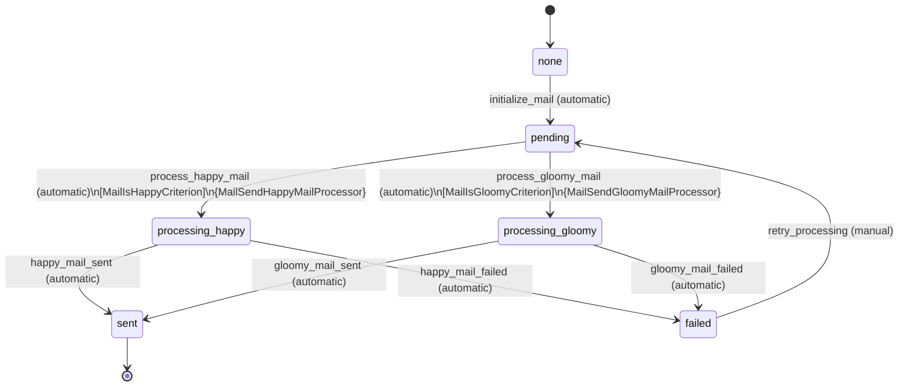

# Workflows

## Mail Workflow

### Description
The Mail workflow manages the processing and sending of email messages based on their emotional tone (happy or gloomy). The workflow determines the appropriate processing path and handles the mail delivery accordingly.

### Workflow States

| State | Description |
|-------|-------------|
| none | Initial state when mail entity is created |
| pending | Mail is ready for processing |
| processing_happy | Mail is being processed as happy mail |
| processing_gloomy | Mail is being processed as gloomy mail |
| sent | Mail has been successfully sent |
| failed | Mail processing or sending failed |

### Workflow Transitions

#### 1. Initial Transition
- **Name**: `initialize_mail`
- **From**: `none`
- **To**: `pending`
- **Type**: Automatic
- **Processor**: None
- **Criterion**: None
- **Description**: Automatically moves new mail entities to pending state

#### 2. Happy Mail Processing
- **Name**: `process_happy_mail`
- **From**: `pending`
- **To**: `processing_happy`
- **Type**: Automatic
- **Processor**: `MailSendHappyMailProcessor`
- **Criterion**: `MailIsHappyCriterion`
- **Description**: Processes mail when it's determined to be happy

#### 3. Gloomy Mail Processing
- **Name**: `process_gloomy_mail`
- **From**: `pending`
- **To**: `processing_gloomy`
- **Type**: Automatic
- **Processor**: `MailSendGloomyMailProcessor`
- **Criterion**: `MailIsGloomyCriterion`
- **Description**: Processes mail when it's determined to be gloomy

#### 4. Happy Mail Success
- **Name**: `happy_mail_sent`
- **From**: `processing_happy`
- **To**: `sent`
- **Type**: Automatic
- **Processor**: None
- **Criterion**: None
- **Description**: Marks happy mail as successfully sent

#### 5. Gloomy Mail Success
- **Name**: `gloomy_mail_sent`
- **From**: `processing_gloomy`
- **To**: `sent`
- **Type**: Automatic
- **Processor**: None
- **Criterion**: None
- **Description**: Marks gloomy mail as successfully sent

#### 6. Happy Mail Failure
- **Name**: `happy_mail_failed`
- **From**: `processing_happy`
- **To**: `failed`
- **Type**: Automatic
- **Processor**: None
- **Criterion**: None
- **Description**: Marks happy mail processing as failed

#### 7. Gloomy Mail Failure
- **Name**: `gloomy_mail_failed`
- **From**: `processing_gloomy`
- **To**: `failed`
- **Type**: Automatic
- **Processor**: None
- **Criterion**: None
- **Description**: Marks gloomy mail processing as failed

#### 8. Retry Processing
- **Name**: `retry_processing`
- **From**: `failed`
- **To**: `pending`
- **Type**: Manual
- **Processor**: None
- **Criterion**: None
- **Description**: Allows manual retry of failed mail processing

### Mermaid State Diagram

```mermaid
stateDiagram-v2
    [*] --> none
    none --> pending : initialize_mail (automatic)
    
    pending --> processing_happy : process_happy_mail (automatic)\n[MailIsHappyCriterion]\n{MailSendHappyMailProcessor}
    pending --> processing_gloomy : process_gloomy_mail (automatic)\n[MailIsGloomyCriterion]\n{MailSendGloomyMailProcessor}
    
    processing_happy --> sent : happy_mail_sent (automatic)
    processing_happy --> failed : happy_mail_failed (automatic)
    
    processing_gloomy --> sent : gloomy_mail_sent (automatic)
    processing_gloomy --> failed : gloomy_mail_failed (automatic)
    
    failed --> pending : retry_processing (manual)
    
    sent --> [*]
```

### Business Rules

1. **Automatic Initial Transition**: All new mail entities automatically move from `none` to `pending`
2. **Conditional Processing**: Mail processing path is determined by criteria evaluating the `isHappy` field
3. **Mutual Exclusivity**: A mail can only be either happy or gloomy, not both
4. **Error Handling**: Failed processing allows for manual retry
5. **Terminal State**: Successfully sent mails reach the terminal `sent` state
6. **Manual Intervention**: Only the retry transition requires manual triggering

### Notes
- The workflow uses criteria to determine the processing path based on the mail's emotional tone
- Processors handle the actual mail sending logic
- Failed mails can be retried manually by transitioning back to pending state
- The workflow ensures that each mail follows exactly one processing path (happy or gloomy)
