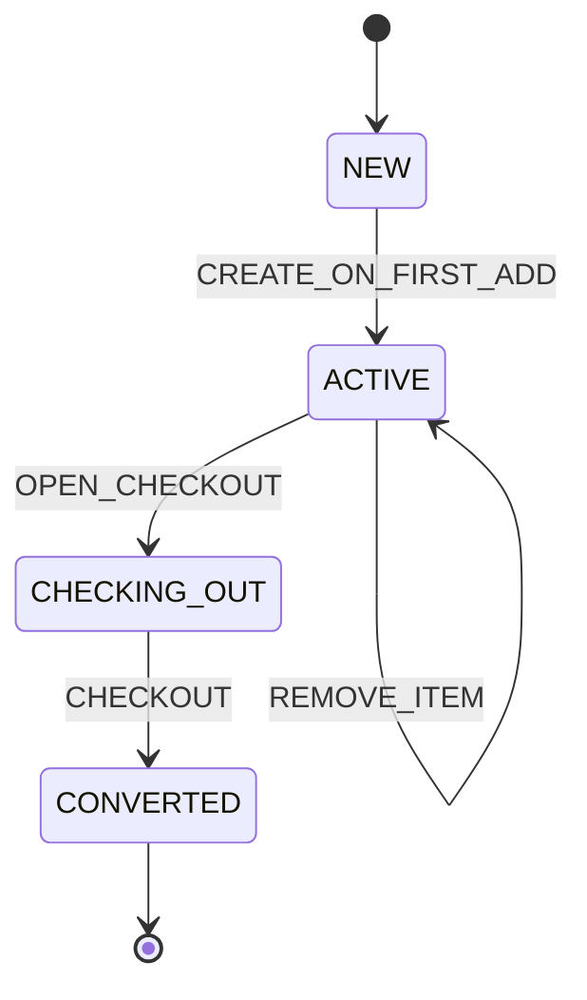
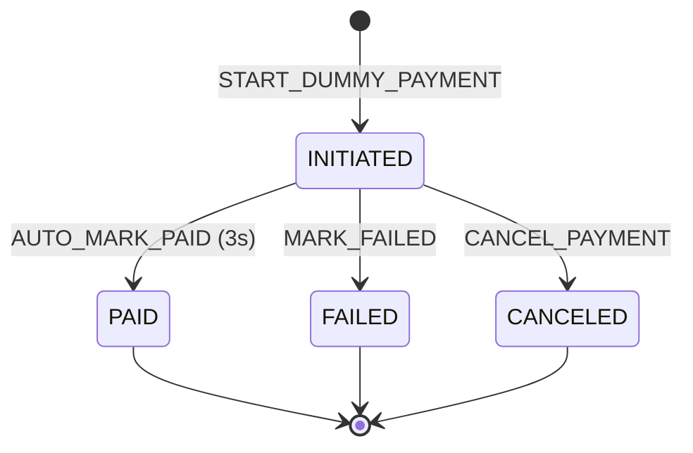
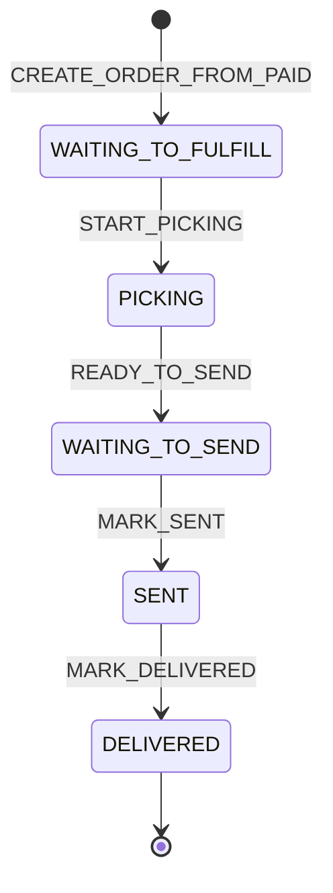
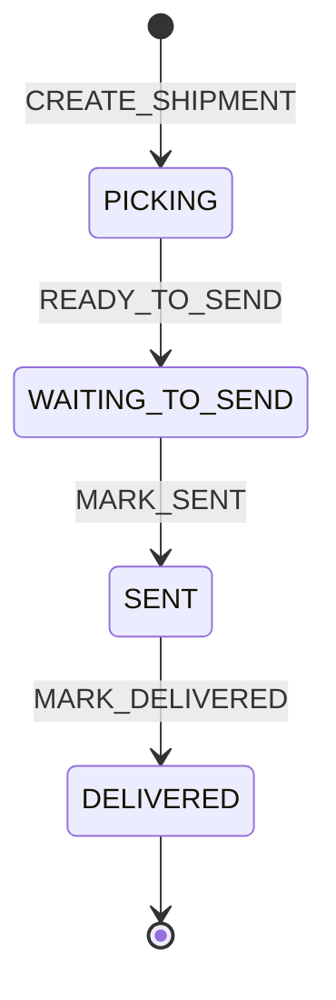
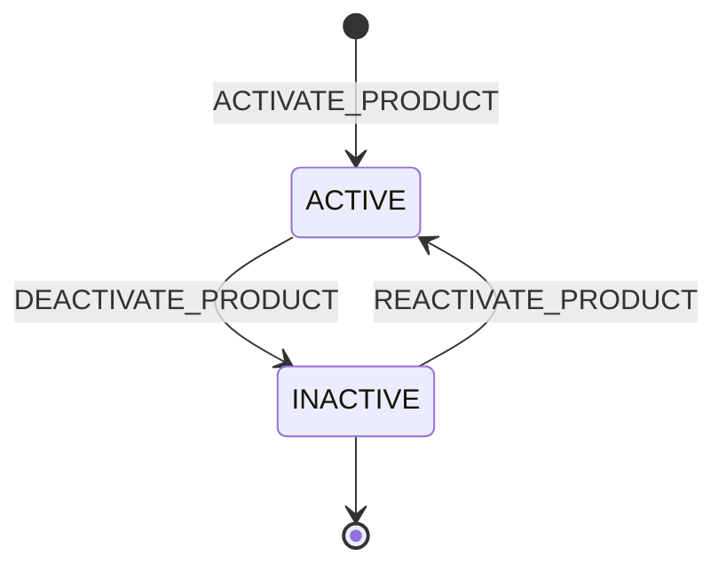

# Workflow Requirements

## Overview
This document defines the detailed workflow requirements for the Cyoda OMS Backend system. Each entity has its own workflow that manages state transitions and business logic through processors and criteria.

## Workflow Definitions

### 1. Cart Workflow (CartFlow)

**Entity**: Cart  
**Description**: Manages cart lifecycle from creation through conversion to order.

#### States and Transitions

**States**: NEW → ACTIVE → CHECKING_OUT → CONVERTED

**Transitions**:

1. **CREATE_ON_FIRST_ADD** (Automatic)
   - From: NEW
   - To: ACTIVE
   - Trigger: First item added to cart
   - Processor: CartRecalculateTotalsProcessor
   - Description: Create cart, add first line, recalculate totals

2. **ADD_ITEM** (Manual)
   - From: ACTIVE
   - To: ACTIVE (loop)
   - Trigger: Add item to cart
   - Processor: CartRecalculateTotalsProcessor
   - Description: Add item and recalculate totals

3. **UPDATE_ITEM** (Manual)
   - From: ACTIVE
   - To: ACTIVE (loop)
   - Trigger: Update item quantity
   - Processor: CartRecalculateTotalsProcessor
   - Description: Update item quantity and recalculate totals

4. **REMOVE_ITEM** (Manual)
   - From: ACTIVE
   - To: ACTIVE (loop)
   - Trigger: Remove item from cart
   - Processor: CartRecalculateTotalsProcessor
   - Description: Remove item and recalculate totals

5. **OPEN_CHECKOUT** (Manual)
   - From: ACTIVE
   - To: CHECKING_OUT
   - Trigger: User initiates checkout
   - Processor: None
   - Description: Set cart to checkout mode

6. **CHECKOUT** (Manual)
   - From: CHECKING_OUT
   - To: CONVERTED
   - Trigger: Payment completed successfully
   - Processor: None
   - Description: Mark cart as converted (signals orchestration)

#### Mermaid State Diagram

```mermaid
stateDiagram-v2
    [*] --> NEW
    NEW --> ACTIVE : CREATE_ON_FIRST_ADD
    ACTIVE --> ACTIVE : ADD_ITEM
    ACTIVE --> ACTIVE : UPDATE_ITEM
    ACTIVE --> ACTIVE : REMOVE_ITEM
    ACTIVE --> CHECKING_OUT : OPEN_CHECKOUT
    CHECKING_OUT --> CONVERTED : CHECKOUT
    CONVERTED --> [*]
```

---

### 2. Payment Workflow (PaymentFlow)

**Entity**: Payment  
**Description**: Manages dummy payment processing with auto-approval after 3 seconds.

#### States and Transitions

**States**: INITIATED → PAID | FAILED | CANCELED

**Transitions**:

1. **START_DUMMY_PAYMENT** (Automatic)
   - From: none (initial)
   - To: INITIATED
   - Trigger: Payment creation
   - Processor: PaymentCreateDummyPaymentProcessor
   - Description: Create Payment in INITIATED state

2. **AUTO_MARK_PAID** (Automatic)
   - From: INITIATED
   - To: PAID
   - Trigger: Timer (3 seconds)
   - Processor: PaymentAutoMarkPaidAfter3sProcessor
   - Description: Automatically mark payment as paid after ~3 seconds

3. **MARK_FAILED** (Manual)
   - From: INITIATED
   - To: FAILED
   - Trigger: Payment processing failure
   - Processor: None
   - Description: Mark payment as failed

4. **CANCEL_PAYMENT** (Manual)
   - From: INITIATED
   - To: CANCELED
   - Trigger: User cancellation
   - Processor: None
   - Description: Cancel payment

#### Mermaid State Diagram

```mermaid
stateDiagram-v2
    [*] --> INITIATED : START_DUMMY_PAYMENT
    INITIATED --> PAID : AUTO_MARK_PAID (3s)
    INITIATED --> FAILED : MARK_FAILED
    INITIATED --> CANCELED : CANCEL_PAYMENT
    PAID --> [*]
    FAILED --> [*]
    CANCELED --> [*]
```

---

### 3. Order Workflow (OrderLifecycle)

**Entity**: Order  
**Description**: Manages order fulfillment lifecycle with single shipment.

#### States and Transitions

**States**: WAITING_TO_FULFILL → PICKING → WAITING_TO_SEND → SENT → DELIVERED

**Transitions**:

1. **CREATE_ORDER_FROM_PAID** (Automatic)
   - From: none (initial)
   - To: WAITING_TO_FULFILL
   - Trigger: Payment marked as PAID
   - Processor: OrderCreateOrderFromPaidProcessor
   - Description: Snapshot cart lines + guestContact into Order, decrement stock, create Shipment

2. **START_PICKING** (Manual)
   - From: WAITING_TO_FULFILL
   - To: PICKING
   - Trigger: Warehouse starts picking
   - Processor: None
   - Description: Begin order fulfillment process

3. **READY_TO_SEND** (Manual)
   - From: PICKING
   - To: WAITING_TO_SEND
   - Trigger: Picking completed
   - Processor: OrderReadyToSendProcessor
   - Description: Mark order ready for shipment, update shipment state

4. **MARK_SENT** (Manual)
   - From: WAITING_TO_SEND
   - To: SENT
   - Trigger: Order shipped
   - Processor: OrderMarkSentProcessor
   - Description: Mark order as sent, update shipment state

5. **MARK_DELIVERED** (Manual)
   - From: SENT
   - To: DELIVERED
   - Trigger: Order delivered
   - Processor: OrderMarkDeliveredProcessor
   - Description: Mark order as delivered, update shipment state

#### Mermaid State Diagram

```mermaid
stateDiagram-v2
    [*] --> WAITING_TO_FULFILL : CREATE_ORDER_FROM_PAID
    WAITING_TO_FULFILL --> PICKING : START_PICKING
    PICKING --> WAITING_TO_SEND : READY_TO_SEND
    WAITING_TO_SEND --> SENT : MARK_SENT
    SENT --> DELIVERED : MARK_DELIVERED
    DELIVERED --> [*]
```

---

### 4. Shipment Workflow (ShipmentFlow)

**Entity**: Shipment  
**Description**: Manages shipment lifecycle synchronized with order states.

#### States and Transitions

**States**: PICKING → WAITING_TO_SEND → SENT → DELIVERED

**Transitions**:

1. **CREATE_SHIPMENT** (Automatic)
   - From: none (initial)
   - To: PICKING
   - Trigger: Order created
   - Processor: None (created by OrderCreateOrderFromPaidProcessor)
   - Description: Create shipment when order is created

2. **READY_TO_SEND** (Automatic)
   - From: PICKING
   - To: WAITING_TO_SEND
   - Trigger: Order moves to WAITING_TO_SEND
   - Processor: ShipmentReadyToSendProcessor
   - Description: Update shipment quantities and state

3. **MARK_SENT** (Automatic)
   - From: WAITING_TO_SEND
   - To: SENT
   - Trigger: Order moves to SENT
   - Processor: ShipmentMarkSentProcessor
   - Description: Update shipment state and quantities

4. **MARK_DELIVERED** (Automatic)
   - From: SENT
   - To: DELIVERED
   - Trigger: Order moves to DELIVERED
   - Processor: ShipmentMarkDeliveredProcessor
   - Description: Mark shipment as delivered

#### Mermaid State Diagram

```mermaid
stateDiagram-v2
    [*] --> PICKING : CREATE_SHIPMENT
    PICKING --> WAITING_TO_SEND : READY_TO_SEND
    WAITING_TO_SEND --> SENT : MARK_SENT
    SENT --> DELIVERED : MARK_DELIVERED
    DELIVERED --> [*]
```

---

### 5. Product Workflow (ProductFlow)

**Entity**: Product  
**Description**: Simple workflow for product lifecycle management.

#### States and Transitions

**States**: ACTIVE → INACTIVE

**Transitions**:

1. **ACTIVATE_PRODUCT** (Automatic)
   - From: none (initial)
   - To: ACTIVE
   - Trigger: Product creation
   - Processor: None
   - Description: Activate product upon creation

2. **DEACTIVATE_PRODUCT** (Manual)
   - From: ACTIVE
   - To: INACTIVE
   - Trigger: Product deactivation
   - Processor: None
   - Description: Deactivate product

3. **REACTIVATE_PRODUCT** (Manual)
   - From: INACTIVE
   - To: ACTIVE
   - Trigger: Product reactivation
   - Processor: None
   - Description: Reactivate product

#### Mermaid State Diagram

```mermaid
stateDiagram-v2
    [*] --> ACTIVE : ACTIVATE_PRODUCT
    ACTIVE --> INACTIVE : DEACTIVATE_PRODUCT
    INACTIVE --> ACTIVE : REACTIVATE_PRODUCT
    INACTIVE --> [*]
```

## Workflow Orchestration

### Cross-Entity Workflow Coordination

1. **Cart → Payment → Order Flow**:
   - Cart CHECKOUT triggers Payment START_DUMMY_PAYMENT
   - Payment PAID triggers Order CREATE_ORDER_FROM_PAID
   - Order creation triggers Shipment CREATE_SHIPMENT

2. **Order → Shipment Synchronization**:
   - Order state changes automatically trigger corresponding Shipment transitions
   - Single shipment per order constraint maintained

3. **Product Stock Management**:
   - Order creation decrements Product.quantityAvailable
   - No reservations or complex inventory management for demo

## Technical Implementation Notes

1. **Automatic Transitions**: First transition from initial state is always automatic
2. **Manual Transitions**: Loop transitions and user-triggered transitions are manual
3. **Processor Execution**: Synchronous execution preferred for demo simplicity
4. **State Synchronization**: Order and Shipment states are kept in sync
5. **Error Handling**: Failed transitions should maintain entity in current state
