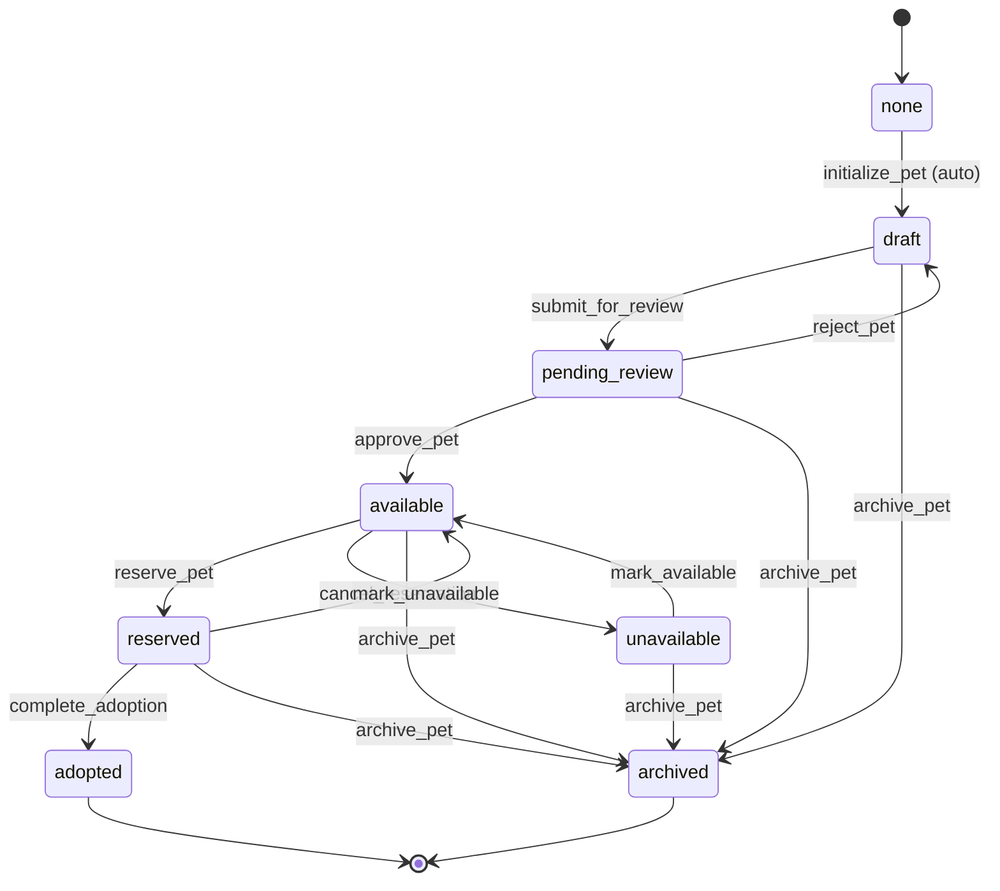
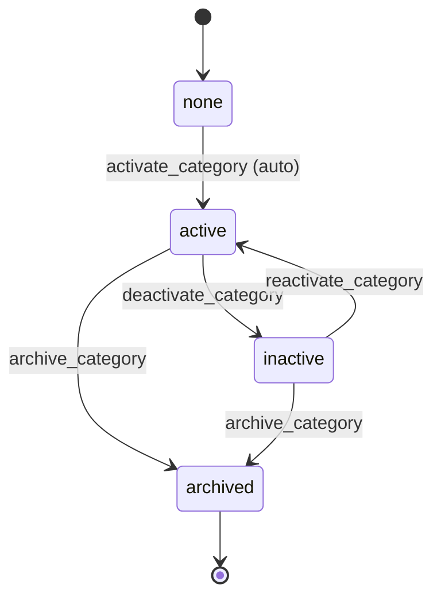
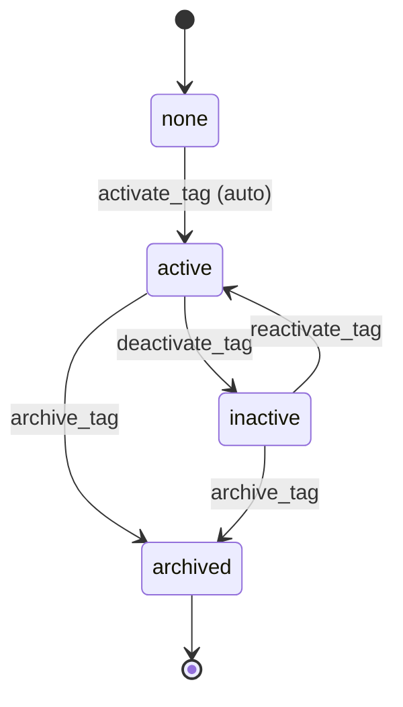
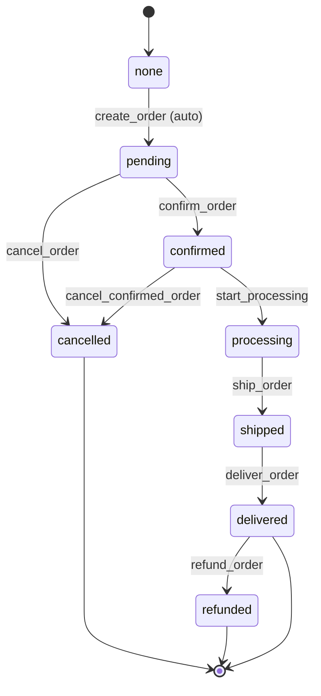

# Workflows Requirements for Purrfect Pets API

## Overview
Each entity in the Purrfect Pets API has its own workflow that manages the entity's lifecycle through various states and transitions. Workflows ensure proper business logic execution and state management.

## 1. Pet Workflow

### States
- `none` (initial): Pet entity created but not yet processed
- `draft`: Pet information being prepared
- `pending_review`: Pet awaiting review and validation
- `available`: Pet is available for adoption/purchase
- `reserved`: Pet is reserved by a customer
- `adopted`: Pet has been adopted/sold
- `unavailable`: Pet is temporarily unavailable
- `archived`: Pet record is archived

### Transitions

#### From `none` to `draft`
- **Name**: `initialize_pet`
- **Type**: Automatic
- **Processor**: `PetInitializationProcessor`
- **Description**: Initialize pet with basic validation

#### From `draft` to `pending_review`
- **Name**: `submit_for_review`
- **Type**: Manual
- **Processor**: `PetSubmissionProcessor`
- **Description**: Submit pet for review with complete information

#### From `pending_review` to `available`
- **Name**: `approve_pet`
- **Type**: Manual
- **Processor**: `PetApprovalProcessor`
- **Criterion**: `PetValidationCriterion`
- **Description**: Approve pet after validation

#### From `pending_review` to `draft`
- **Name**: `reject_pet`
- **Type**: Manual
- **Processor**: `PetRejectionProcessor`
- **Description**: Reject pet and return to draft for corrections

#### From `available` to `reserved`
- **Name**: `reserve_pet`
- **Type**: Manual
- **Processor**: `PetReservationProcessor`
- **Description**: Reserve pet for a customer

#### From `reserved` to `adopted`
- **Name**: `complete_adoption`
- **Type**: Manual
- **Processor**: `PetAdoptionProcessor`
- **Description**: Complete the adoption process

#### From `reserved` to `available`
- **Name**: `cancel_reservation`
- **Type**: Manual
- **Processor**: `PetReservationCancellationProcessor`
- **Description**: Cancel reservation and make pet available again

#### From `available` to `unavailable`
- **Name**: `mark_unavailable`
- **Type**: Manual
- **Processor**: `PetUnavailabilityProcessor`
- **Description**: Mark pet as temporarily unavailable

#### From `unavailable` to `available`
- **Name**: `mark_available`
- **Type**: Manual
- **Processor**: `PetAvailabilityProcessor`
- **Description**: Mark pet as available again

#### From any state to `archived`
- **Name**: `archive_pet`
- **Type**: Manual
- **Processor**: `PetArchivalProcessor`
- **Description**: Archive pet record

### Pet Workflow Diagram

```mermaid
stateDiagram-v2
    [*] --> none
    none --> draft : initialize_pet (auto)
    draft --> pending_review : submit_for_review
    pending_review --> available : approve_pet
    pending_review --> draft : reject_pet
    available --> reserved : reserve_pet
    reserved --> adopted : complete_adoption
    reserved --> available : cancel_reservation
    available --> unavailable : mark_unavailable
    unavailable --> available : mark_available
    draft --> archived : archive_pet
    pending_review --> archived : archive_pet
    available --> archived : archive_pet
    reserved --> archived : archive_pet
    unavailable --> archived : archive_pet
    adopted --> [*]
    archived --> [*]
```

## 2. Category Workflow

### States
- `none` (initial): Category created but not processed
- `active`: Category is active and can be used
- `inactive`: Category is inactive
- `archived`: Category is archived

### Transitions

#### From `none` to `active`
- **Name**: `activate_category`
- **Type**: Automatic
- **Processor**: `CategoryActivationProcessor`
- **Description**: Activate category after creation

#### From `active` to `inactive`
- **Name**: `deactivate_category`
- **Type**: Manual
- **Processor**: `CategoryDeactivationProcessor`
- **Description**: Deactivate category

#### From `inactive` to `active`
- **Name**: `reactivate_category`
- **Type**: Manual
- **Processor**: `CategoryReactivationProcessor`
- **Description**: Reactivate category

#### From any state to `archived`
- **Name**: `archive_category`
- **Type**: Manual
- **Processor**: `CategoryArchivalProcessor`
- **Description**: Archive category

### Category Workflow Diagram

```mermaid
stateDiagram-v2
    [*] --> none
    none --> active : activate_category (auto)
    active --> inactive : deactivate_category
    inactive --> active : reactivate_category
    active --> archived : archive_category
    inactive --> archived : archive_category
    archived --> [*]
```

## 3. Tag Workflow

### States
- `none` (initial): Tag created but not processed
- `active`: Tag is active and can be used
- `inactive`: Tag is inactive
- `archived`: Tag is archived

### Transitions

#### From `none` to `active`
- **Name**: `activate_tag`
- **Type**: Automatic
- **Processor**: `TagActivationProcessor`
- **Description**: Activate tag after creation

#### From `active` to `inactive`
- **Name**: `deactivate_tag`
- **Type**: Manual
- **Processor**: `TagDeactivationProcessor`
- **Description**: Deactivate tag

#### From `inactive` to `active`
- **Name**: `reactivate_tag`
- **Type**: Manual
- **Processor**: `TagReactivationProcessor`
- **Description**: Reactivate tag

#### From any state to `archived`
- **Name**: `archive_tag`
- **Type**: Manual
- **Processor**: `TagArchivalProcessor`
- **Description**: Archive tag

### Tag Workflow Diagram

```mermaid
stateDiagram-v2
    [*] --> none
    none --> active : activate_tag (auto)
    active --> inactive : deactivate_tag
    inactive --> active : reactivate_tag
    active --> archived : archive_tag
    inactive --> archived : archive_tag
    archived --> [*]
```

## 4. Order Workflow

### States
- `none` (initial): Order created but not processed
- `pending`: Order is pending processing
- `confirmed`: Order is confirmed
- `processing`: Order is being processed
- `shipped`: Order has been shipped
- `delivered`: Order has been delivered
- `cancelled`: Order has been cancelled
- `refunded`: Order has been refunded

### Transitions

#### From `none` to `pending`
- **Name**: `create_order`
- **Type**: Automatic
- **Processor**: `OrderCreationProcessor`
- **Description**: Create order with initial validation

#### From `pending` to `confirmed`
- **Name**: `confirm_order`
- **Type**: Manual
- **Processor**: `OrderConfirmationProcessor`
- **Criterion**: `OrderValidationCriterion`
- **Description**: Confirm order after validation

#### From `confirmed` to `processing`
- **Name**: `start_processing`
- **Type**: Manual
- **Processor**: `OrderProcessingProcessor`
- **Description**: Start processing the order

#### From `processing` to `shipped`
- **Name**: `ship_order`
- **Type**: Manual
- **Processor**: `OrderShippingProcessor`
- **Description**: Ship the order

#### From `shipped` to `delivered`
- **Name**: `deliver_order`
- **Type**: Manual
- **Processor**: `OrderDeliveryProcessor`
- **Description**: Mark order as delivered

#### From `pending` to `cancelled`
- **Name**: `cancel_order`
- **Type**: Manual
- **Processor**: `OrderCancellationProcessor`
- **Description**: Cancel pending order

#### From `confirmed` to `cancelled`
- **Name**: `cancel_confirmed_order`
- **Type**: Manual
- **Processor**: `OrderCancellationProcessor`
- **Description**: Cancel confirmed order

#### From `delivered` to `refunded`
- **Name**: `refund_order`
- **Type**: Manual
- **Processor**: `OrderRefundProcessor`
- **Description**: Process order refund

### Order Workflow Diagram

```mermaid
stateDiagram-v2
    [*] --> none
    none --> pending : create_order (auto)
    pending --> confirmed : confirm_order
    confirmed --> processing : start_processing
    processing --> shipped : ship_order
    shipped --> delivered : deliver_order
    pending --> cancelled : cancel_order
    confirmed --> cancelled : cancel_confirmed_order
    delivered --> refunded : refund_order
    cancelled --> [*]
    refunded --> [*]
    delivered --> [*]
```

## Workflow Rules

### General Rules
- All workflows start from the `none` state
- First transition from `none` is always automatic
- Manual transitions require explicit user action
- Loop transitions (returning to previous states) are marked as manual
- Each entity can only be in one state at a time

### Processor and Criterion Naming
- Processors follow PascalCase: `EntityActionProcessor`
- Criteria follow PascalCase: `EntityValidationCriterion`
- Names must be unique within the system

### Transition Types
- **Automatic**: Triggered automatically by the system
- **Manual**: Triggered by user action or external event

### State Management
- Entity state is managed by `entity.meta.state`
- State changes are tracked with timestamps
- Previous state information is maintained for audit purposes
