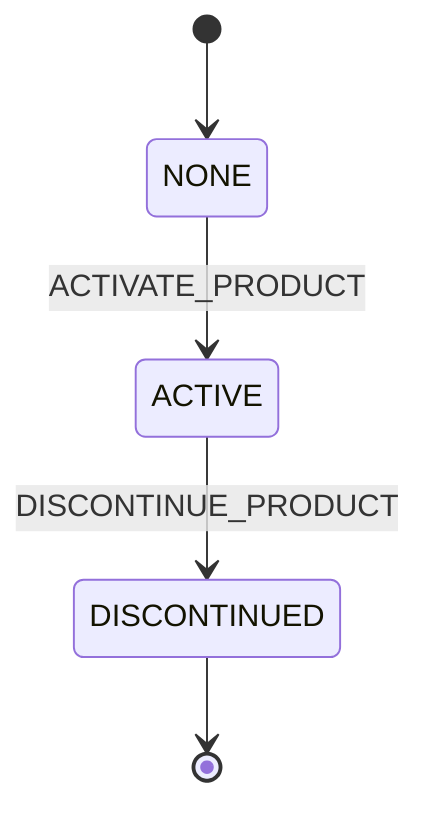
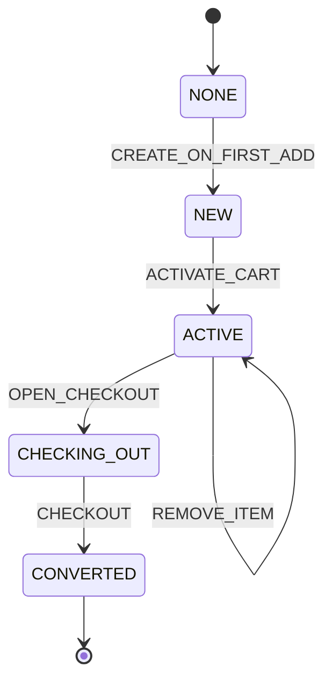
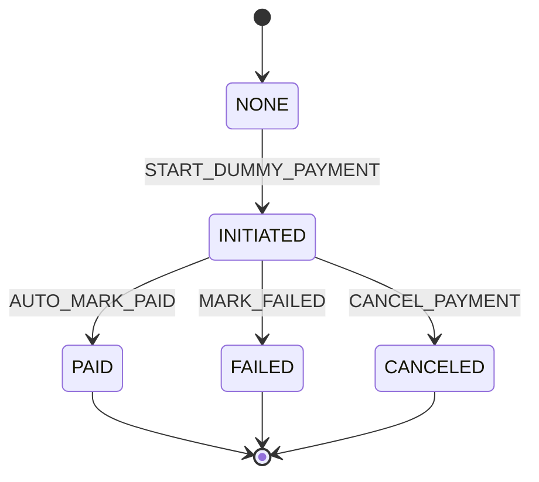
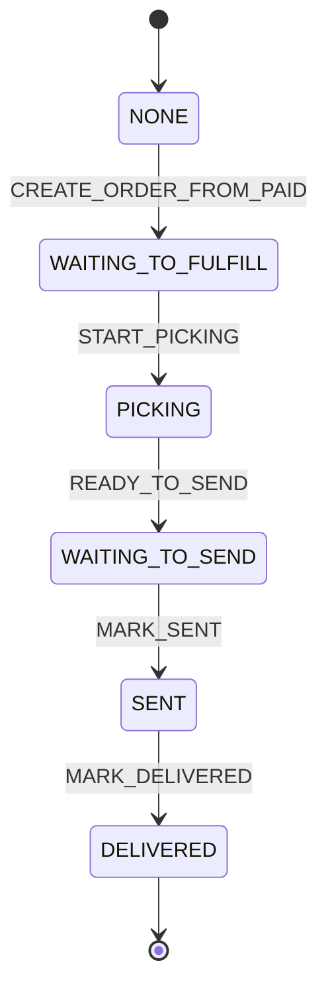
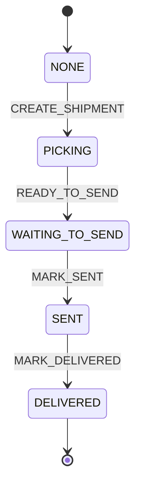

# Workflow Requirements

## Overview
This document defines the workflow requirements for all entities in the Cyoda OMS Backend system. Each workflow represents a finite state machine that manages entity lifecycle and business processes.

## Workflows

### 1. ProductWorkflow

**Purpose:** Manages product lifecycle from creation to discontinuation.

**States:** NONE → ACTIVE → DISCONTINUED

**Transitions:**
- `ACTIVATE_PRODUCT`: NONE → ACTIVE (automatic, initial transition)
  - Processor: ProductActivationProcessor
  - Description: Activates a newly created product
- `DISCONTINUE_PRODUCT`: ACTIVE → DISCONTINUED (manual)
  - Processor: ProductDiscontinuationProcessor
  - Description: Marks product as discontinued

```mermaid
stateDiagram-v2
    [*] --> NONE
    NONE --> ACTIVE : ACTIVATE_PRODUCT
    ACTIVE --> DISCONTINUED : DISCONTINUE_PRODUCT
    DISCONTINUED --> [*]
```

### 2. CartWorkflow

**Purpose:** Manages shopping cart lifecycle from creation through conversion to order.

**States:** NONE → NEW → ACTIVE → CHECKING_OUT → CONVERTED

**Transitions:**
- `CREATE_ON_FIRST_ADD`: NONE → NEW (automatic, initial transition)
  - Processor: CartCreationProcessor
  - Description: Creates cart and adds first item
- `ACTIVATE_CART`: NEW → ACTIVE (automatic)
  - Processor: CartActivationProcessor
  - Description: Activates cart after first item addition
- `ADD_ITEM`: ACTIVE → ACTIVE (manual)
  - Processor: CartAddItemProcessor
  - Description: Adds or increments item in cart
- `UPDATE_ITEM`: ACTIVE → ACTIVE (manual)
  - Processor: CartUpdateItemProcessor
  - Description: Updates item quantity in cart
- `REMOVE_ITEM`: ACTIVE → ACTIVE (manual)
  - Processor: CartRemoveItemProcessor
  - Description: Removes item from cart
- `OPEN_CHECKOUT`: ACTIVE → CHECKING_OUT (manual)
  - Processor: CartCheckoutProcessor
  - Description: Initiates checkout process
- `CHECKOUT`: CHECKING_OUT → CONVERTED (manual)
  - Processor: CartConversionProcessor
  - Description: Converts cart to order after payment

```mermaid
stateDiagram-v2
    [*] --> NONE
    NONE --> NEW : CREATE_ON_FIRST_ADD
    NEW --> ACTIVE : ACTIVATE_CART
    ACTIVE --> ACTIVE : ADD_ITEM
    ACTIVE --> ACTIVE : UPDATE_ITEM
    ACTIVE --> ACTIVE : REMOVE_ITEM
    ACTIVE --> CHECKING_OUT : OPEN_CHECKOUT
    CHECKING_OUT --> CONVERTED : CHECKOUT
    CONVERTED --> [*]
```

### 3. PaymentWorkflow

**Purpose:** Manages dummy payment processing with automatic approval after 3 seconds.

**States:** NONE → INITIATED → PAID | FAILED | CANCELED

**Transitions:**
- `START_DUMMY_PAYMENT`: NONE → INITIATED (automatic, initial transition)
  - Processor: PaymentInitiationProcessor
  - Description: Creates payment record in initiated state
- `AUTO_MARK_PAID`: INITIATED → PAID (automatic, after 3 seconds)
  - Processor: PaymentAutoApprovalProcessor
  - Description: Automatically approves payment after 3 seconds
- `MARK_FAILED`: INITIATED → FAILED (manual)
  - Processor: PaymentFailureProcessor
  - Description: Marks payment as failed
- `CANCEL_PAYMENT`: INITIATED → CANCELED (manual)
  - Processor: PaymentCancellationProcessor
  - Description: Cancels payment

```mermaid
stateDiagram-v2
    [*] --> NONE
    NONE --> INITIATED : START_DUMMY_PAYMENT
    INITIATED --> PAID : AUTO_MARK_PAID
    INITIATED --> FAILED : MARK_FAILED
    INITIATED --> CANCELED : CANCEL_PAYMENT
    PAID --> [*]
    FAILED --> [*]
    CANCELED --> [*]
```

### 4. OrderWorkflow

**Purpose:** Manages order fulfillment from creation through delivery.

**States:** NONE → WAITING_TO_FULFILL → PICKING → WAITING_TO_SEND → SENT → DELIVERED

**Transitions:**
- `CREATE_ORDER_FROM_PAID`: NONE → WAITING_TO_FULFILL (automatic, initial transition)
  - Processor: OrderCreationProcessor
  - Description: Creates order from paid cart, decrements stock, creates shipment
- `START_PICKING`: WAITING_TO_FULFILL → PICKING (manual)
  - Processor: OrderPickingProcessor
  - Description: Starts picking process for order
- `READY_TO_SEND`: PICKING → WAITING_TO_SEND (manual)
  - Processor: OrderReadyToSendProcessor
  - Description: Marks order ready for shipment
- `MARK_SENT`: WAITING_TO_SEND → SENT (manual)
  - Processor: OrderSentProcessor
  - Description: Marks order as sent
- `MARK_DELIVERED`: SENT → DELIVERED (manual)
  - Processor: OrderDeliveredProcessor
  - Description: Marks order as delivered

```mermaid
stateDiagram-v2
    [*] --> NONE
    NONE --> WAITING_TO_FULFILL : CREATE_ORDER_FROM_PAID
    WAITING_TO_FULFILL --> PICKING : START_PICKING
    PICKING --> WAITING_TO_SEND : READY_TO_SEND
    WAITING_TO_SEND --> SENT : MARK_SENT
    SENT --> DELIVERED : MARK_DELIVERED
    DELIVERED --> [*]
```

### 5. ShipmentWorkflow

**Purpose:** Manages shipment processing from picking through delivery.

**States:** NONE → PICKING → WAITING_TO_SEND → SENT → DELIVERED

**Transitions:**
- `CREATE_SHIPMENT`: NONE → PICKING (automatic, initial transition)
  - Processor: ShipmentCreationProcessor
  - Description: Creates shipment in picking state
- `READY_TO_SEND`: PICKING → WAITING_TO_SEND (manual)
  - Processor: ShipmentReadyProcessor
  - Description: Marks shipment ready for dispatch
- `MARK_SENT`: WAITING_TO_SEND → SENT (manual)
  - Processor: ShipmentSentProcessor
  - Description: Marks shipment as sent
- `MARK_DELIVERED`: SENT → DELIVERED (manual)
  - Processor: ShipmentDeliveredProcessor
  - Description: Marks shipment as delivered

```mermaid
stateDiagram-v2
    [*] --> NONE
    NONE --> PICKING : CREATE_SHIPMENT
    PICKING --> WAITING_TO_SEND : READY_TO_SEND
    WAITING_TO_SEND --> SENT : MARK_SENT
    SENT --> DELIVERED : MARK_DELIVERED
    DELIVERED --> [*]
```

## Workflow Coordination

### Order and Shipment Synchronization
- Order and Shipment workflows are coordinated
- Order state derives from Shipment state in single-shipment scenario
- When Shipment transitions, Order follows the same transition

### Cart to Order Conversion
- Cart CHECKOUT transition triggers Order CREATE_ORDER_FROM_PAID
- Payment must be in PAID state before order creation
- Cart becomes CONVERTED after successful order creation

### Stock Management
- Product quantityAvailable is decremented during Order creation
- No reservations are used (immediate stock decrement policy)

## Transition Types
- **Automatic**: Triggered by system events or processors
- **Manual**: Triggered by user actions or external events
- **Initial**: First transition from NONE state (always automatic)

## Error Handling
- Failed transitions maintain current state
- Processors can implement retry logic
- Criteria can prevent invalid transitions
