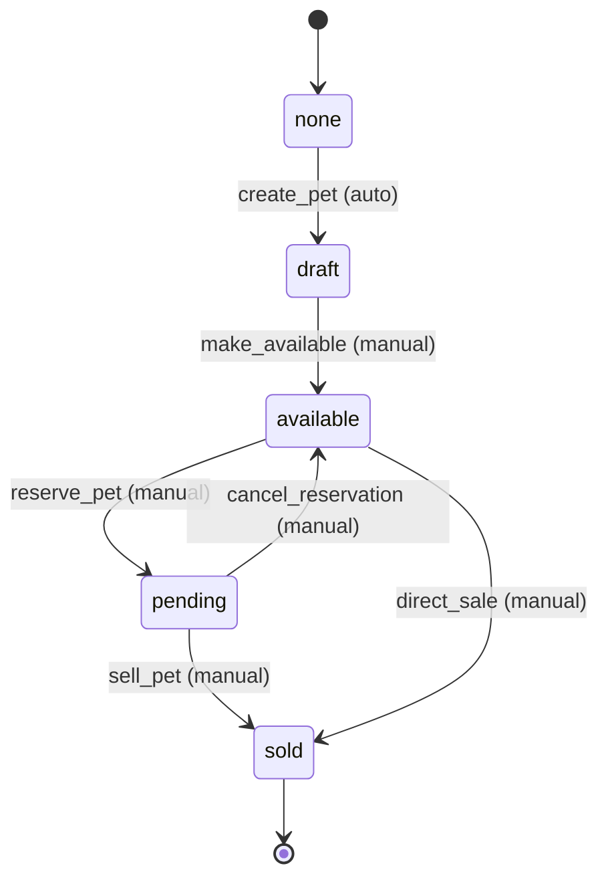
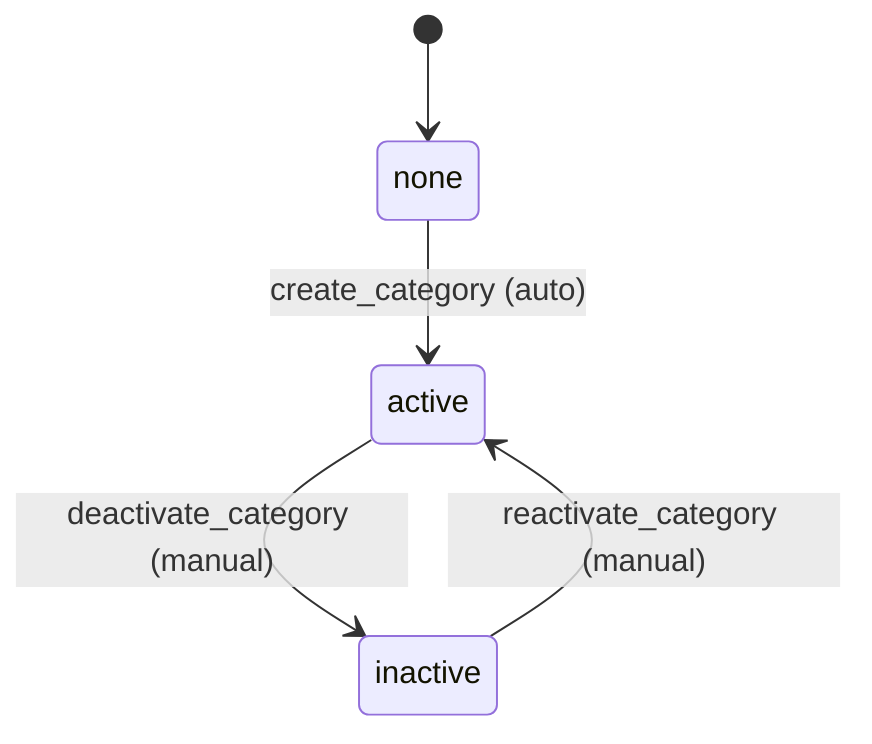
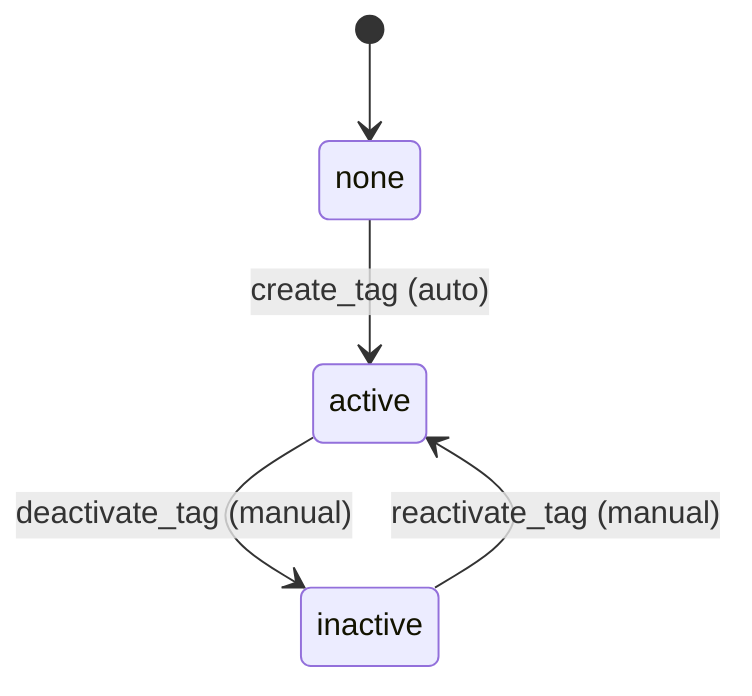
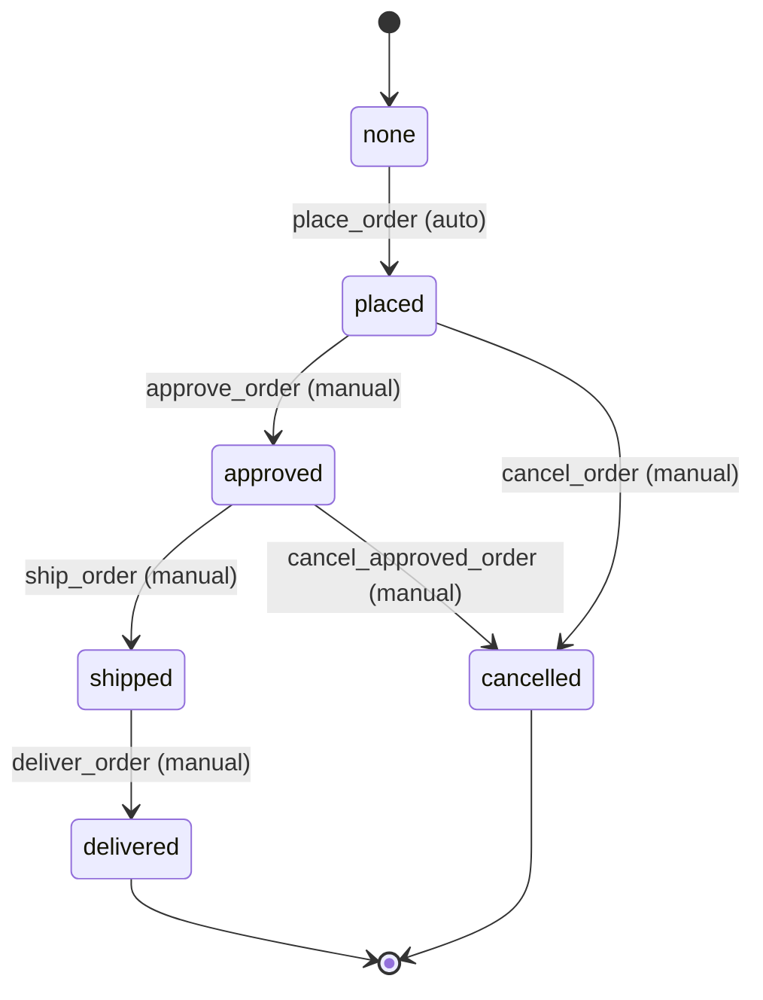
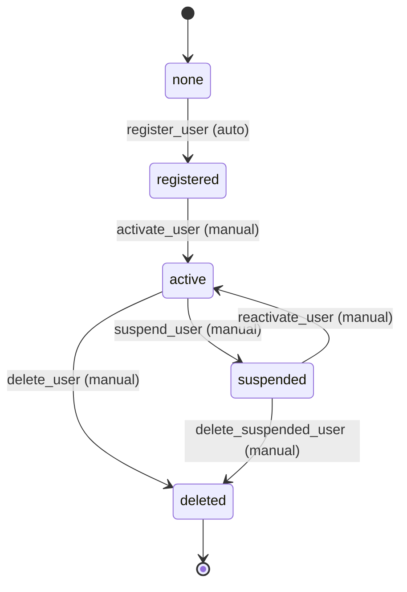

# Purrfect Pets API - Workflow Requirements

## Overview
This document defines the workflow requirements for all entities in the Purrfect Pets API application. Each entity has its own workflow with states and transitions.

## 1. Pet Workflow

**Description**: Manages the lifecycle of pets in the store from creation to sale.

**States**:
- `none` (initial state)
- `draft` - Pet information is being prepared
- `available` - Pet is available for purchase
- `pending` - Pet is reserved/pending sale
- `sold` - Pet has been sold

**Transitions**:

1. **create_pet** (none → draft)
   - Type: Automatic
   - Processor: PetCreationProcessor
   - Description: Initial creation of pet record

2. **make_available** (draft → available)
   - Type: Manual
   - Processor: PetValidationProcessor
   - Criterion: PetValidityCriterion
   - Description: Make pet available after validation

3. **reserve_pet** (available → pending)
   - Type: Manual
   - Processor: PetReservationProcessor
   - Description: Reserve pet for potential buyer

4. **cancel_reservation** (pending → available)
   - Type: Manual
   - Description: Cancel reservation and make pet available again

5. **sell_pet** (pending → sold)
   - Type: Manual
   - Processor: PetSaleProcessor
   - Description: Complete pet sale

6. **direct_sale** (available → sold)
   - Type: Manual
   - Processor: PetSaleProcessor
   - Description: Direct sale without reservation

```mermaid
stateDiagram-v2
    [*] --> none
    none --> draft : create_pet (auto)
    draft --> available : make_available (manual)
    available --> pending : reserve_pet (manual)
    pending --> available : cancel_reservation (manual)
    pending --> sold : sell_pet (manual)
    available --> sold : direct_sale (manual)
    sold --> [*]
```

## 2. Category Workflow

**Description**: Simple workflow for category management.

**States**:
- `none` (initial state)
- `active` - Category is active and can be used
- `inactive` - Category is inactive

**Transitions**:

1. **create_category** (none → active)
   - Type: Automatic
   - Processor: CategoryCreationProcessor
   - Description: Create new category

2. **deactivate_category** (active → inactive)
   - Type: Manual
   - Description: Deactivate category

3. **reactivate_category** (inactive → active)
   - Type: Manual
   - Description: Reactivate category

```mermaid
stateDiagram-v2
    [*] --> none
    none --> active : create_category (auto)
    active --> inactive : deactivate_category (manual)
    inactive --> active : reactivate_category (manual)
```

## 3. Tag Workflow

**Description**: Simple workflow for tag management.

**States**:
- `none` (initial state)
- `active` - Tag is active and can be used
- `inactive` - Tag is inactive

**Transitions**:

1. **create_tag** (none → active)
   - Type: Automatic
   - Processor: TagCreationProcessor
   - Description: Create new tag

2. **deactivate_tag** (active → inactive)
   - Type: Manual
   - Description: Deactivate tag

3. **reactivate_tag** (inactive → active)
   - Type: Manual
   - Description: Reactivate tag

```mermaid
stateDiagram-v2
    [*] --> none
    none --> active : create_tag (auto)
    active --> inactive : deactivate_tag (manual)
    inactive --> active : reactivate_tag (manual)
```

## 4. Order Workflow

**Description**: Manages the lifecycle of orders from placement to delivery.

**States**:
- `none` (initial state)
- `placed` - Order has been placed
- `approved` - Order has been approved for processing
- `shipped` - Order has been shipped
- `delivered` - Order has been delivered
- `cancelled` - Order has been cancelled

**Transitions**:

1. **place_order** (none → placed)
   - Type: Automatic
   - Processor: OrderCreationProcessor
   - Criterion: OrderValidityCriterion
   - Description: Place new order

2. **approve_order** (placed → approved)
   - Type: Manual
   - Processor: OrderApprovalProcessor
   - Criterion: OrderApprovalCriterion
   - Description: Approve order for processing

3. **ship_order** (approved → shipped)
   - Type: Manual
   - Processor: OrderShippingProcessor
   - Description: Ship the order

4. **deliver_order** (shipped → delivered)
   - Type: Manual
   - Processor: OrderDeliveryProcessor
   - Description: Mark order as delivered

5. **cancel_order** (placed → cancelled)
   - Type: Manual
   - Processor: OrderCancellationProcessor
   - Description: Cancel placed order

6. **cancel_approved_order** (approved → cancelled)
   - Type: Manual
   - Processor: OrderCancellationProcessor
   - Description: Cancel approved order

```mermaid
stateDiagram-v2
    [*] --> none
    none --> placed : place_order (auto)
    placed --> approved : approve_order (manual)
    placed --> cancelled : cancel_order (manual)
    approved --> shipped : ship_order (manual)
    approved --> cancelled : cancel_approved_order (manual)
    shipped --> delivered : deliver_order (manual)
    delivered --> [*]
    cancelled --> [*]
```

## 5. User Workflow

**Description**: Manages user account lifecycle.

**States**:
- `none` (initial state)
- `registered` - User has registered
- `active` - User account is active
- `suspended` - User account is suspended
- `deleted` - User account is deleted

**Transitions**:

1. **register_user** (none → registered)
   - Type: Automatic
   - Processor: UserRegistrationProcessor
   - Criterion: UserValidityCriterion
   - Description: Register new user

2. **activate_user** (registered → active)
   - Type: Manual
   - Processor: UserActivationProcessor
   - Description: Activate user account

3. **suspend_user** (active → suspended)
   - Type: Manual
   - Processor: UserSuspensionProcessor
   - Description: Suspend user account

4. **reactivate_user** (suspended → active)
   - Type: Manual
   - Description: Reactivate suspended user

5. **delete_user** (active → deleted)
   - Type: Manual
   - Processor: UserDeletionProcessor
   - Description: Delete user account

6. **delete_suspended_user** (suspended → deleted)
   - Type: Manual
   - Processor: UserDeletionProcessor
   - Description: Delete suspended user account

```mermaid
stateDiagram-v2
    [*] --> none
    none --> registered : register_user (auto)
    registered --> active : activate_user (manual)
    active --> suspended : suspend_user (manual)
    suspended --> active : reactivate_user (manual)
    active --> deleted : delete_user (manual)
    suspended --> deleted : delete_suspended_user (manual)
    deleted --> [*]
```

## Workflow Notes

1. **Initial Transitions**: All workflows start with an automatic transition from the `none` state.
2. **Manual Transitions**: Most state changes require manual triggers through API calls.
3. **Loop Transitions**: Transitions that go back to previous states (like cancel_reservation, reactivate_user) are marked as manual.
4. **Processors**: Each transition may have associated processors for business logic.
5. **Criteria**: Some transitions have criteria to validate conditions before allowing the transition.
