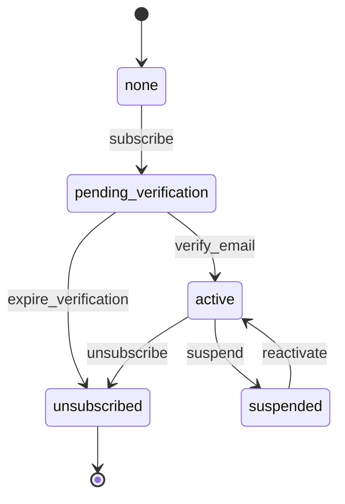
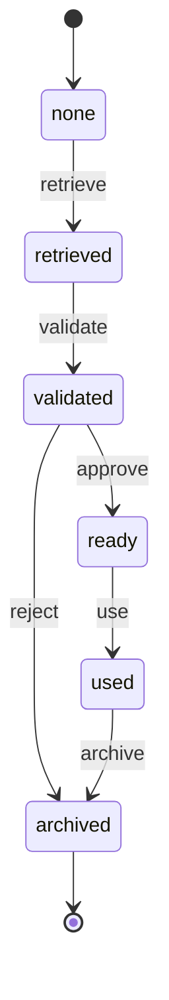
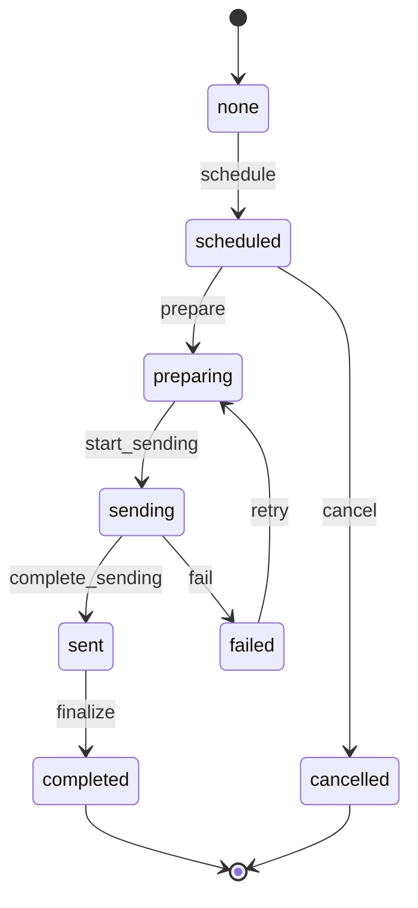

# Workflows

## Overview
This document defines the workflows for each entity in the Weekly Cat Fact Subscription application. Each workflow represents the state machine that governs the lifecycle of the entity.

## 1. Subscriber Workflow

**Workflow Name**: `subscriber_workflow`

**Description**: Manages the lifecycle of a subscriber from registration to unsubscription.

**States**:
- `none` (initial): Starting state before subscription
- `pending_verification`: Email verification pending
- `active`: Active subscription
- `unsubscribed`: User has unsubscribed
- `suspended`: Subscription temporarily suspended (e.g., bounced emails)

**Transitions**:

1. **subscribe** (none → pending_verification)
   - **Type**: Automatic
   - **Processor**: SubscriberRegistrationProcessor
   - **Description**: Process new subscription request

2. **verify_email** (pending_verification → active)
   - **Type**: Manual
   - **Processor**: SubscriberVerificationProcessor
   - **Description**: Verify email address and activate subscription

3. **unsubscribe** (active → unsubscribed)
   - **Type**: Manual
   - **Processor**: SubscriberUnsubscribeProcessor
   - **Description**: Process unsubscription request

4. **suspend** (active → suspended)
   - **Type**: Automatic
   - **Processor**: SubscriberSuspensionProcessor
   - **Criterion**: SubscriberSuspensionCriterion
   - **Description**: Suspend subscription due to delivery issues

5. **reactivate** (suspended → active)
   - **Type**: Manual
   - **Processor**: SubscriberReactivationProcessor
   - **Description**: Reactivate suspended subscription

6. **expire_verification** (pending_verification → unsubscribed)
   - **Type**: Automatic
   - **Criterion**: SubscriberVerificationExpirationCriterion
   - **Description**: Expire unverified subscriptions after timeout

```mermaid
stateDiagram-v2
    [*] --> none
    none --> pending_verification : subscribe
    pending_verification --> active : verify_email
    pending_verification --> unsubscribed : expire_verification
    active --> unsubscribed : unsubscribe
    active --> suspended : suspend
    suspended --> active : reactivate
    unsubscribed --> [*]
```

## 2. CatFact Workflow

**Workflow Name**: `catfact_workflow`

**Description**: Manages the lifecycle of cat facts from retrieval to usage in campaigns.

**States**:
- `none` (initial): Starting state before retrieval
- `retrieved`: Fact retrieved from API
- `validated`: Fact content validated
- `ready`: Ready for use in campaigns
- `used`: Used in at least one campaign
- `archived`: Archived fact (no longer in active use)

**Transitions**:

1. **retrieve** (none → retrieved)
   - **Type**: Automatic
   - **Processor**: CatFactRetrievalProcessor
   - **Description**: Retrieve cat fact from external API

2. **validate** (retrieved → validated)
   - **Type**: Automatic
   - **Processor**: CatFactValidationProcessor
   - **Criterion**: CatFactValidationCriterion
   - **Description**: Validate fact content and format

3. **approve** (validated → ready)
   - **Type**: Automatic
   - **Processor**: CatFactApprovalProcessor
   - **Description**: Mark fact as ready for campaigns

4. **use** (ready → used)
   - **Type**: Automatic
   - **Processor**: CatFactUsageProcessor
   - **Description**: Mark fact as used when included in campaign

5. **archive** (used → archived)
   - **Type**: Manual
   - **Processor**: CatFactArchiveProcessor
   - **Description**: Archive old or overused facts

6. **reject** (validated → archived)
   - **Type**: Manual
   - **Criterion**: CatFactRejectionCriterion
   - **Description**: Reject inappropriate facts

```mermaid
stateDiagram-v2
    [*] --> none
    none --> retrieved : retrieve
    retrieved --> validated : validate
    validated --> ready : approve
    validated --> archived : reject
    ready --> used : use
    used --> archived : archive
    archived --> [*]
```

## 3. EmailCampaign Workflow

**Workflow Name**: `emailcampaign_workflow`

**Description**: Manages the lifecycle of email campaigns from creation to completion.

**States**:
- `none` (initial): Starting state before creation
- `scheduled`: Campaign scheduled for future sending
- `preparing`: Preparing campaign content and recipient list
- `sending`: Currently sending emails
- `sent`: All emails sent successfully
- `completed`: Campaign completed with analytics
- `failed`: Campaign failed to send
- `cancelled`: Campaign cancelled before sending

**Transitions**:

1. **schedule** (none → scheduled)
   - **Type**: Automatic
   - **Processor**: EmailCampaignScheduleProcessor
   - **Description**: Schedule new email campaign

2. **prepare** (scheduled → preparing)
   - **Type**: Automatic
   - **Processor**: EmailCampaignPreparationProcessor
   - **Criterion**: EmailCampaignPreparationCriterion
   - **Description**: Prepare campaign when scheduled time arrives

3. **start_sending** (preparing → sending)
   - **Type**: Automatic
   - **Processor**: EmailCampaignSendProcessor
   - **Description**: Start sending emails to subscribers

4. **complete_sending** (sending → sent)
   - **Type**: Automatic
   - **Processor**: EmailCampaignCompletionProcessor
   - **Description**: Mark campaign as sent when all emails processed

5. **finalize** (sent → completed)
   - **Type**: Automatic
   - **Processor**: EmailCampaignFinalizationProcessor
   - **Description**: Finalize campaign with analytics and reporting

6. **fail** (sending → failed)
   - **Type**: Automatic
   - **Criterion**: EmailCampaignFailureCriterion
   - **Description**: Handle campaign failures during sending

7. **cancel** (scheduled → cancelled)
   - **Type**: Manual
   - **Processor**: EmailCampaignCancellationProcessor
   - **Description**: Cancel scheduled campaign

8. **retry** (failed → preparing)
   - **Type**: Manual
   - **Processor**: EmailCampaignRetryProcessor
   - **Description**: Retry failed campaign

```mermaid
stateDiagram-v2
    [*] --> none
    none --> scheduled : schedule
    scheduled --> preparing : prepare
    scheduled --> cancelled : cancel
    preparing --> sending : start_sending
    sending --> sent : complete_sending
    sending --> failed : fail
    sent --> completed : finalize
    failed --> preparing : retry
    cancelled --> [*]
    completed --> [*]
```

## Workflow Integration Notes

1. **Cross-Entity Dependencies**:
   - EmailCampaign creation requires at least one CatFact in `ready` state
   - EmailCampaign sending requires active Subscribers
   - CatFact transitions to `used` when EmailCampaign starts sending

2. **Scheduled Processing**:
   - Weekly scheduled job triggers CatFact retrieval
   - Weekly scheduled job creates new EmailCampaign
   - Email verification expiration runs daily

3. **Manual vs Automatic Transitions**:
   - First transitions from `none` are always automatic
   - Loop transitions (retry, reactivate) are manual
   - User-initiated actions (unsubscribe, cancel) are manual
   - System-driven processes are automatic
