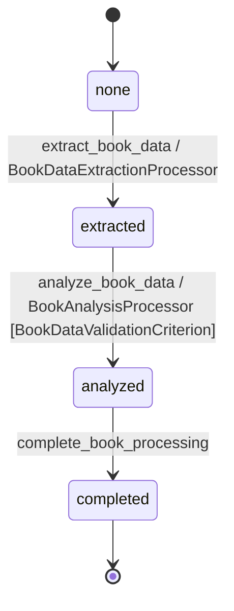
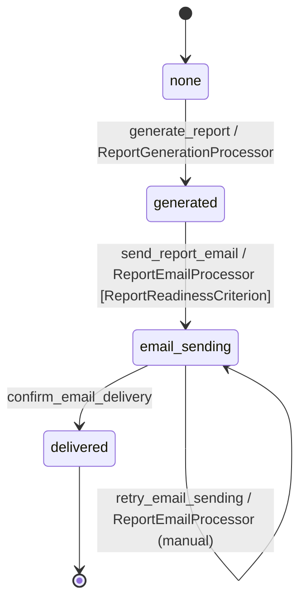
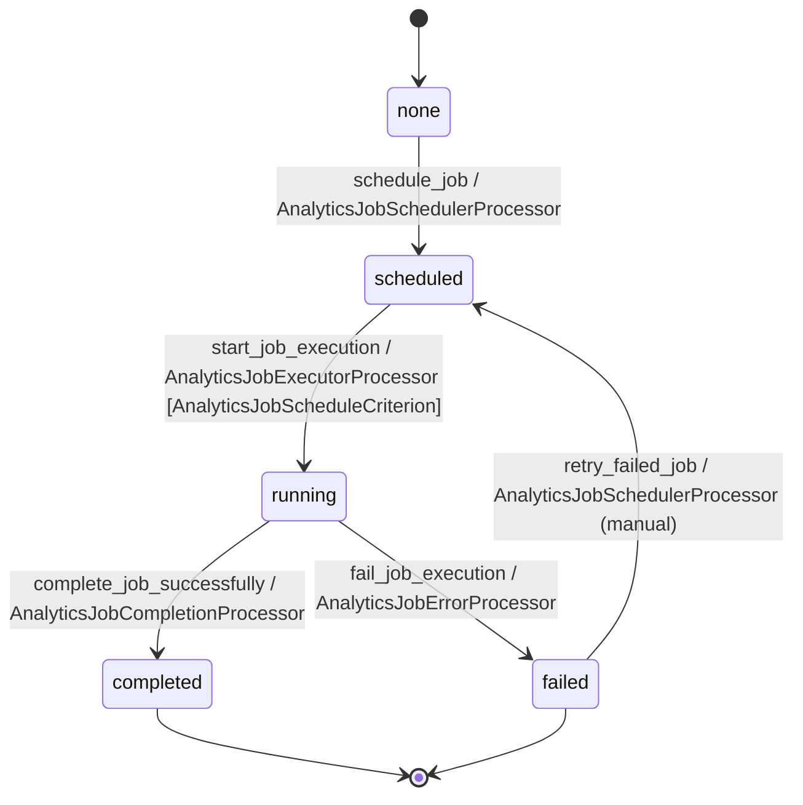

# Workflow Specifications

## Overview
This document defines the state machine workflows for each entity in the book data analysis application. Each workflow manages the lifecycle of entities through various processing states.

## 1. Book Workflow

**Purpose**: Manages the lifecycle of book data from API extraction through analysis completion.

**States and Transitions**:

### States:
- `none` (initial): Book entity created but not yet processed
- `extracted`: Book data successfully retrieved from API
- `analyzed`: Book data analyzed and metrics calculated
- `completed`: Book processing fully completed

### Transitions:

1. **none → extracted**
   - **Name**: `extract_book_data`
   - **Type**: Automatic (triggered when book is created)
   - **Processor**: `BookDataExtractionProcessor`
   - **Criterion**: None

2. **extracted → analyzed**
   - **Name**: `analyze_book_data`
   - **Type**: Automatic
   - **Processor**: `BookAnalysisProcessor`
   - **Criterion**: `BookDataValidationCriterion`

3. **analyzed → completed**
   - **Name**: `complete_book_processing`
   - **Type**: Automatic
   - **Processor**: None
   - **Criterion**: None

### Mermaid Diagram:

```mermaid
stateDiagram-v2
    [*] --> none
    none --> extracted : extract_book_data / BookDataExtractionProcessor
    extracted --> analyzed : analyze_book_data / BookAnalysisProcessor [BookDataValidationCriterion]
    analyzed --> completed : complete_book_processing
    completed --> [*]
```

## 2. Report Workflow

**Purpose**: Manages the lifecycle of analytics reports from generation through email delivery.

**States and Transitions**:

### States:
- `none` (initial): Report entity created but not yet generated
- `generated`: Report content generated with analytics insights
- `email_sending`: Report is being sent via email
- `delivered`: Report successfully delivered to recipients

### Transitions:

1. **none → generated**
   - **Name**: `generate_report`
   - **Type**: Automatic (triggered when report is created)
   - **Processor**: `ReportGenerationProcessor`
   - **Criterion**: None

2. **generated → email_sending**
   - **Name**: `send_report_email`
   - **Type**: Automatic
   - **Processor**: `ReportEmailProcessor`
   - **Criterion**: `ReportReadinessCriterion`

3. **email_sending → delivered**
   - **Name**: `confirm_email_delivery`
   - **Type**: Automatic
   - **Processor**: None
   - **Criterion**: None

4. **email_sending → email_sending** (retry loop)
   - **Name**: `retry_email_sending`
   - **Type**: Manual (for retry scenarios)
   - **Processor**: `ReportEmailProcessor`
   - **Criterion**: None

### Mermaid Diagram:

```mermaid
stateDiagram-v2
    [*] --> none
    none --> generated : generate_report / ReportGenerationProcessor
    generated --> email_sending : send_report_email / ReportEmailProcessor [ReportReadinessCriterion]
    email_sending --> delivered : confirm_email_delivery
    email_sending --> email_sending : retry_email_sending / ReportEmailProcessor (manual)
    delivered --> [*]
```

## 3. AnalyticsJob Workflow

**Purpose**: Manages the lifecycle of scheduled analytics jobs from scheduling through completion.

**States and Transitions**:

### States:
- `none` (initial): Job entity created but not yet scheduled
- `scheduled`: Job scheduled for execution
- `running`: Job is currently executing
- `completed`: Job successfully completed
- `failed`: Job failed during execution

### Transitions:

1. **none → scheduled**
   - **Name**: `schedule_job`
   - **Type**: Automatic (triggered when job is created)
   - **Processor**: `AnalyticsJobSchedulerProcessor`
   - **Criterion**: None

2. **scheduled → running**
   - **Name**: `start_job_execution`
   - **Type**: Automatic (triggered by scheduler)
   - **Processor**: `AnalyticsJobExecutorProcessor`
   - **Criterion**: `AnalyticsJobScheduleCriterion`

3. **running → completed**
   - **Name**: `complete_job_successfully`
   - **Type**: Automatic
   - **Processor**: `AnalyticsJobCompletionProcessor`
   - **Criterion**: None

4. **running → failed**
   - **Name**: `fail_job_execution`
   - **Type**: Automatic (on error)
   - **Processor**: `AnalyticsJobErrorProcessor`
   - **Criterion**: None

5. **failed → scheduled** (retry loop)
   - **Name**: `retry_failed_job`
   - **Type**: Manual (for retry scenarios)
   - **Processor**: `AnalyticsJobSchedulerProcessor`
   - **Criterion**: None

### Mermaid Diagram:

```mermaid
stateDiagram-v2
    [*] --> none
    none --> scheduled : schedule_job / AnalyticsJobSchedulerProcessor
    scheduled --> running : start_job_execution / AnalyticsJobExecutorProcessor [AnalyticsJobScheduleCriterion]
    running --> completed : complete_job_successfully / AnalyticsJobCompletionProcessor
    running --> failed : fail_job_execution / AnalyticsJobErrorProcessor
    failed --> scheduled : retry_failed_job / AnalyticsJobSchedulerProcessor (manual)
    completed --> [*]
    failed --> [*]
```

## Workflow Integration Notes

### Cross-Entity Interactions:
1. **AnalyticsJob → Book**: When a job starts running, it creates Book entities for data extraction
2. **AnalyticsJob → Report**: When a job completes book analysis, it creates Report entities
3. **Book → Report**: Analyzed books are associated with reports during report generation

### Scheduling Logic:
- AnalyticsJob entities are automatically created every Wednesday
- The scheduler creates new jobs with `jobType = "WEEKLY_DATA_EXTRACTION"`
- Each job processes all available books and generates weekly reports

### Error Handling:
- Failed jobs can be manually retried using the `retry_failed_job` transition
- Email sending failures can be retried using the `retry_email_sending` transition
- All error states preserve error messages for debugging
