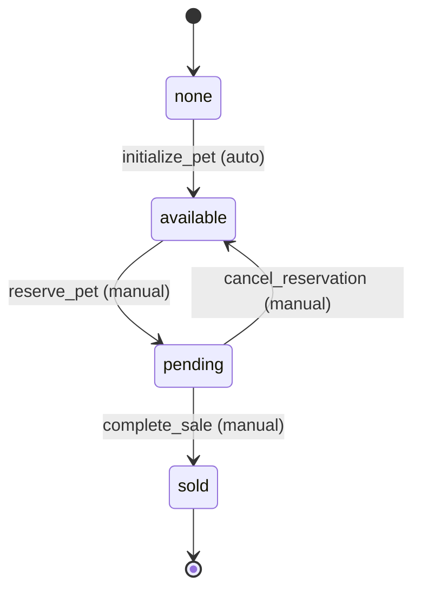
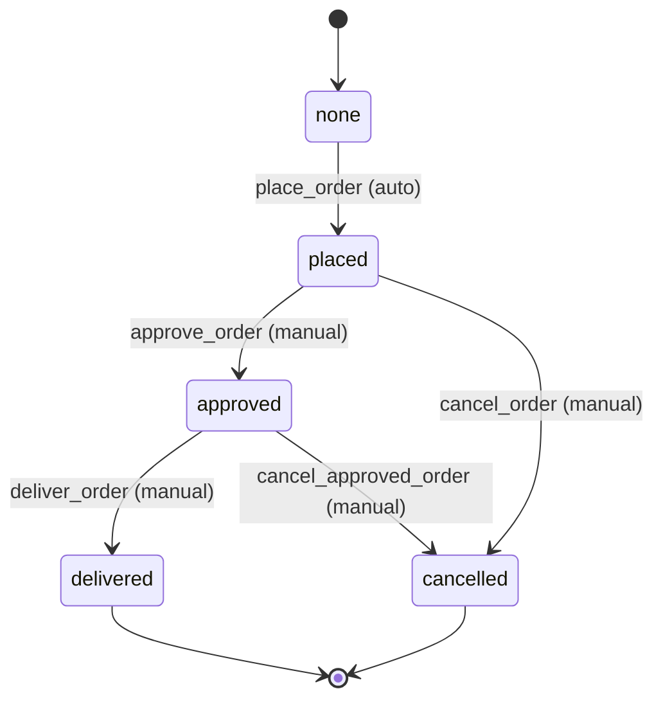
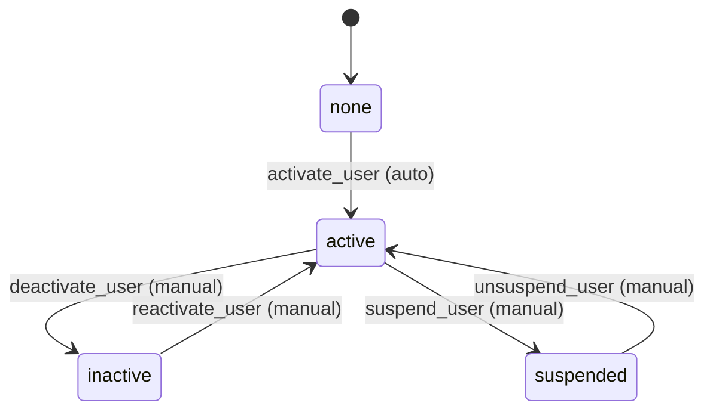
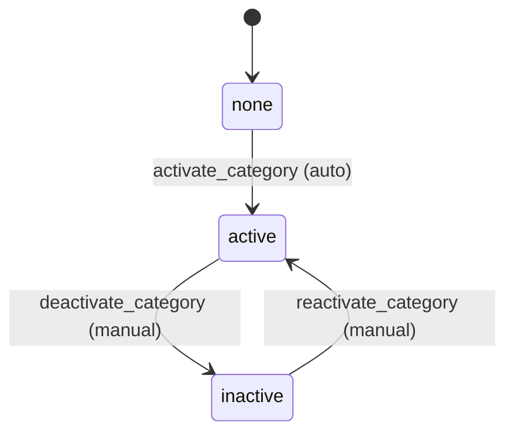
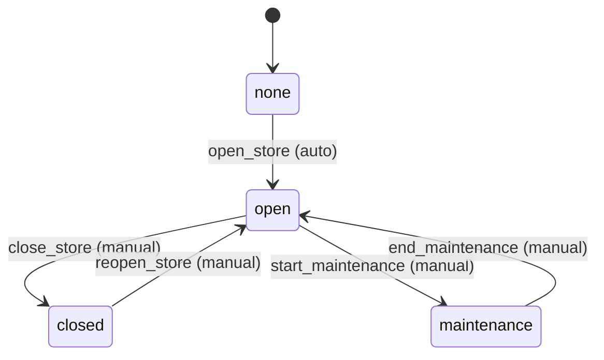

# Purrfect Pets - Workflow Requirements

## Overview
This document defines the workflow states and transitions for each entity in the Purrfect Pets API. Each entity has its own workflow that manages state transitions through business processes.

## Workflow Definitions

### 1. Pet Workflow

**Description**: Manages the lifecycle of pets in the store from creation to sale.

**States**:
- `none` (initial) - Pet entity created but not yet available
- `available` - Pet is available for purchase
- `pending` - Pet has been reserved/ordered but not yet sold
- `sold` - Pet has been sold and is no longer available

**Transitions**:
1. `initialize_pet` (automatic): none → available
   - **Processor**: PetInitializationProcessor
   - **Description**: Validates pet data and makes it available for sale

2. `reserve_pet` (manual): available → pending
   - **Processor**: PetReservationProcessor
   - **Description**: Reserves pet when an order is placed

3. `complete_sale` (manual): pending → sold
   - **Processor**: PetSaleCompletionProcessor
   - **Description**: Finalizes pet sale when order is delivered

4. `cancel_reservation` (manual): pending → available
   - **Processor**: PetReservationCancellationProcessor
   - **Description**: Returns pet to available when order is cancelled

```mermaid
stateDiagram-v2
    [*] --> none
    none --> available : initialize_pet (auto)
    available --> pending : reserve_pet (manual)
    pending --> sold : complete_sale (manual)
    pending --> available : cancel_reservation (manual)
    sold --> [*]
```

### 2. Order Workflow

**Description**: Manages the order lifecycle from placement to delivery.

**States**:
- `none` (initial) - Order entity created but not yet placed
- `placed` - Order has been placed by customer
- `approved` - Order has been approved by store
- `delivered` - Order has been delivered to customer
- `cancelled` - Order has been cancelled

**Transitions**:
1. `place_order` (automatic): none → placed
   - **Processor**: OrderPlacementProcessor
   - **Description**: Validates order and reserves pet

2. `approve_order` (manual): placed → approved
   - **Processor**: OrderApprovalProcessor
   - **Criterion**: OrderApprovalCriterion
   - **Description**: Approves order if pet is available and user is valid

3. `deliver_order` (manual): approved → delivered
   - **Processor**: OrderDeliveryProcessor
   - **Description**: Marks order as delivered and completes pet sale

4. `cancel_order` (manual): placed → cancelled
   - **Processor**: OrderCancellationProcessor
   - **Description**: Cancels order and releases pet reservation

5. `cancel_approved_order` (manual): approved → cancelled
   - **Processor**: OrderCancellationProcessor
   - **Description**: Cancels approved order and releases pet reservation

```mermaid
stateDiagram-v2
    [*] --> none
    none --> placed : place_order (auto)
    placed --> approved : approve_order (manual)
    placed --> cancelled : cancel_order (manual)
    approved --> delivered : deliver_order (manual)
    approved --> cancelled : cancel_approved_order (manual)
    delivered --> [*]
    cancelled --> [*]
```

### 3. User Workflow

**Description**: Manages user account lifecycle and status.

**States**:
- `none` (initial) - User account created but not yet active
- `active` - User account is active and can place orders
- `inactive` - User account is temporarily inactive
- `suspended` - User account is suspended due to violations

**Transitions**:
1. `activate_user` (automatic): none → active
   - **Processor**: UserActivationProcessor
   - **Description**: Validates user data and activates account

2. `deactivate_user` (manual): active → inactive
   - **Processor**: UserDeactivationProcessor
   - **Description**: Deactivates user account temporarily

3. `reactivate_user` (manual): inactive → active
   - **Processor**: UserReactivationProcessor
   - **Description**: Reactivates previously inactive user

4. `suspend_user` (manual): active → suspended
   - **Processor**: UserSuspensionProcessor
   - **Description**: Suspends user for policy violations

5. `unsuspend_user` (manual): suspended → active
   - **Processor**: UserUnsuspensionProcessor
   - **Criterion**: UserUnsuspensionCriterion
   - **Description**: Removes suspension if conditions are met

```mermaid
stateDiagram-v2
    [*] --> none
    none --> active : activate_user (auto)
    active --> inactive : deactivate_user (manual)
    active --> suspended : suspend_user (manual)
    inactive --> active : reactivate_user (manual)
    suspended --> active : unsuspend_user (manual)
```

### 4. Category Workflow

**Description**: Simple workflow for category management.

**States**:
- `none` (initial) - Category created but not yet active
- `active` - Category is active and can be used
- `inactive` - Category is inactive and cannot be used

**Transitions**:
1. `activate_category` (automatic): none → active
   - **Processor**: CategoryActivationProcessor
   - **Description**: Validates category data and activates it

2. `deactivate_category` (manual): active → inactive
   - **Processor**: CategoryDeactivationProcessor
   - **Criterion**: CategoryDeactivationCriterion
   - **Description**: Deactivates category if no pets are using it

3. `reactivate_category` (manual): inactive → active
   - **Processor**: CategoryReactivationProcessor
   - **Description**: Reactivates previously inactive category

```mermaid
stateDiagram-v2
    [*] --> none
    none --> active : activate_category (auto)
    active --> inactive : deactivate_category (manual)
    inactive --> active : reactivate_category (manual)
```

### 5. Tag Workflow

**Description**: Simple workflow for tag management.

**States**:
- `none` (initial) - Tag created but not yet active
- `active` - Tag is active and can be used
- `inactive` - Tag is inactive and cannot be used

**Transitions**:
1. `activate_tag` (automatic): none → active
   - **Processor**: TagActivationProcessor
   - **Description**: Validates tag data and activates it

2. `deactivate_tag` (manual): active → inactive
   - **Processor**: TagDeactivationProcessor
   - **Description**: Deactivates tag

3. `reactivate_tag` (manual): inactive → active
   - **Processor**: TagReactivationProcessor
   - **Description**: Reactivates previously inactive tag

```mermaid
stateDiagram-v2
    [*] --> none
    none --> active : activate_tag (auto)
    active --> inactive : deactivate_tag (manual)
    inactive --> active : reactivate_tag (manual)
```

### 6. Store Workflow

**Description**: Manages store operational status.

**States**:
- `none` (initial) - Store created but not yet open
- `open` - Store is open for business
- `closed` - Store is temporarily closed
- `maintenance` - Store is under maintenance

**Transitions**:
1. `open_store` (automatic): none → open
   - **Processor**: StoreOpeningProcessor
   - **Description**: Validates store data and opens for business

2. `close_store` (manual): open → closed
   - **Processor**: StoreClosingProcessor
   - **Description**: Temporarily closes store

3. `reopen_store` (manual): closed → open
   - **Processor**: StoreReopeningProcessor
   - **Description**: Reopens previously closed store

4. `start_maintenance` (manual): open → maintenance
   - **Processor**: StoreMaintenanceProcessor
   - **Description**: Puts store in maintenance mode

5. `end_maintenance` (manual): maintenance → open
   - **Processor**: StoreMaintenanceEndProcessor
   - **Description**: Ends maintenance and reopens store

```mermaid
stateDiagram-v2
    [*] --> none
    none --> open : open_store (auto)
    open --> closed : close_store (manual)
    open --> maintenance : start_maintenance (manual)
    closed --> open : reopen_store (manual)
    maintenance --> open : end_maintenance (manual)
```

## Workflow Rules

1. **Initial Transitions**: All workflows start with an automatic transition from `none` to the first active state
2. **Manual Transitions**: All subsequent transitions are manual and triggered by API calls
3. **Loop Transitions**: Transitions that return to previous states are always manual
4. **Processors**: Each transition may have a processor for business logic
5. **Criteria**: Some transitions have criteria for conditional logic
6. **State Access**: Current state is accessed via `entity.meta.state`
7. **State Management**: States are managed automatically by the workflow system
