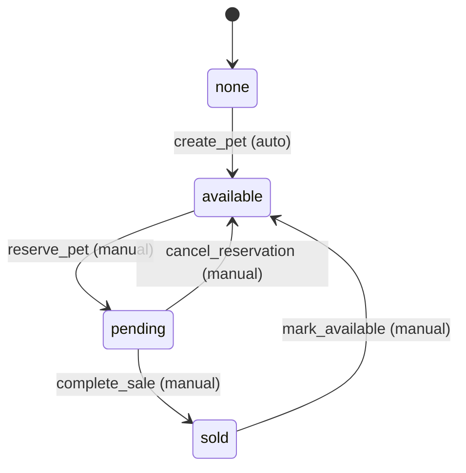
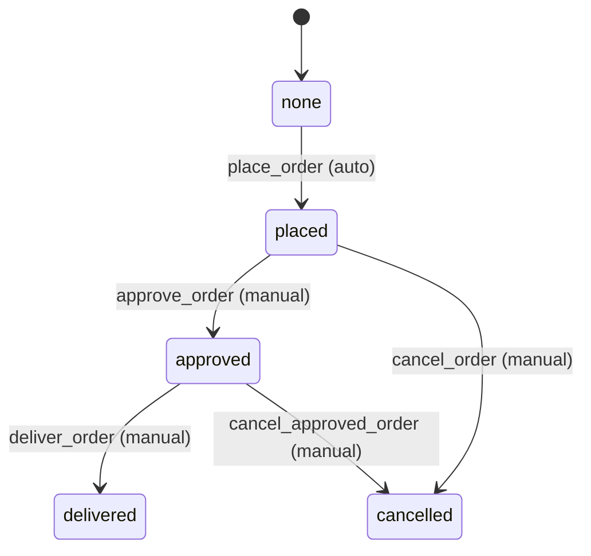
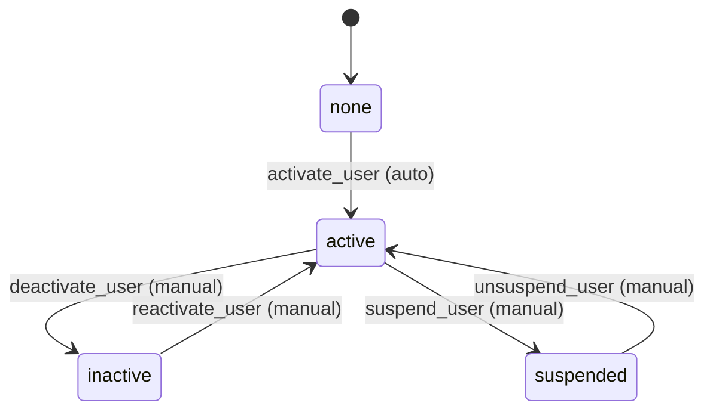
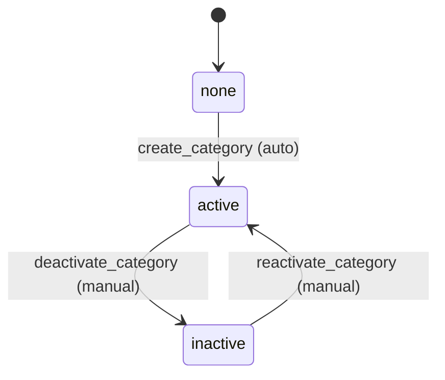
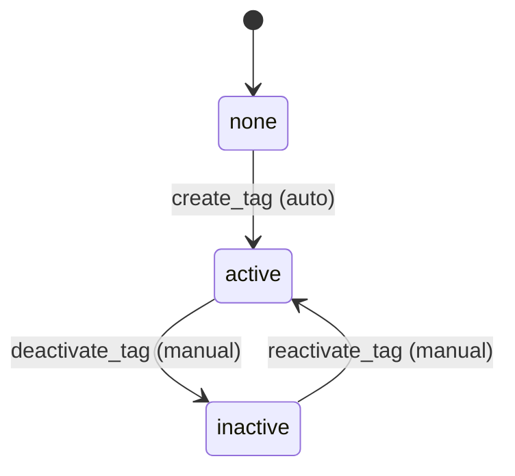
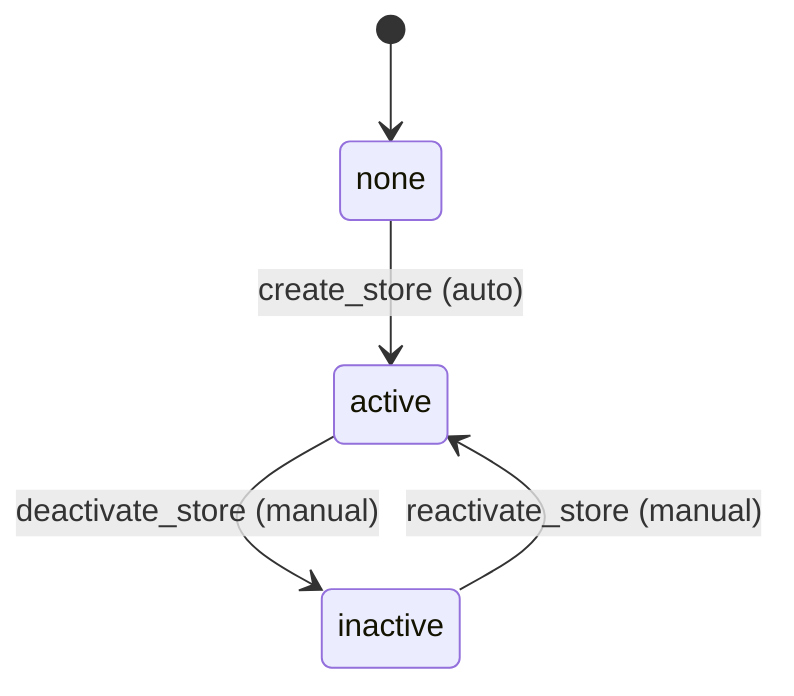

# Purrfect Pets - Workflow Requirements

## Overview
This document defines the workflows for each entity in the Purrfect Pets application. Each workflow represents the lifecycle and state transitions for the respective entity.

## 1. Pet Workflow

**Description**: Manages the lifecycle of pets in the store from availability to sale.

**States**:
- `none` (initial state)
- `available` - Pet is available for purchase
- `pending` - Pet is reserved/pending purchase
- `sold` - Pet has been sold

**Transitions**:
1. `create_pet` (none → available) - Automatic transition when pet is created
2. `reserve_pet` (available → pending) - Manual transition when pet is reserved
3. `complete_sale` (pending → sold) - Manual transition when sale is completed
4. `cancel_reservation` (pending → available) - Manual transition to cancel reservation
5. `mark_available` (sold → available) - Manual transition if sale is cancelled

**Processors**:
- `PetCreationProcessor` - Validates pet data on creation
- `PetReservationProcessor` - Handles pet reservation logic
- `PetSaleProcessor` - Processes pet sale completion

**Criteria**:
- `PetAvailabilityCriterion` - Checks if pet is available for reservation
- `PetReservationValidCriterion` - Validates reservation conditions


```mermaid
stateDiagram-v2
    [*] --> none
    none --> available : create_pet (auto)
    available --> pending : reserve_pet (manual)
    pending --> sold : complete_sale (manual)
    pending --> available : cancel_reservation (manual)
    sold --> available : mark_available (manual)
```

## 2. Order Workflow

**Description**: Manages the order lifecycle from placement to delivery.

**States**:
- `none` (initial state)
- `placed` - Order has been placed
- `approved` - Order has been approved for processing
- `delivered` - Order has been delivered
- `cancelled` - Order has been cancelled

**Transitions**:
1. `place_order` (none → placed) - Automatic transition when order is created
2. `approve_order` (placed → approved) - Manual transition for order approval
3. `deliver_order` (approved → delivered) - Manual transition when order is delivered
4. `cancel_order` (placed → cancelled) - Manual transition to cancel order
5. `cancel_approved_order` (approved → cancelled) - Manual transition to cancel approved order

**Processors**:
- `OrderCreationProcessor` - Validates order data and reserves pet
- `OrderApprovalProcessor` - Processes order approval
- `OrderDeliveryProcessor` - Handles order delivery
- `OrderCancellationProcessor` - Processes order cancellation

**Criteria**:
- `OrderValidationCriterion` - Validates order data
- `PetAvailableForOrderCriterion` - Checks if pet is available for ordering


```mermaid
stateDiagram-v2
    [*] --> none
    none --> placed : place_order (auto)
    placed --> approved : approve_order (manual)
    placed --> cancelled : cancel_order (manual)
    approved --> delivered : deliver_order (manual)
    approved --> cancelled : cancel_approved_order (manual)
```

## 3. User Workflow

**Description**: Manages user account lifecycle and status.

**States**:
- `none` (initial state)
- `active` - User account is active
- `inactive` - User account is temporarily inactive
- `suspended` - User account is suspended

**Transitions**:
1. `activate_user` (none → active) - Automatic transition when user is created
2. `deactivate_user` (active → inactive) - Manual transition to deactivate user
3. `suspend_user` (active → suspended) - Manual transition to suspend user
4. `reactivate_user` (inactive → active) - Manual transition to reactivate user
5. `unsuspend_user` (suspended → active) - Manual transition to unsuspend user

**Processors**:
- `UserCreationProcessor` - Validates user data and sets up account
- `UserDeactivationProcessor` - Handles user deactivation
- `UserSuspensionProcessor` - Processes user suspension

**Criteria**:
- `UserValidationCriterion` - Validates user registration data
- `UserPermissionCriterion` - Checks user permissions for actions


```mermaid
stateDiagram-v2
    [*] --> none
    none --> active : activate_user (auto)
    active --> inactive : deactivate_user (manual)
    active --> suspended : suspend_user (manual)
    inactive --> active : reactivate_user (manual)
    suspended --> active : unsuspend_user (manual)
```

## 4. Category Workflow

**Description**: Simple workflow for category management.

**States**:
- `none` (initial state)
- `active` - Category is active and available
- `inactive` - Category is inactive

**Transitions**:
1. `create_category` (none → active) - Automatic transition when category is created
2. `deactivate_category` (active → inactive) - Manual transition to deactivate category
3. `reactivate_category` (inactive → active) - Manual transition to reactivate category

**Processors**:
- `CategoryCreationProcessor` - Validates category data

**Criteria**:
- `CategoryValidationCriterion` - Validates category data


```mermaid
stateDiagram-v2
    [*] --> none
    none --> active : create_category (auto)
    active --> inactive : deactivate_category (manual)
    inactive --> active : reactivate_category (manual)
```

## 5. Tag Workflow

**Description**: Simple workflow for tag management.

**States**:
- `none` (initial state)
- `active` - Tag is active and available
- `inactive` - Tag is inactive

**Transitions**:
1. `create_tag` (none → active) - Automatic transition when tag is created
2. `deactivate_tag` (active → inactive) - Manual transition to deactivate tag
3. `reactivate_tag` (inactive → active) - Manual transition to reactivate tag

**Processors**:
- `TagCreationProcessor` - Validates tag data

**Criteria**:
- `TagValidationCriterion` - Validates tag data


```mermaid
stateDiagram-v2
    [*] --> none
    none --> active : create_tag (auto)
    active --> inactive : deactivate_tag (manual)
    inactive --> active : reactivate_tag (manual)
```

## 6. Store Workflow

**Description**: Simple workflow for store management.

**States**:
- `none` (initial state)
- `active` - Store is active and operational
- `inactive` - Store is inactive

**Transitions**:
1. `create_store` (none → active) - Automatic transition when store is created
2. `deactivate_store` (active → inactive) - Manual transition to deactivate store
3. `reactivate_store` (inactive → active) - Manual transition to reactivate store

**Processors**:
- `StoreCreationProcessor` - Validates store data

**Criteria**:
- `StoreValidationCriterion` - Validates store data


```mermaid
stateDiagram-v2
    [*] --> none
    none --> active : create_store (auto)
    active --> inactive : deactivate_store (manual)
    inactive --> active : reactivate_store (manual)
```

## Workflow Configuration Notes

### Transition Types
- **Automatic**: Triggered automatically by the system (first transition from `none`)
- **Manual**: Triggered by user action or API call

### Processor Configuration
All processors should use the following configuration:
```json
{
  "executionMode": "SYNC",
  "config": {
    "attachEntity": true,
    "calculationNodesTags": "cyoda_application",
    "responseTimeoutMs": 3000,
    "retryPolicy": "FIXED"
  }
}
```

### Criterion Configuration
All criteria should use the following configuration:
```json
{
  "config": {
    "attachEntity": true,
    "calculationNodesTags": "cyoda_application",
    "responseTimeoutMs": 5000,
    "retryPolicy": "FIXED"
  }
}
```

### State Management Rules
1. All entities start in the `none` state
2. First transition is always automatic and moves to the primary active state
3. Manual transitions require explicit API calls with transition names
4. State changes trigger appropriate processors and criteria
5. Invalid state transitions are prevented by the workflow engine
