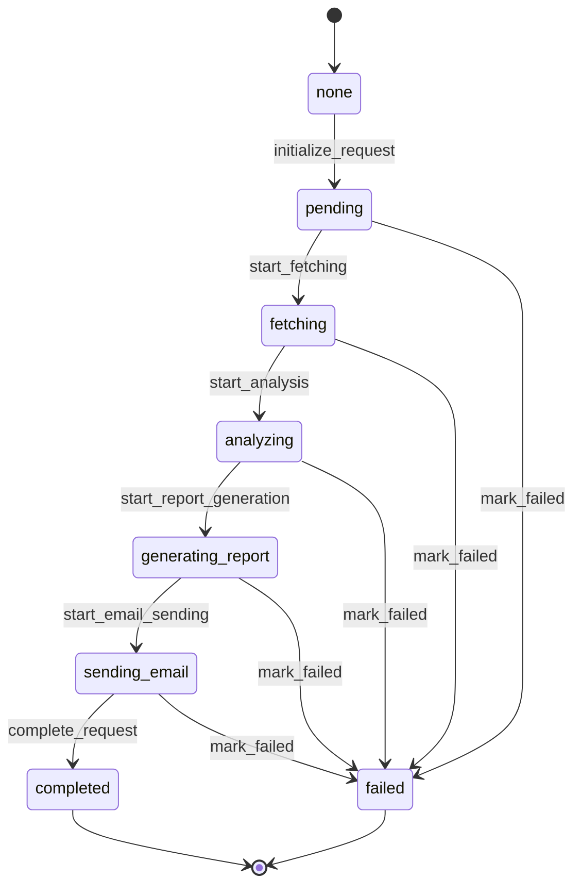
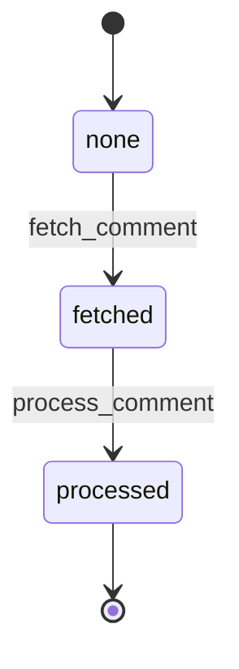
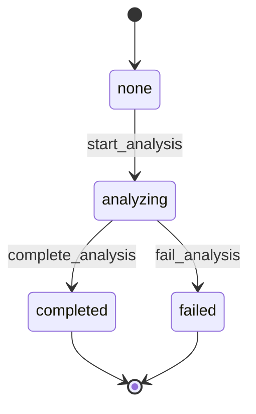
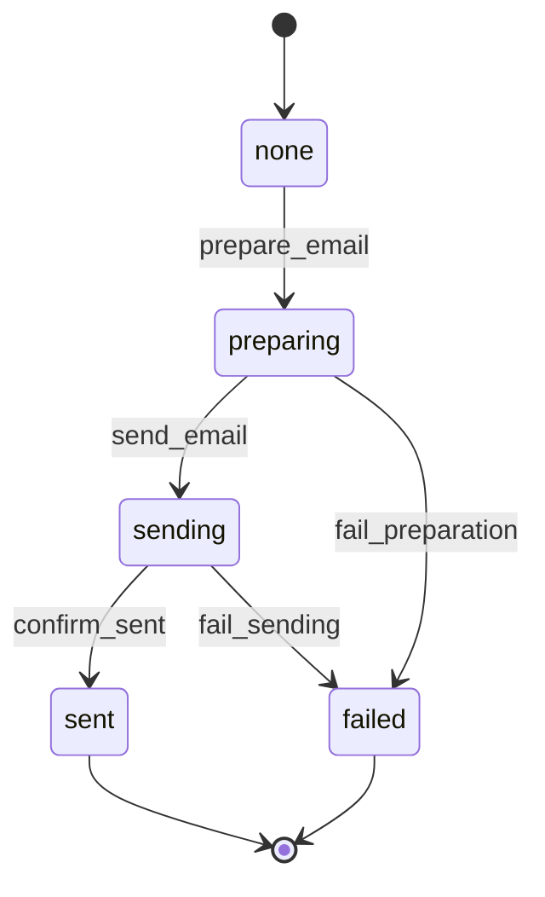

# Workflows

## 1. CommentAnalysisRequest Workflow

**Description**: Manages the complete lifecycle of a comment analysis request from creation to completion.

**States**:
- `none` (initial state)
- `pending` (request created, waiting to fetch comments)
- `fetching` (fetching comments from API)
- `analyzing` (analyzing fetched comments)
- `generating_report` (generating analysis report)
- `sending_email` (sending email with report)
- `completed` (process completed successfully)
- `failed` (process failed at any stage)

**Transitions**:

1. `none` → `pending`
   - **Name**: `initialize_request`
   - **Type**: Automatic
   - **Processor**: `CommentAnalysisRequestInitializeProcessor`
   - **Criterion**: None

2. `pending` → `fetching`
   - **Name**: `start_fetching`
   - **Type**: Automatic
   - **Processor**: `CommentAnalysisRequestStartFetchingProcessor`
   - **Criterion**: None

3. `fetching` → `analyzing`
   - **Name**: `start_analysis`
   - **Type**: Automatic
   - **Processor**: `CommentAnalysisRequestStartAnalysisProcessor`
   - **Criterion**: `CommentAnalysisRequestFetchCompleteCriterion`

4. `analyzing` → `generating_report`
   - **Name**: `start_report_generation`
   - **Type**: Automatic
   - **Processor**: `CommentAnalysisRequestStartReportProcessor`
   - **Criterion**: `CommentAnalysisRequestAnalysisCompleteCriterion`

5. `generating_report` → `sending_email`
   - **Name**: `start_email_sending`
   - **Type**: Automatic
   - **Processor**: `CommentAnalysisRequestStartEmailProcessor`
   - **Criterion**: `CommentAnalysisRequestReportCompleteCriterion`

6. `sending_email` → `completed`
   - **Name**: `complete_request`
   - **Type**: Automatic
   - **Processor**: `CommentAnalysisRequestCompleteProcessor`
   - **Criterion**: `CommentAnalysisRequestEmailSentCriterion`

7. Any state → `failed`
   - **Name**: `mark_failed`
   - **Type**: Manual
   - **Processor**: `CommentAnalysisRequestFailProcessor`
   - **Criterion**: None

```mermaid
stateDiagram-v2
    [*] --> none
    none --> pending : initialize_request
    pending --> fetching : start_fetching
    fetching --> analyzing : start_analysis
    analyzing --> generating_report : start_report_generation
    generating_report --> sending_email : start_email_sending
    sending_email --> completed : complete_request
    pending --> failed : mark_failed
    fetching --> failed : mark_failed
    analyzing --> failed : mark_failed
    generating_report --> failed : mark_failed
    sending_email --> failed : mark_failed
    completed --> [*]
    failed --> [*]
```

---

## 2. Comment Workflow

**Description**: Manages the lifecycle of individual comments from fetching to processing.

**States**:
- `none` (initial state)
- `fetched` (comment successfully fetched from API)
- `processed` (comment has been included in analysis)

**Transitions**:

1. `none` → `fetched`
   - **Name**: `fetch_comment`
   - **Type**: Automatic
   - **Processor**: `CommentFetchProcessor`
   - **Criterion**: None

2. `fetched` → `processed`
   - **Name**: `process_comment`
   - **Type**: Automatic
   - **Processor**: `CommentProcessProcessor`
   - **Criterion**: None

```mermaid
stateDiagram-v2
    [*] --> none
    none --> fetched : fetch_comment
    fetched --> processed : process_comment
    processed --> [*]
```

---

## 3. CommentAnalysis Workflow

**Description**: Manages the analysis process of comments.

**States**:
- `none` (initial state)
- `analyzing` (analysis in progress)
- `completed` (analysis completed successfully)
- `failed` (analysis failed)

**Transitions**:

1. `none` → `analyzing`
   - **Name**: `start_analysis`
   - **Type**: Automatic
   - **Processor**: `CommentAnalysisStartProcessor`
   - **Criterion**: None

2. `analyzing` → `completed`
   - **Name**: `complete_analysis`
   - **Type**: Automatic
   - **Processor**: `CommentAnalysisCompleteProcessor`
   - **Criterion**: `CommentAnalysisValidCriterion`

3. `analyzing` → `failed`
   - **Name**: `fail_analysis`
   - **Type**: Manual
   - **Processor**: `CommentAnalysisFailProcessor`
   - **Criterion**: None

```mermaid
stateDiagram-v2
    [*] --> none
    none --> analyzing : start_analysis
    analyzing --> completed : complete_analysis
    analyzing --> failed : fail_analysis
    completed --> [*]
    failed --> [*]
```

---

## 4. EmailReport Workflow

**Description**: Manages the email report generation and sending process.

**States**:
- `none` (initial state)
- `preparing` (preparing email content)
- `sending` (email being sent)
- `sent` (email successfully sent)
- `failed` (email sending failed)

**Transitions**:

1. `none` → `preparing`
   - **Name**: `prepare_email`
   - **Type**: Automatic
   - **Processor**: `EmailReportPrepareProcessor`
   - **Criterion**: None

2. `preparing` → `sending`
   - **Name**: `send_email`
   - **Type**: Automatic
   - **Processor**: `EmailReportSendProcessor`
   - **Criterion**: `EmailReportContentReadyCriterion`

3. `sending` → `sent`
   - **Name**: `confirm_sent`
   - **Type**: Automatic
   - **Processor**: `EmailReportConfirmProcessor`
   - **Criterion**: `EmailReportSentCriterion`

4. `preparing` → `failed`
   - **Name**: `fail_preparation`
   - **Type**: Manual
   - **Processor**: `EmailReportFailProcessor`
   - **Criterion**: None

5. `sending` → `failed`
   - **Name**: `fail_sending`
   - **Type**: Manual
   - **Processor**: `EmailReportFailProcessor`
   - **Criterion**: None

```mermaid
stateDiagram-v2
    [*] --> none
    none --> preparing : prepare_email
    preparing --> sending : send_email
    sending --> sent : confirm_sent
    preparing --> failed : fail_preparation
    sending --> failed : fail_sending
    sent --> [*]
    failed --> [*]
```
