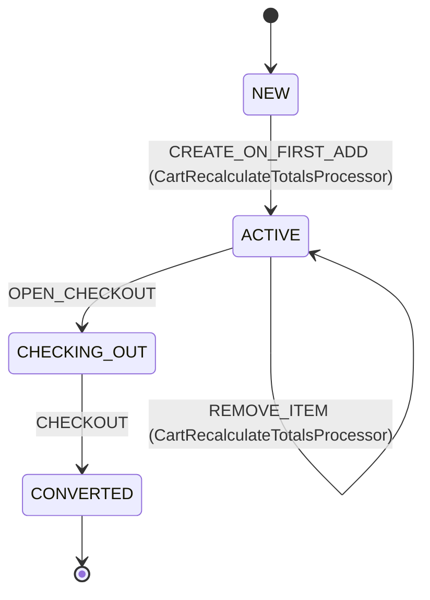
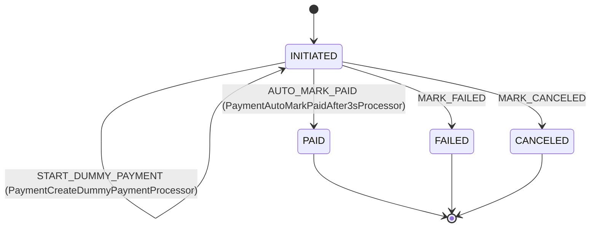
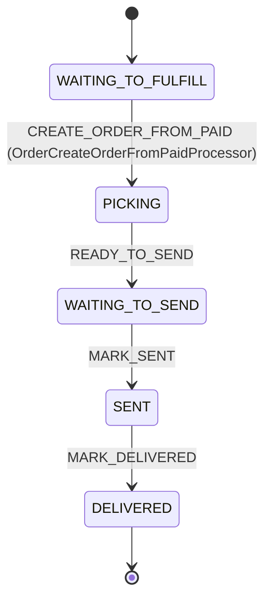
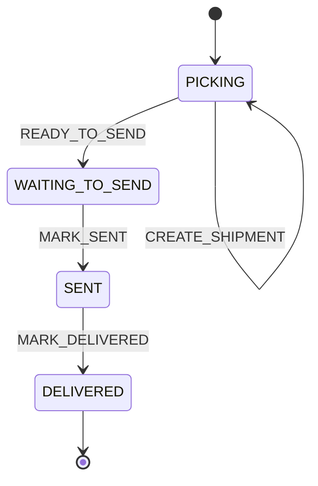

# Workflow Requirements

This document defines the detailed workflow requirements for all entities in the Cyoda OMS Backend system.

## Workflow Overview

Each entity has its own workflow that manages state transitions through business processes. All workflows start from an initial state and progress through defined transitions.

## 1. Cart Workflow (CartFlow)

**Purpose**: Manages shopping cart lifecycle from creation to conversion.

**States**: NEW → ACTIVE → CHECKING_OUT → CONVERTED

**Initial State**: NEW

### Transitions

1. **CREATE_ON_FIRST_ADD**
   - From: NEW
   - To: ACTIVE
   - Type: Automatic (first transition from initial state)
   - Processor: CartRecalculateTotalsProcessor
   - Description: Creates cart, adds first line item, and recalculates totals

2. **ADD_ITEM**
   - From: ACTIVE
   - To: ACTIVE (stays in same state)
   - Type: Manual
   - Processor: CartRecalculateTotalsProcessor
   - Description: Adds or increments item quantity and recalculates totals

3. **DECREMENT_ITEM**
   - From: ACTIVE
   - To: ACTIVE (stays in same state)
   - Type: Manual
   - Processor: CartRecalculateTotalsProcessor
   - Description: Decrements item quantity and recalculates totals

4. **REMOVE_ITEM**
   - From: ACTIVE
   - To: ACTIVE (stays in same state)
   - Type: Manual
   - Processor: CartRecalculateTotalsProcessor
   - Description: Removes item from cart and recalculates totals

5. **OPEN_CHECKOUT**
   - From: ACTIVE
   - To: CHECKING_OUT
   - Type: Manual
   - Description: Initiates checkout process

6. **CHECKOUT**
   - From: CHECKING_OUT
   - To: CONVERTED
   - Type: Manual
   - Description: Completes checkout and signals orchestration

### Mermaid Diagram

```mermaid
stateDiagram-v2
    [*] --> NEW
    NEW --> ACTIVE : CREATE_ON_FIRST_ADD (CartRecalculateTotalsProcessor)
    ACTIVE --> ACTIVE : ADD_ITEM (CartRecalculateTotalsProcessor)
    ACTIVE --> ACTIVE : DECREMENT_ITEM (CartRecalculateTotalsProcessor)
    ACTIVE --> ACTIVE : REMOVE_ITEM (CartRecalculateTotalsProcessor)
    ACTIVE --> CHECKING_OUT : OPEN_CHECKOUT
    CHECKING_OUT --> CONVERTED : CHECKOUT
    CONVERTED --> [*]
```

## 2. Payment Workflow (PaymentFlow)

**Purpose**: Manages dummy payment processing with auto-approval.

**States**: INITIATED → PAID | FAILED | CANCELED

**Initial State**: INITIATED

### Transitions

1. **START_DUMMY_PAYMENT**
   - From: INITIATED (initial state)
   - To: INITIATED (stays in same state)
   - Type: Automatic (first transition from initial state)
   - Processor: PaymentCreateDummyPaymentProcessor
   - Description: Creates payment record in INITIATED state

2. **AUTO_MARK_PAID**
   - From: INITIATED
   - To: PAID
   - Type: Automatic
   - Processor: PaymentAutoMarkPaidAfter3sProcessor
   - Description: Automatically marks payment as PAID after ~3 seconds

3. **MARK_FAILED**
   - From: INITIATED
   - To: FAILED
   - Type: Manual
   - Description: Marks payment as failed (for error scenarios)

4. **MARK_CANCELED**
   - From: INITIATED
   - To: CANCELED
   - Type: Manual
   - Description: Cancels payment (for cancellation scenarios)

### Mermaid Diagram

```mermaid
stateDiagram-v2
    [*] --> INITIATED
    INITIATED --> INITIATED : START_DUMMY_PAYMENT (PaymentCreateDummyPaymentProcessor)
    INITIATED --> PAID : AUTO_MARK_PAID (PaymentAutoMarkPaidAfter3sProcessor)
    INITIATED --> FAILED : MARK_FAILED
    INITIATED --> CANCELED : MARK_CANCELED
    PAID --> [*]
    FAILED --> [*]
    CANCELED --> [*]
```

## 3. Order Workflow (OrderLifecycle)

**Purpose**: Manages order fulfillment from creation to delivery.

**States**: WAITING_TO_FULFILL → PICKING → WAITING_TO_SEND → SENT → DELIVERED

**Initial State**: WAITING_TO_FULFILL

### Transitions

1. **CREATE_ORDER_FROM_PAID**
   - From: WAITING_TO_FULFILL (initial state)
   - To: PICKING
   - Type: Automatic (first transition from initial state)
   - Processor: OrderCreateOrderFromPaidProcessor
   - Description: Creates order from paid cart, decrements stock, creates shipment

2. **READY_TO_SEND**
   - From: PICKING
   - To: WAITING_TO_SEND
   - Type: Manual
   - Description: Order is picked and ready for shipment

3. **MARK_SENT**
   - From: WAITING_TO_SEND
   - To: SENT
   - Type: Manual
   - Description: Order has been shipped

4. **MARK_DELIVERED**
   - From: SENT
   - To: DELIVERED
   - Type: Manual
   - Description: Order has been delivered to customer

### Mermaid Diagram

```mermaid
stateDiagram-v2
    [*] --> WAITING_TO_FULFILL
    WAITING_TO_FULFILL --> PICKING : CREATE_ORDER_FROM_PAID (OrderCreateOrderFromPaidProcessor)
    PICKING --> WAITING_TO_SEND : READY_TO_SEND
    WAITING_TO_SEND --> SENT : MARK_SENT
    SENT --> DELIVERED : MARK_DELIVERED
    DELIVERED --> [*]
```

## 4. Shipment Workflow (ShipmentLifecycle)

**Purpose**: Manages shipment processing in parallel with order workflow.

**States**: PICKING → WAITING_TO_SEND → SENT → DELIVERED

**Initial State**: PICKING

### Transitions

1. **CREATE_SHIPMENT**
   - From: PICKING (initial state)
   - To: PICKING (stays in same state)
   - Type: Automatic (first transition from initial state)
   - Description: Creates shipment record when order is created

2. **READY_TO_SEND**
   - From: PICKING
   - To: WAITING_TO_SEND
   - Type: Manual
   - Description: Shipment is picked and ready to send

3. **MARK_SENT**
   - From: WAITING_TO_SEND
   - To: SENT
   - Type: Manual
   - Description: Shipment has been sent

4. **MARK_DELIVERED**
   - From: SENT
   - To: DELIVERED
   - Type: Manual
   - Description: Shipment has been delivered

### Mermaid Diagram

```mermaid
stateDiagram-v2
    [*] --> PICKING
    PICKING --> PICKING : CREATE_SHIPMENT
    PICKING --> WAITING_TO_SEND : READY_TO_SEND
    WAITING_TO_SEND --> SENT : MARK_SENT
    SENT --> DELIVERED : MARK_DELIVERED
    DELIVERED --> [*]
```

## Workflow Orchestration

### Order Creation Flow
1. Cart reaches CONVERTED state
2. Payment reaches PAID state
3. Order workflow triggered with CREATE_ORDER_FROM_PAID
4. Shipment automatically created in PICKING state
5. Order and Shipment states advance together

### State Synchronization
- Order and Shipment states are synchronized
- Order state derives from Shipment state in most cases
- Both entities progress through similar state transitions

## Business Rules

1. **Automatic Transitions**: First transition from initial state is always automatic
2. **Manual Transitions**: Loop transitions and state reversals are manual
3. **Processor Requirements**: Complex business logic requires processors
4. **State Validation**: Transitions only allowed from valid current states
5. **Orchestration**: Cross-entity workflows coordinate through processors
