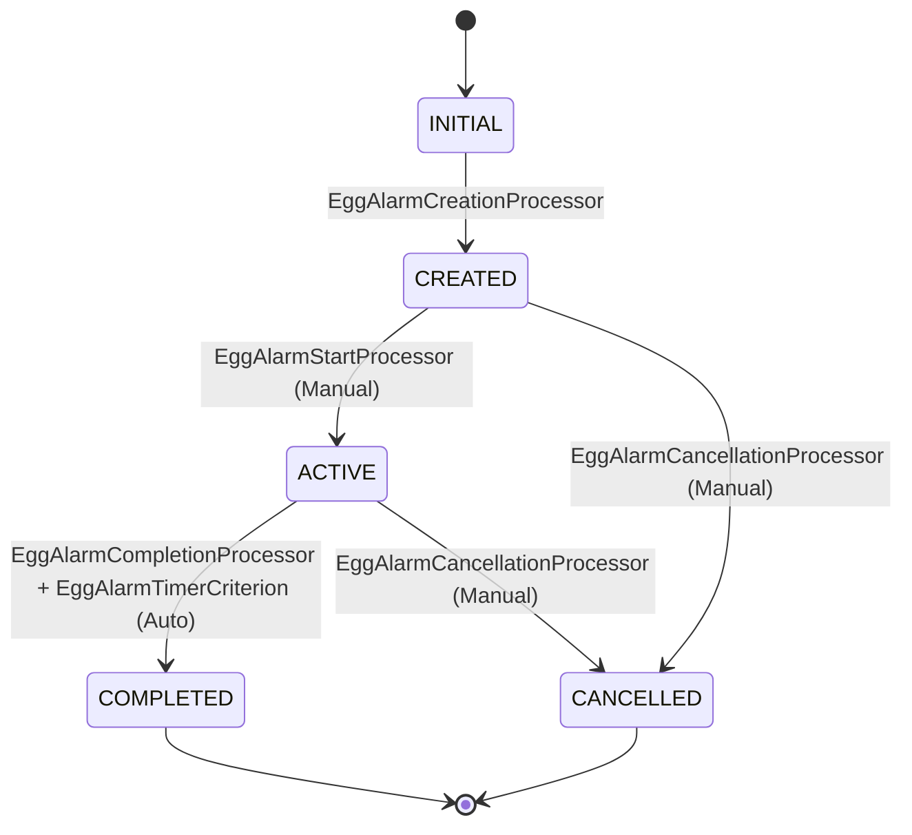

# Workflows Requirements

## EggAlarm Workflow

### Description
The EggAlarm workflow manages the lifecycle of an egg cooking alarm from creation to completion or cancellation.

### Workflow Name
`EggAlarm`

### States
- **INITIAL** - System initial state (not user-visible)
- **CREATED** - Alarm has been created with egg type selection
- **ACTIVE** - Alarm is currently running and timing the cooking
- **COMPLETED** - Alarm has finished and egg is ready
- **CANCELLED** - Alarm was cancelled before completion

### Transitions

| From State | To State | Type | Processor | Criterion | Description |
|------------|----------|------|-----------|-----------|-------------|
| INITIAL | CREATED | Automatic | EggAlarmCreationProcessor | - | Creates new egg alarm with selected type |
| CREATED | ACTIVE | Manual | EggAlarmStartProcessor | - | Starts the alarm timer |
| CREATED | CANCELLED | Manual | EggAlarmCancellationProcessor | - | Cancels alarm before starting |
| ACTIVE | COMPLETED | Automatic | EggAlarmCompletionProcessor | EggAlarmTimerCriterion | Completes alarm when timer expires |
| ACTIVE | CANCELLED | Manual | EggAlarmCancellationProcessor | - | Cancels active alarm |

### Transition Details

#### INITIAL → CREATED (Automatic)
- **Trigger**: New EggAlarm entity creation
- **Processor**: EggAlarmCreationProcessor
- **Purpose**: Initialize alarm with cooking time based on egg type
- **Business Logic**: Set cooking time based on egg type selection

#### CREATED → ACTIVE (Manual)
- **Trigger**: User starts the alarm
- **Processor**: EggAlarmStartProcessor  
- **Purpose**: Begin timing the cooking process
- **Business Logic**: Record start time and activate timer

#### CREATED → CANCELLED (Manual)
- **Trigger**: User cancels before starting
- **Processor**: EggAlarmCancellationProcessor
- **Purpose**: Cancel alarm that hasn't been started
- **Business Logic**: Mark alarm as cancelled

#### ACTIVE → COMPLETED (Automatic)
- **Trigger**: Timer expiration
- **Processor**: EggAlarmCompletionProcessor
- **Criterion**: EggAlarmTimerCriterion
- **Purpose**: Complete alarm when cooking time is reached
- **Business Logic**: Check if cooking time has elapsed and mark as completed

#### ACTIVE → CANCELLED (Manual)
- **Trigger**: User cancels active alarm
- **Processor**: EggAlarmCancellationProcessor
- **Purpose**: Cancel running alarm
- **Business Logic**: Stop timer and mark as cancelled

### Mermaid State Diagram

```mermaid
stateDiagram-v2
    [*] --> INITIAL
    INITIAL --> CREATED : EggAlarmCreationProcessor
    CREATED --> ACTIVE : EggAlarmStartProcessor (Manual)
    CREATED --> CANCELLED : EggAlarmCancellationProcessor (Manual)
    ACTIVE --> COMPLETED : EggAlarmCompletionProcessor + EggAlarmTimerCriterion (Auto)
    ACTIVE --> CANCELLED : EggAlarmCancellationProcessor (Manual)
    COMPLETED --> [*]
    CANCELLED --> [*]
```

### Business Rules
1. First transition from INITIAL to CREATED is always automatic
2. Manual transitions require explicit user action (API calls)
3. Automatic transition from ACTIVE to COMPLETED is triggered by timer expiration
4. Cancellation is possible from both CREATED and ACTIVE states
5. Once COMPLETED or CANCELLED, the alarm reaches a terminal state
