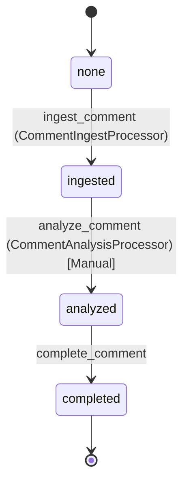
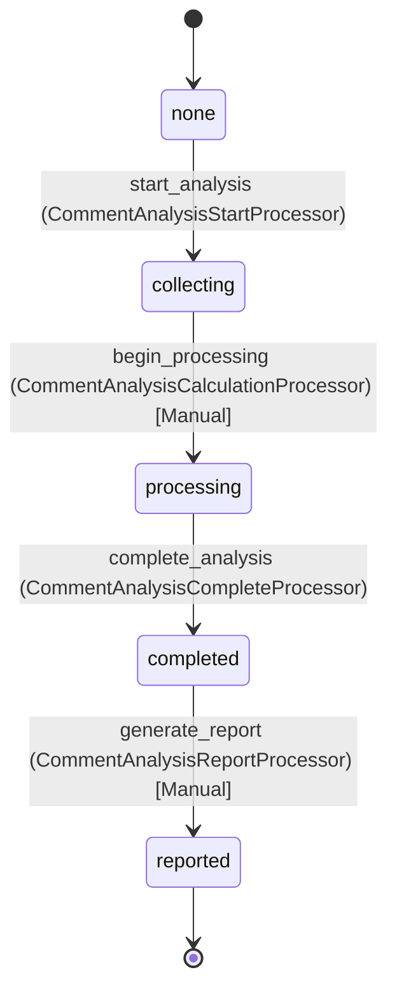
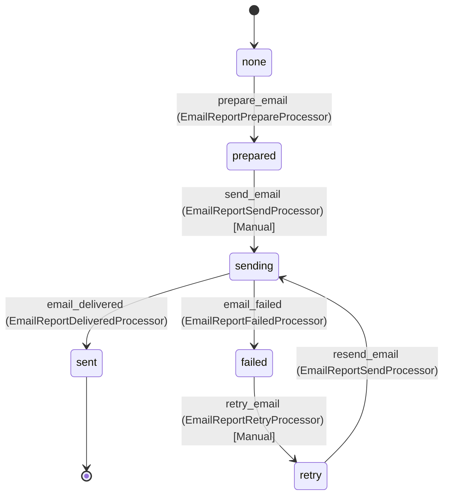

# Workflow Requirements

## Overview
This document defines the workflow requirements for the Comments Analysis Application. Each entity has its own workflow with states, transitions, processors, and criteria.

## 1. Comment Workflow

**Purpose**: Manages the lifecycle of individual comments from ingestion to analysis readiness.

**States**:
- `none` (initial): Comment entity created but not yet processed
- `ingested`: Comment data has been validated and stored
- `analyzed`: Comment has been included in analysis processing
- `completed`: Comment processing is complete

**Transitions**:

### none → ingested
- **Name**: `ingest_comment`
- **Type**: Automatic (triggered on entity creation)
- **Processor**: `CommentIngestProcessor`
- **Criterion**: None
- **Purpose**: Validate and enrich comment data from API

### ingested → analyzed  
- **Name**: `analyze_comment`
- **Type**: Manual (triggered by analysis request)
- **Processor**: `CommentAnalysisProcessor`
- **Criterion**: None
- **Purpose**: Mark comment as part of analysis batch

### analyzed → completed
- **Name**: `complete_comment`
- **Type**: Automatic
- **Processor**: None
- **Criterion**: None
- **Purpose**: Final state for processed comments

```mermaid
stateDiagram-v2
    [*] --> none
    none --> ingested : ingest_comment (CommentIngestProcessor)
    ingested --> analyzed : analyze_comment (CommentAnalysisProcessor) [Manual]
    analyzed --> completed : complete_comment
    completed --> [*]
```

## 2. CommentAnalysis Workflow

**Purpose**: Manages the analysis process for comments grouped by postId.

**States**:
- `none` (initial): Analysis entity created but not started
- `collecting`: Gathering comments for the specified postId
- `processing`: Performing statistical analysis on collected comments
- `completed`: Analysis finished, ready for email report
- `reported`: Email report has been generated and sent

**Transitions**:

### none → collecting
- **Name**: `start_analysis`
- **Type**: Automatic (triggered on entity creation)
- **Processor**: `CommentAnalysisStartProcessor`
- **Criterion**: None
- **Purpose**: Initialize analysis for a postId

### collecting → processing
- **Name**: `begin_processing`
- **Type**: Manual (triggered when all comments collected)
- **Processor**: `CommentAnalysisCalculationProcessor`
- **Criterion**: `CommentAnalysisReadyCriterion`
- **Purpose**: Start statistical analysis of comments

### processing → completed
- **Name**: `complete_analysis`
- **Type**: Automatic
- **Processor**: `CommentAnalysisCompleteProcessor`
- **Criterion**: None
- **Purpose**: Finalize analysis results

### completed → reported
- **Name**: `generate_report`
- **Type**: Manual (triggered by email request)
- **Processor**: `CommentAnalysisReportProcessor`
- **Criterion**: None
- **Purpose**: Create email report entity

```mermaid
stateDiagram-v2
    [*] --> none
    none --> collecting : start_analysis (CommentAnalysisStartProcessor)
    collecting --> processing : begin_processing (CommentAnalysisCalculationProcessor) [Manual]
    processing --> completed : complete_analysis (CommentAnalysisCompleteProcessor)
    completed --> reported : generate_report (CommentAnalysisReportProcessor) [Manual]
    reported --> [*]
```

## 3. EmailReport Workflow

**Purpose**: Manages email report generation and delivery.

**States**:
- `none` (initial): Email report entity created but not prepared
- `prepared`: Email content generated and ready to send
- `sending`: Email is being sent via email service
- `sent`: Email successfully delivered
- `failed`: Email delivery failed
- `retry`: Retrying failed email delivery

**Transitions**:

### none → prepared
- **Name**: `prepare_email`
- **Type**: Automatic (triggered on entity creation)
- **Processor**: `EmailReportPrepareProcessor`
- **Criterion**: None
- **Purpose**: Generate email content from analysis data

### prepared → sending
- **Name**: `send_email`
- **Type**: Manual (triggered by send request)
- **Processor**: `EmailReportSendProcessor`
- **Criterion**: `EmailReportValidCriterion`
- **Purpose**: Send email via email service

### sending → sent
- **Name**: `email_delivered`
- **Type**: Automatic
- **Processor**: `EmailReportDeliveredProcessor`
- **Criterion**: None
- **Purpose**: Mark email as successfully sent

### sending → failed
- **Name**: `email_failed`
- **Type**: Automatic
- **Processor**: `EmailReportFailedProcessor`
- **Criterion**: None
- **Purpose**: Handle email delivery failure

### failed → retry
- **Name**: `retry_email`
- **Type**: Manual (triggered by retry request)
- **Processor**: `EmailReportRetryProcessor`
- **Criterion**: `EmailReportRetryCriterion`
- **Purpose**: Retry failed email delivery

### retry → sending
- **Name**: `resend_email`
- **Type**: Automatic
- **Processor**: `EmailReportSendProcessor`
- **Criterion**: None
- **Purpose**: Attempt to send email again

```mermaid
stateDiagram-v2
    [*] --> none
    none --> prepared : prepare_email (EmailReportPrepareProcessor)
    prepared --> sending : send_email (EmailReportSendProcessor) [Manual]
    sending --> sent : email_delivered (EmailReportDeliveredProcessor)
    sending --> failed : email_failed (EmailReportFailedProcessor)
    failed --> retry : retry_email (EmailReportRetryProcessor) [Manual]
    retry --> sending : resend_email (EmailReportSendProcessor)
    sent --> [*]
```

## Workflow Integration

**Process Flow**:
1. Comments are ingested individually (Comment workflow: none → ingested)
2. Analysis is triggered for a postId (CommentAnalysis workflow: none → collecting)
3. Comments are marked for analysis (Comment workflow: ingested → analyzed)
4. Analysis processing begins (CommentAnalysis workflow: collecting → processing → completed)
5. Email report is generated (CommentAnalysis workflow: completed → reported)
6. Email is prepared and sent (EmailReport workflow: none → prepared → sending → sent)
7. Comments are marked complete (Comment workflow: analyzed → completed)

**Key Integration Points**:
- CommentAnalysisProcessor updates related Comment entities to "analyzed" state
- CommentAnalysisReportProcessor creates EmailReport entity
- EmailReport processors handle delivery and retry logic independently

**Manual vs Automatic Transitions**:
- **Automatic**: System-driven transitions that happen immediately
- **Manual**: User/API-driven transitions that require explicit triggering
- First transitions from `none` are always automatic
- Loop transitions (retry scenarios) are manual to prevent infinite loops
