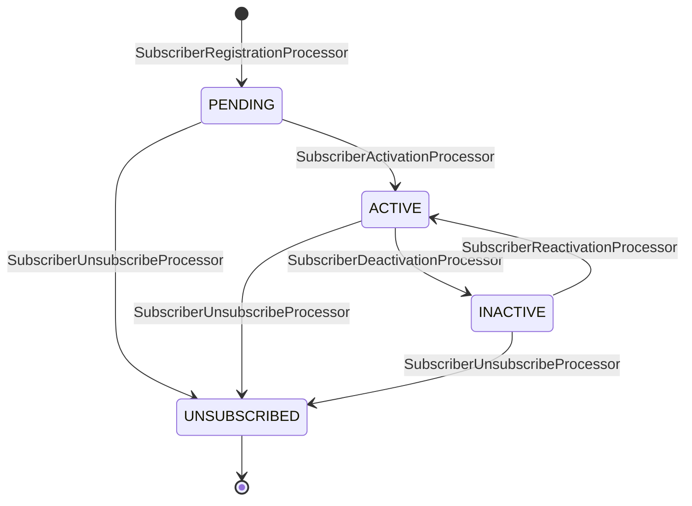
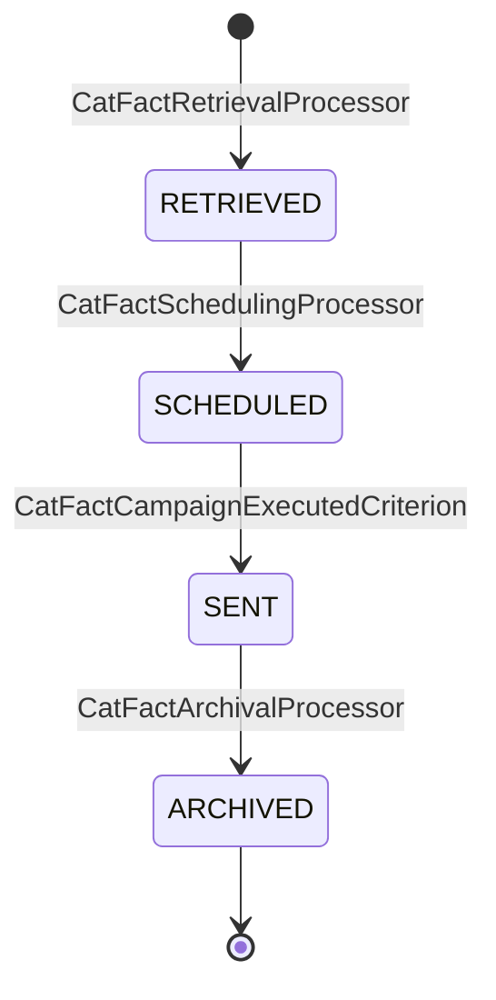
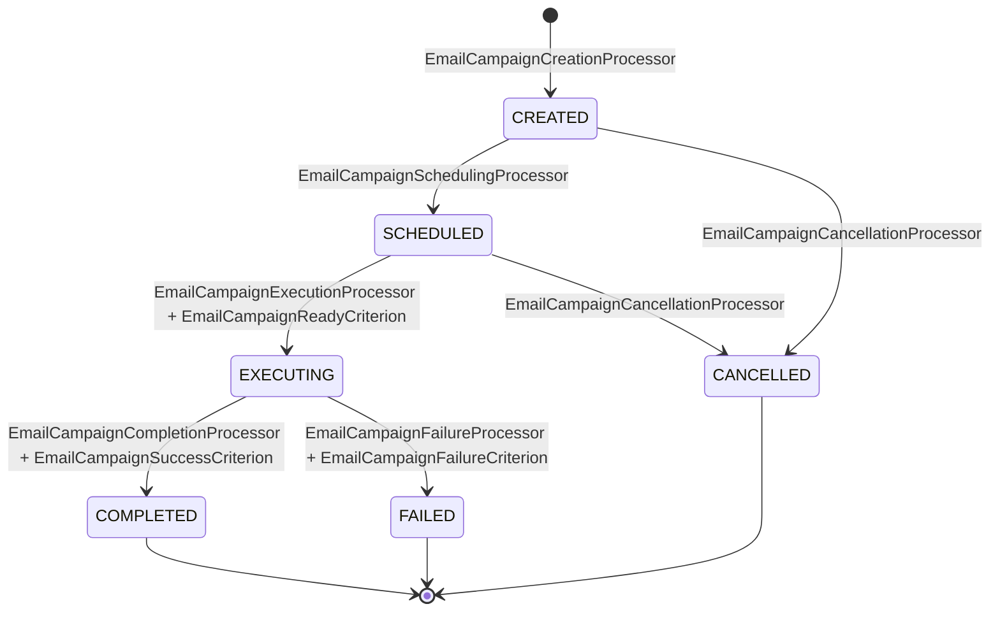
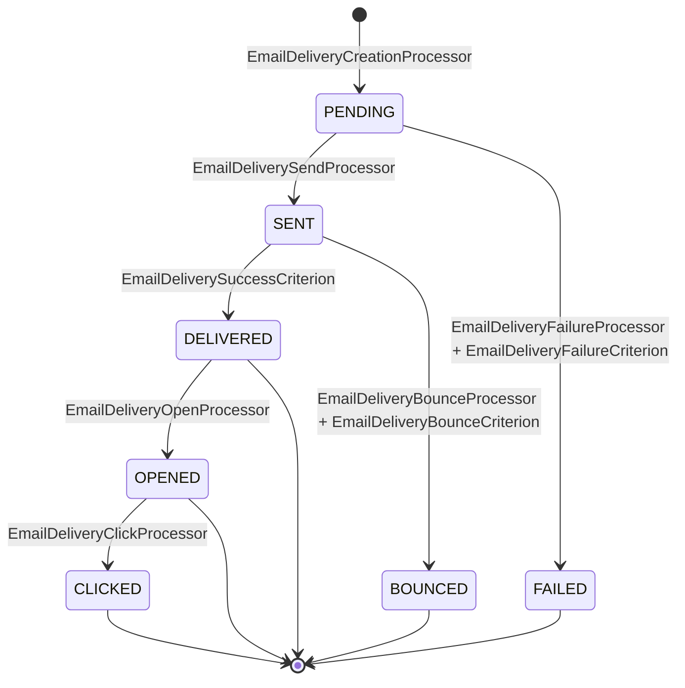

# Workflows Requirements

## Overview
This document defines the workflows for the Weekly Cat Fact Subscription application. Each entity has its own workflow that manages state transitions and business logic.

## 1. Subscriber Workflow

**Workflow Name:** `SubscriberWorkflow`

**Description:** Manages the lifecycle of subscriber subscriptions from initial signup to unsubscription.

**States:**
- `INITIAL` - System initial state (not user-visible)
- `PENDING` - Subscription created but not yet confirmed
- `ACTIVE` - Subscription is confirmed and active
- `INACTIVE` - Subscription is temporarily deactivated
- `UNSUBSCRIBED` - User has permanently unsubscribed

**Transitions:**

| From | To | Type | Processor | Criterion | Description |
|------|----|----|-----------|-----------|-------------|
| INITIAL | PENDING | Automatic | SubscriberRegistrationProcessor | - | Initial subscription creation |
| PENDING | ACTIVE | Manual | SubscriberActivationProcessor | - | Confirm subscription |
| ACTIVE | INACTIVE | Manual | SubscriberDeactivationProcessor | - | Temporarily deactivate subscription |
| INACTIVE | ACTIVE | Manual | SubscriberReactivationProcessor | - | Reactivate subscription |
| ACTIVE | UNSUBSCRIBED | Manual | SubscriberUnsubscribeProcessor | - | Permanent unsubscription |
| INACTIVE | UNSUBSCRIBED | Manual | SubscriberUnsubscribeProcessor | - | Permanent unsubscription |
| PENDING | UNSUBSCRIBED | Manual | SubscriberUnsubscribeProcessor | - | Cancel pending subscription |

```mermaid
stateDiagram-v2
    [*] --> PENDING : SubscriberRegistrationProcessor
    PENDING --> ACTIVE : SubscriberActivationProcessor
    PENDING --> UNSUBSCRIBED : SubscriberUnsubscribeProcessor
    ACTIVE --> INACTIVE : SubscriberDeactivationProcessor
    INACTIVE --> ACTIVE : SubscriberReactivationProcessor
    ACTIVE --> UNSUBSCRIBED : SubscriberUnsubscribeProcessor
    INACTIVE --> UNSUBSCRIBED : SubscriberUnsubscribeProcessor
    UNSUBSCRIBED --> [*]
```

---

## 2. CatFact Workflow

**Workflow Name:** `CatFactWorkflow`

**Description:** Manages the lifecycle of cat facts from API retrieval to archival after use.

**States:**
- `INITIAL` - System initial state (not user-visible)
- `RETRIEVED` - Fact fetched from external API
- `SCHEDULED` - Fact scheduled for a specific campaign
- `SENT` - Fact has been sent to subscribers
- `ARCHIVED` - Fact is archived after being sent

**Transitions:**

| From | To | Type | Processor | Criterion | Description |
|------|----|----|-----------|-----------|-------------|
| INITIAL | RETRIEVED | Automatic | CatFactRetrievalProcessor | - | Fetch fact from API |
| RETRIEVED | SCHEDULED | Manual | CatFactSchedulingProcessor | - | Schedule fact for campaign |
| SCHEDULED | SENT | Automatic | - | CatFactCampaignExecutedCriterion | Mark as sent when campaign executes |
| SENT | ARCHIVED | Automatic | CatFactArchivalProcessor | - | Archive after successful send |

```mermaid
stateDiagram-v2
    [*] --> RETRIEVED : CatFactRetrievalProcessor
    RETRIEVED --> SCHEDULED : CatFactSchedulingProcessor
    SCHEDULED --> SENT : CatFactCampaignExecutedCriterion
    SENT --> ARCHIVED : CatFactArchivalProcessor
    ARCHIVED --> [*]
```

---

## 3. EmailCampaign Workflow

**Workflow Name:** `EmailCampaignWorkflow`

**Description:** Manages the lifecycle of email campaigns from creation to completion.

**States:**
- `INITIAL` - System initial state (not user-visible)
- `CREATED` - Campaign created but not scheduled
- `SCHEDULED` - Campaign scheduled for execution
- `EXECUTING` - Campaign is currently being executed
- `COMPLETED` - Campaign execution completed successfully
- `FAILED` - Campaign execution failed
- `CANCELLED` - Campaign was cancelled before execution

**Transitions:**

| From | To | Type | Processor | Criterion | Description |
|------|----|----|-----------|-----------|-------------|
| INITIAL | CREATED | Automatic | EmailCampaignCreationProcessor | - | Create new campaign |
| CREATED | SCHEDULED | Manual | EmailCampaignSchedulingProcessor | - | Schedule campaign for execution |
| SCHEDULED | EXECUTING | Automatic | EmailCampaignExecutionProcessor | EmailCampaignReadyCriterion | Start campaign execution |
| EXECUTING | COMPLETED | Automatic | EmailCampaignCompletionProcessor | EmailCampaignSuccessCriterion | Complete successful campaign |
| EXECUTING | FAILED | Automatic | EmailCampaignFailureProcessor | EmailCampaignFailureCriterion | Handle failed campaign |
| CREATED | CANCELLED | Manual | EmailCampaignCancellationProcessor | - | Cancel campaign before scheduling |
| SCHEDULED | CANCELLED | Manual | EmailCampaignCancellationProcessor | - | Cancel scheduled campaign |

```mermaid
stateDiagram-v2
    [*] --> CREATED : EmailCampaignCreationProcessor
    CREATED --> SCHEDULED : EmailCampaignSchedulingProcessor
    CREATED --> CANCELLED : EmailCampaignCancellationProcessor
    SCHEDULED --> EXECUTING : EmailCampaignExecutionProcessor + EmailCampaignReadyCriterion
    SCHEDULED --> CANCELLED : EmailCampaignCancellationProcessor
    EXECUTING --> COMPLETED : EmailCampaignCompletionProcessor + EmailCampaignSuccessCriterion
    EXECUTING --> FAILED : EmailCampaignFailureProcessor + EmailCampaignFailureCriterion
    COMPLETED --> [*]
    FAILED --> [*]
    CANCELLED --> [*]
```

---

## 4. EmailDelivery Workflow

**Workflow Name:** `EmailDeliveryWorkflow`

**Description:** Manages individual email delivery attempts and tracking.

**States:**
- `INITIAL` - System initial state (not user-visible)
- `PENDING` - Delivery queued for sending
- `SENT` - Email sent to email service
- `DELIVERED` - Email delivered to recipient's inbox
- `OPENED` - Recipient opened the email
- `CLICKED` - Recipient clicked a link in the email
- `FAILED` - Email delivery failed
- `BOUNCED` - Email bounced back

**Transitions:**

| From | To | Type | Processor | Criterion | Description |
|------|----|----|-----------|-----------|-------------|
| INITIAL | PENDING | Automatic | EmailDeliveryCreationProcessor | - | Create delivery record |
| PENDING | SENT | Automatic | EmailDeliverySendProcessor | - | Send email via email service |
| PENDING | FAILED | Automatic | EmailDeliveryFailureProcessor | EmailDeliveryFailureCriterion | Handle send failure |
| SENT | DELIVERED | Automatic | - | EmailDeliverySuccessCriterion | Mark as delivered |
| SENT | BOUNCED | Automatic | EmailDeliveryBounceProcessor | EmailDeliveryBounceCriterion | Handle bounced email |
| DELIVERED | OPENED | Automatic | EmailDeliveryOpenProcessor | - | Track email open |
| OPENED | CLICKED | Automatic | EmailDeliveryClickProcessor | - | Track link click |

```mermaid
stateDiagram-v2
    [*] --> PENDING : EmailDeliveryCreationProcessor
    PENDING --> SENT : EmailDeliverySendProcessor
    PENDING --> FAILED : EmailDeliveryFailureProcessor + EmailDeliveryFailureCriterion
    SENT --> DELIVERED : EmailDeliverySuccessCriterion
    SENT --> BOUNCED : EmailDeliveryBounceProcessor + EmailDeliveryBounceCriterion
    DELIVERED --> OPENED : EmailDeliveryOpenProcessor
    OPENED --> CLICKED : EmailDeliveryClickProcessor
    DELIVERED --> [*]
    OPENED --> [*]
    CLICKED --> [*]
    FAILED --> [*]
    BOUNCED --> [*]
```

## Workflow Integration Notes

1. **Scheduled Execution**: The CatFact retrieval and EmailCampaign execution should be triggered by scheduled jobs (weekly).

2. **Cross-Entity Dependencies**: 
   - EmailCampaign creation depends on available CatFacts in RETRIEVED state
   - EmailDelivery creation depends on active Subscribers and executing EmailCampaigns

3. **Error Handling**: Each workflow includes failure states and appropriate error handling transitions.

4. **Manual vs Automatic Transitions**:
   - First transitions from INITIAL are always automatic
   - User-initiated actions (subscribe, unsubscribe, schedule) are manual
   - System-triggered events (delivery status updates, scheduled executions) are automatic

5. **Loop Transitions**: None of the workflows have loop transitions back to previous states, maintaining clear forward progression.
