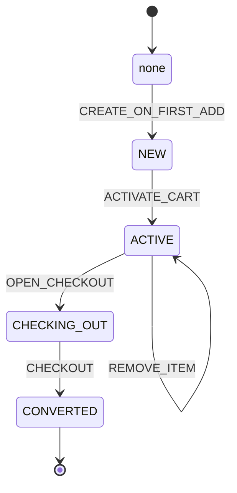
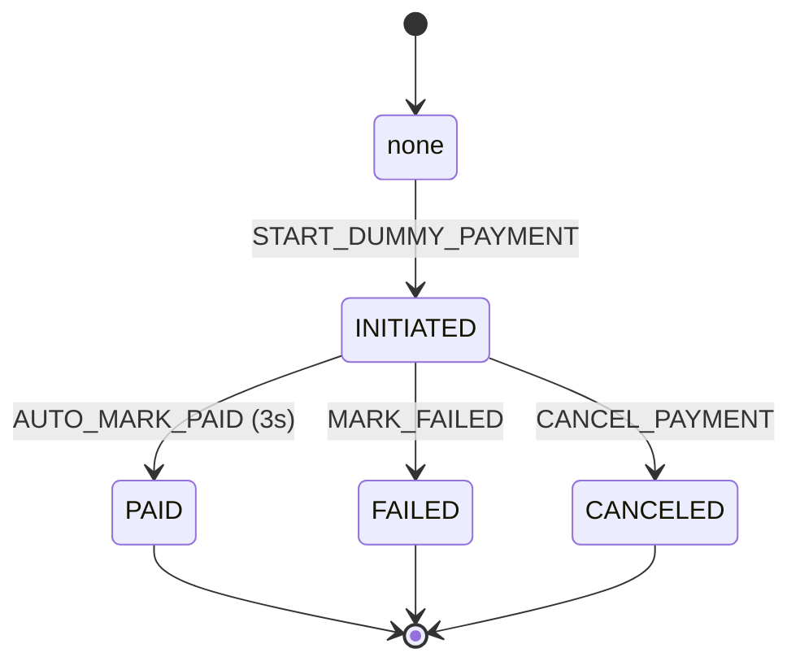
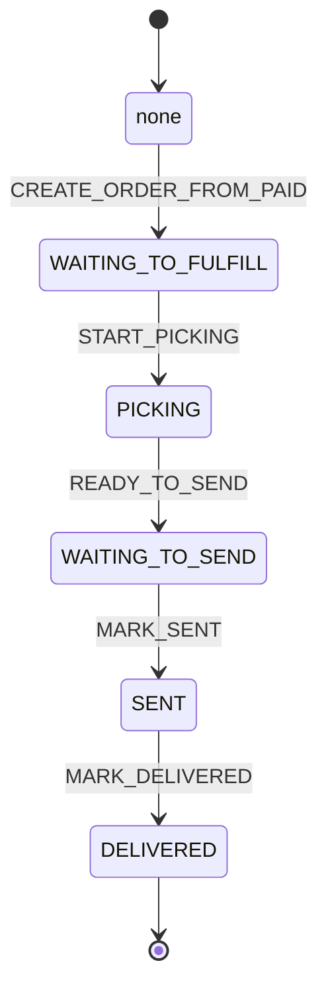
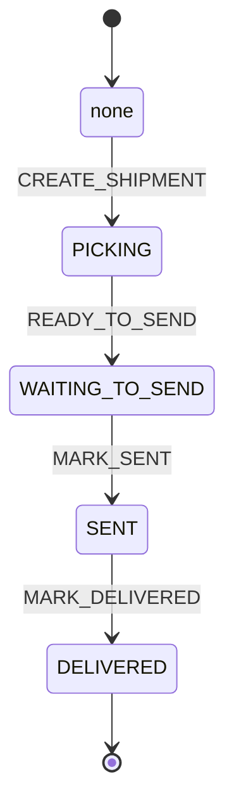

# Workflow Requirements

## Overview

This document defines the detailed workflow requirements for the Cyoda OMS Backend system. Each entity has its own workflow that manages state transitions and business logic through processors and criteria.

## Workflow Definitions

### 1. Cart Workflow (CartFlow)

**Purpose**: Manages the shopping cart lifecycle from creation through checkout conversion.

**Entity**: Cart

**States**: 
- `none` (initial state)
- `NEW` 
- `ACTIVE`
- `CHECKING_OUT`
- `CONVERTED`

**Transitions**:

1. **CREATE_ON_FIRST_ADD** (none → NEW)
   - **Type**: Automatic
   - **Trigger**: First item added to cart
   - **Processor**: CartCreateProcessor
   - **Description**: Creates cart entity and adds first line item

2. **ACTIVATE_CART** (NEW → ACTIVE)
   - **Type**: Automatic  
   - **Trigger**: After cart creation
   - **Processor**: CartRecalculateTotalsProcessor
   - **Description**: Recalculates totals and activates cart

3. **ADD_ITEM** (ACTIVE → ACTIVE)
   - **Type**: Manual
   - **Trigger**: User adds item to cart
   - **Processor**: CartRecalculateTotalsProcessor
   - **Description**: Adds/increments item and recalculates totals

4. **UPDATE_ITEM** (ACTIVE → ACTIVE)
   - **Type**: Manual
   - **Trigger**: User updates item quantity
   - **Processor**: CartRecalculateTotalsProcessor
   - **Description**: Updates item quantity and recalculates totals

5. **REMOVE_ITEM** (ACTIVE → ACTIVE)
   - **Type**: Manual
   - **Trigger**: User removes item from cart
   - **Processor**: CartRecalculateTotalsProcessor
   - **Description**: Removes item and recalculates totals

6. **OPEN_CHECKOUT** (ACTIVE → CHECKING_OUT)
   - **Type**: Manual
   - **Trigger**: User initiates checkout
   - **Description**: Moves cart to checkout state

7. **CHECKOUT** (CHECKING_OUT → CONVERTED)
   - **Type**: Manual
   - **Trigger**: Successful payment completion
   - **Description**: Marks cart as converted to order

**Mermaid Diagram**:

```mermaid
stateDiagram-v2
    [*] --> none
    none --> NEW : CREATE_ON_FIRST_ADD
    NEW --> ACTIVE : ACTIVATE_CART
    ACTIVE --> ACTIVE : ADD_ITEM
    ACTIVE --> ACTIVE : UPDATE_ITEM
    ACTIVE --> ACTIVE : REMOVE_ITEM
    ACTIVE --> CHECKING_OUT : OPEN_CHECKOUT
    CHECKING_OUT --> CONVERTED : CHECKOUT
    CONVERTED --> [*]
```

### 2. Payment Workflow (PaymentFlow)

**Purpose**: Manages dummy payment processing with automatic approval after 3 seconds.

**Entity**: Payment

**States**:
- `none` (initial state)
- `INITIATED`
- `PAID`
- `FAILED`
- `CANCELED`

**Transitions**:

1. **START_DUMMY_PAYMENT** (none → INITIATED)
   - **Type**: Automatic
   - **Trigger**: Payment creation request
   - **Processor**: PaymentCreateDummyProcessor
   - **Description**: Creates payment entity in initiated state

2. **AUTO_MARK_PAID** (INITIATED → PAID)
   - **Type**: Automatic
   - **Trigger**: 3-second timer
   - **Processor**: PaymentAutoMarkPaidProcessor
   - **Description**: Automatically marks payment as paid after 3 seconds

3. **MARK_FAILED** (INITIATED → FAILED)
   - **Type**: Manual
   - **Trigger**: Payment processing failure
   - **Description**: Marks payment as failed

4. **CANCEL_PAYMENT** (INITIATED → CANCELED)
   - **Type**: Manual
   - **Trigger**: User cancellation
   - **Description**: Cancels the payment

**Mermaid Diagram**:

```mermaid
stateDiagram-v2
    [*] --> none
    none --> INITIATED : START_DUMMY_PAYMENT
    INITIATED --> PAID : AUTO_MARK_PAID (3s)
    INITIATED --> FAILED : MARK_FAILED
    INITIATED --> CANCELED : CANCEL_PAYMENT
    PAID --> [*]
    FAILED --> [*]
    CANCELED --> [*]
```

### 3. Order Workflow (OrderLifecycle)

**Purpose**: Manages order fulfillment from creation through delivery.

**Entity**: Order

**States**:
- `none` (initial state)
- `WAITING_TO_FULFILL`
- `PICKING`
- `WAITING_TO_SEND`
- `SENT`
- `DELIVERED`

**Transitions**:

1. **CREATE_ORDER_FROM_PAID** (none → WAITING_TO_FULFILL)
   - **Type**: Automatic
   - **Trigger**: Successful payment completion
   - **Processor**: OrderCreateFromPaidProcessor
   - **Description**: Creates order from cart, decrements stock, creates shipment

2. **START_PICKING** (WAITING_TO_FULFILL → PICKING)
   - **Type**: Manual
   - **Trigger**: Warehouse starts picking
   - **Description**: Begins order picking process

3. **READY_TO_SEND** (PICKING → WAITING_TO_SEND)
   - **Type**: Manual
   - **Trigger**: Picking completed
   - **Processor**: OrderReadyToSendProcessor
   - **Description**: Marks order ready for shipment

4. **MARK_SENT** (WAITING_TO_SEND → SENT)
   - **Type**: Manual
   - **Trigger**: Order shipped
   - **Processor**: OrderMarkSentProcessor
   - **Description**: Updates order and shipment to sent status

5. **MARK_DELIVERED** (SENT → DELIVERED)
   - **Type**: Manual
   - **Trigger**: Delivery confirmation
   - **Processor**: OrderMarkDeliveredProcessor
   - **Description**: Marks order as delivered

**Mermaid Diagram**:

```mermaid
stateDiagram-v2
    [*] --> none
    none --> WAITING_TO_FULFILL : CREATE_ORDER_FROM_PAID
    WAITING_TO_FULFILL --> PICKING : START_PICKING
    PICKING --> WAITING_TO_SEND : READY_TO_SEND
    WAITING_TO_SEND --> SENT : MARK_SENT
    SENT --> DELIVERED : MARK_DELIVERED
    DELIVERED --> [*]
```

### 4. Shipment Workflow (ShipmentLifecycle)

**Purpose**: Manages shipment processing in parallel with order workflow.

**Entity**: Shipment

**States**:
- `none` (initial state)
- `PICKING`
- `WAITING_TO_SEND`
- `SENT`
- `DELIVERED`

**Transitions**:

1. **CREATE_SHIPMENT** (none → PICKING)
   - **Type**: Automatic
   - **Trigger**: Order creation
   - **Description**: Creates shipment when order is created

2. **READY_TO_SEND** (PICKING → WAITING_TO_SEND)
   - **Type**: Manual
   - **Trigger**: Picking completed
   - **Processor**: ShipmentReadyToSendProcessor
   - **Description**: Marks shipment ready to send

3. **MARK_SENT** (WAITING_TO_SEND → SENT)
   - **Type**: Manual
   - **Trigger**: Shipment dispatched
   - **Processor**: ShipmentMarkSentProcessor
   - **Description**: Updates shipment to sent status

4. **MARK_DELIVERED** (SENT → DELIVERED)
   - **Type**: Manual
   - **Trigger**: Delivery confirmation
   - **Processor**: ShipmentMarkDeliveredProcessor
   - **Description**: Marks shipment as delivered

**Mermaid Diagram**:

```mermaid
stateDiagram-v2
    [*] --> none
    none --> PICKING : CREATE_SHIPMENT
    PICKING --> WAITING_TO_SEND : READY_TO_SEND
    WAITING_TO_SEND --> SENT : MARK_SENT
    SENT --> DELIVERED : MARK_DELIVERED
    DELIVERED --> [*]
```

## Workflow Interaction Rules

1. **Cart to Payment**: Cart must be in `CHECKING_OUT` state before payment can be initiated
2. **Payment to Order**: Payment must be in `PAID` state before order creation
3. **Order to Shipment**: Shipment is automatically created when order is created
4. **Parallel Processing**: Order and Shipment workflows run in parallel after order creation
5. **State Synchronization**: Order state derives from shipment state for fulfillment stages

## Transition Types

- **Automatic**: Triggered by system events or other workflow completions
- **Manual**: Triggered by user actions or external system calls

## Error Handling

- Failed transitions should not change entity state
- Processors should handle errors gracefully and provide meaningful error messages
- Retry logic should be implemented for transient failures
- Critical failures should trigger appropriate error states where applicable
