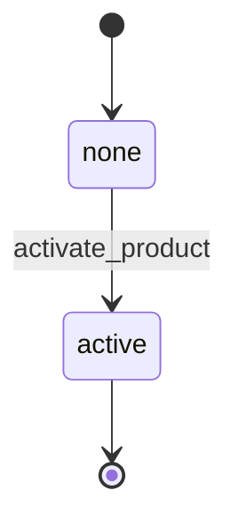
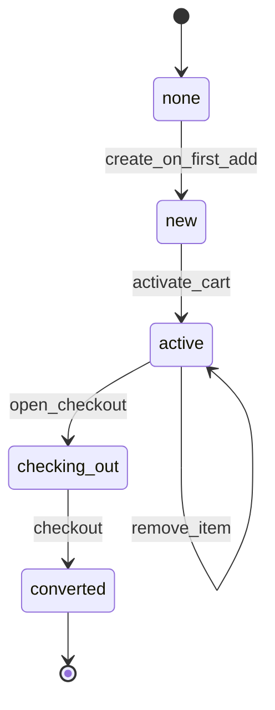
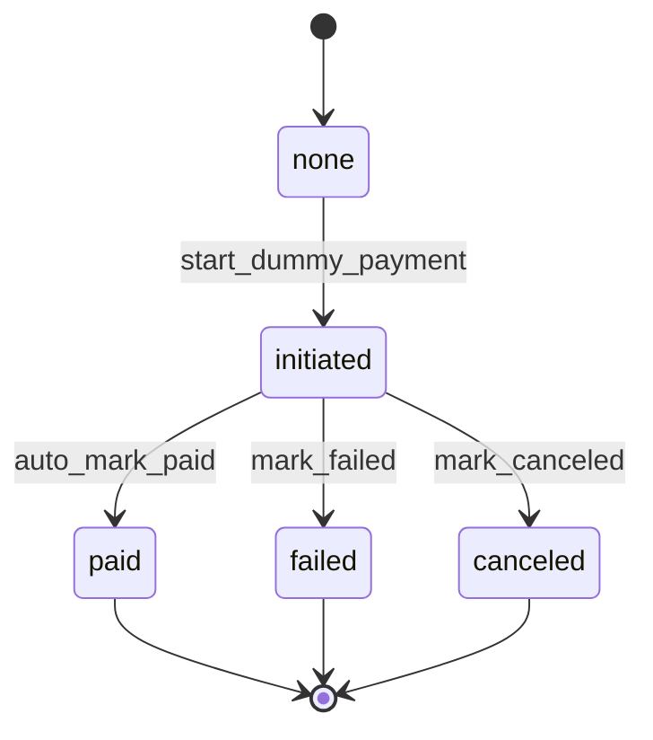
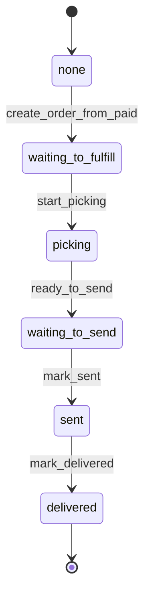
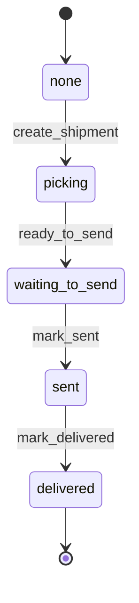

# Workflow Requirements

## Overview
This document defines the workflow requirements for the Cyoda OMS Backend system. Each entity has its own workflow that manages state transitions and business logic execution.

## Workflows

### 1. Product Workflow
**Purpose**: Manages product lifecycle states

**States**: 
- `none` (initial) → `active`

**Transitions**:
- `activate_product`: none → active (automatic, no processor/criterion needed)

**Mermaid Diagram**:

```mermaid
stateDiagram-v2
    [*] --> none
    none --> active : activate_product
    active --> [*]
```

**Notes**: Simple workflow as products are mostly static catalog items

### 2. Cart Workflow  
**Purpose**: Manages shopping cart states and operations

**States**: 
- `none` (initial) → `new` → `active` → `checking_out` → `converted`

**Transitions**:
- `create_on_first_add`: none → new (automatic)
- `activate_cart`: new → active (automatic, processor: CartActivateProcessor)
- `add_item`: active → active (manual, processor: CartAddItemProcessor)
- `update_item`: active → active (manual, processor: CartUpdateItemProcessor)  
- `remove_item`: active → active (manual, processor: CartRemoveItemProcessor)
- `open_checkout`: active → checking_out (manual, processor: CartOpenCheckoutProcessor)
- `checkout`: checking_out → converted (manual, processor: CartCheckoutProcessor)

**Mermaid Diagram**:

```mermaid
stateDiagram-v2
    [*] --> none
    none --> new : create_on_first_add
    new --> active : activate_cart
    active --> active : add_item
    active --> active : update_item
    active --> active : remove_item
    active --> checking_out : open_checkout
    checking_out --> converted : checkout
    converted --> [*]
```

### 3. Payment Workflow
**Purpose**: Manages payment processing states

**States**: 
- `none` (initial) → `initiated` → `paid` | `failed` | `canceled`

**Transitions**:
- `start_dummy_payment`: none → initiated (automatic, processor: PaymentStartProcessor)
- `auto_mark_paid`: initiated → paid (automatic, processor: PaymentAutoMarkPaidProcessor)
- `mark_failed`: initiated → failed (manual, processor: PaymentMarkFailedProcessor)
- `mark_canceled`: initiated → canceled (manual, processor: PaymentMarkCanceledProcessor)

**Mermaid Diagram**:

```mermaid
stateDiagram-v2
    [*] --> none
    none --> initiated : start_dummy_payment
    initiated --> paid : auto_mark_paid
    initiated --> failed : mark_failed
    initiated --> canceled : mark_canceled
    paid --> [*]
    failed --> [*]
    canceled --> [*]
```

### 4. Order Workflow
**Purpose**: Manages order fulfillment lifecycle

**States**: 
- `none` (initial) → `waiting_to_fulfill` → `picking` → `waiting_to_send` → `sent` → `delivered`

**Transitions**:
- `create_order_from_paid`: none → waiting_to_fulfill (automatic, processor: OrderCreateFromPaidProcessor)
- `start_picking`: waiting_to_fulfill → picking (manual, processor: OrderStartPickingProcessor)
- `ready_to_send`: picking → waiting_to_send (manual, processor: OrderReadyToSendProcessor)
- `mark_sent`: waiting_to_send → sent (manual, processor: OrderMarkSentProcessor)
- `mark_delivered`: sent → delivered (manual, processor: OrderMarkDeliveredProcessor)

**Mermaid Diagram**:

```mermaid
stateDiagram-v2
    [*] --> none
    none --> waiting_to_fulfill : create_order_from_paid
    waiting_to_fulfill --> picking : start_picking
    picking --> waiting_to_send : ready_to_send
    waiting_to_send --> sent : mark_sent
    sent --> delivered : mark_delivered
    delivered --> [*]
```

### 5. Shipment Workflow
**Purpose**: Manages shipment processing states

**States**: 
- `none` (initial) → `picking` → `waiting_to_send` → `sent` → `delivered`

**Transitions**:
- `create_shipment`: none → picking (automatic, processor: ShipmentCreateProcessor)
- `ready_to_send`: picking → waiting_to_send (manual, processor: ShipmentReadyToSendProcessor)
- `mark_sent`: waiting_to_send → sent (manual, processor: ShipmentMarkSentProcessor)
- `mark_delivered`: sent → delivered (manual, processor: ShipmentMarkDeliveredProcessor)

**Mermaid Diagram**:

```mermaid
stateDiagram-v2
    [*] --> none
    none --> picking : create_shipment
    picking --> waiting_to_send : ready_to_send
    waiting_to_send --> sent : mark_sent
    sent --> delivered : mark_delivered
    delivered --> [*]
```

## Workflow Orchestration

### Cart to Order Flow
1. Cart reaches `converted` state via checkout
2. Payment is created and auto-processed to `paid` state
3. Order creation is triggered from paid payment
4. Order processor creates shipment automatically
5. Shipment and order states progress together

### State Synchronization
- Order state derives from shipment state
- Shipment state changes trigger order state updates
- Single shipment per order simplifies state management

## Transition Types
- **Automatic**: Triggered by system events, no user intervention
- **Manual**: Triggered by user actions or external events
- **Loop transitions**: Self-transitions (e.g., cart item operations) are manual
