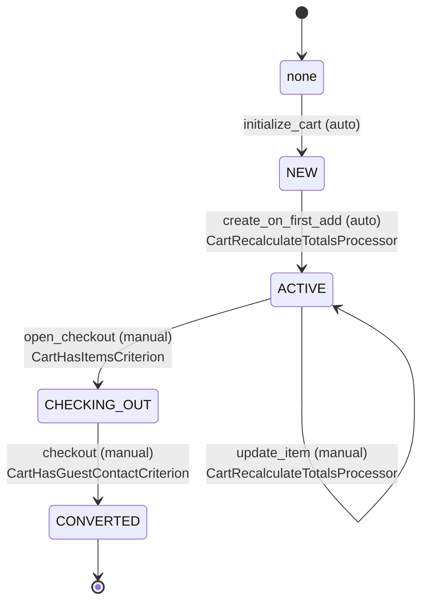
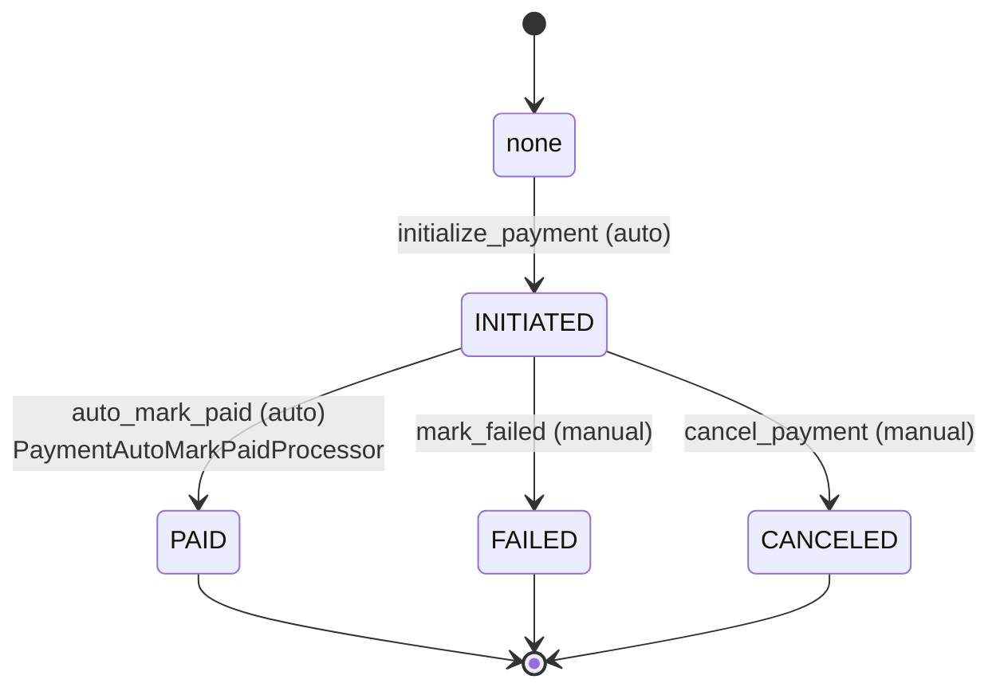
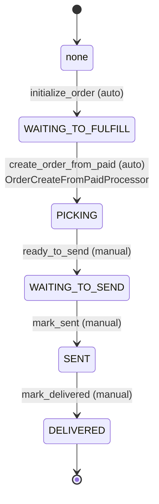
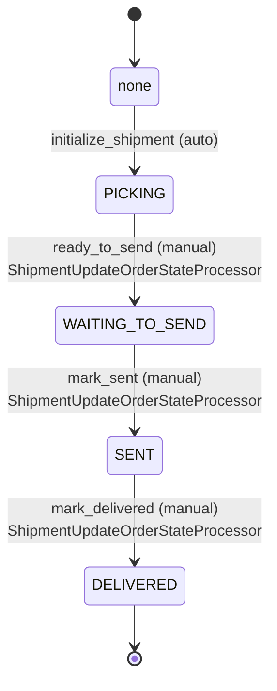

# Workflow Requirements

## Overview

This document defines the detailed workflow requirements for the Cyoda OMS Backend system. Each entity has its own workflow that manages state transitions through business processes.

## Workflow Design Principles

1. Each entity has its own workflow
2. First transition from initial state is always automatic
3. Loop transitions (to same or previous state) are marked as manual
4. Processors implement business logic for transitions
5. Criteria implement conditional logic for transitions
6. Transitions can have processors, criteria, both, or neither

## 1. CartFlow Workflow

**Entity:** Cart
**Purpose:** Manages shopping cart lifecycle from creation to conversion

### States and Transitions

**Initial State:** `none`

**States:** `none` → `NEW` → `ACTIVE` → `CHECKING_OUT` → `CONVERTED`

### Transition Details

1. **none → NEW**
   - **Transition Name:** `initialize_cart`
   - **Type:** Automatic (first transition)
   - **Processor:** None
   - **Criterion:** None
   - **Description:** Initial state transition when cart is created

2. **NEW → ACTIVE**
   - **Transition Name:** `create_on_first_add`
   - **Type:** Automatic
   - **Processor:** `CartRecalculateTotalsProcessor`
   - **Criterion:** None
   - **Description:** Triggered when first item is added to cart

3. **ACTIVE → ACTIVE (loop)**
   - **Transition Name:** `add_item`
   - **Type:** Manual
   - **Processor:** `CartRecalculateTotalsProcessor`
   - **Criterion:** None
   - **Description:** Add or increment item quantity

4. **ACTIVE → ACTIVE (loop)**
   - **Transition Name:** `update_item`
   - **Type:** Manual
   - **Processor:** `CartRecalculateTotalsProcessor`
   - **Criterion:** None
   - **Description:** Update item quantity or remove item (qty=0)

5. **ACTIVE → CHECKING_OUT**
   - **Transition Name:** `open_checkout`
   - **Type:** Manual
   - **Processor:** None
   - **Criterion:** `CartHasItemsCriterion`
   - **Description:** Begin checkout process

6. **CHECKING_OUT → CONVERTED**
   - **Transition Name:** `checkout`
   - **Type:** Manual
   - **Processor:** None
   - **Criterion:** `CartHasGuestContactCriterion`
   - **Description:** Complete checkout and convert cart

### Mermaid Diagram

```mermaid
stateDiagram-v2
    [*] --> none
    none --> NEW : initialize_cart (auto)
    NEW --> ACTIVE : create_on_first_add (auto)<br/>CartRecalculateTotalsProcessor
    ACTIVE --> ACTIVE : add_item (manual)<br/>CartRecalculateTotalsProcessor
    ACTIVE --> ACTIVE : update_item (manual)<br/>CartRecalculateTotalsProcessor
    ACTIVE --> CHECKING_OUT : open_checkout (manual)<br/>CartHasItemsCriterion
    CHECKING_OUT --> CONVERTED : checkout (manual)<br/>CartHasGuestContactCriterion
    CONVERTED --> [*]
```

## 2. PaymentFlow Workflow

**Entity:** Payment
**Purpose:** Manages dummy payment processing with auto-approval

### States and Transitions

**Initial State:** `none`

**States:** `none` → `INITIATED` → `PAID` | `FAILED` | `CANCELED`

### Transition Details

1. **none → INITIATED**
   - **Transition Name:** `initialize_payment`
   - **Type:** Automatic (first transition)
   - **Processor:** None
   - **Criterion:** None
   - **Description:** Initial state transition when payment is created

2. **INITIATED → PAID**
   - **Transition Name:** `auto_mark_paid`
   - **Type:** Automatic
   - **Processor:** `PaymentAutoMarkPaidProcessor`
   - **Criterion:** None
   - **Description:** Auto-approve payment after ~3 seconds

3. **INITIATED → FAILED**
   - **Transition Name:** `mark_failed`
   - **Type:** Manual
   - **Processor:** None
   - **Criterion:** None
   - **Description:** Mark payment as failed (for testing/admin)

4. **INITIATED → CANCELED**
   - **Transition Name:** `cancel_payment`
   - **Type:** Manual
   - **Processor:** None
   - **Criterion:** None
   - **Description:** Cancel payment (for testing/admin)

### Mermaid Diagram

```mermaid
stateDiagram-v2
    [*] --> none
    none --> INITIATED : initialize_payment (auto)
    INITIATED --> PAID : auto_mark_paid (auto)<br/>PaymentAutoMarkPaidProcessor
    INITIATED --> FAILED : mark_failed (manual)
    INITIATED --> CANCELED : cancel_payment (manual)
    PAID --> [*]
    FAILED --> [*]
    CANCELED --> [*]
```

## 3. OrderLifecycle Workflow

**Entity:** Order
**Purpose:** Manages order fulfillment from creation to delivery

### States and Transitions

**Initial State:** `none`

**States:** `none` → `WAITING_TO_FULFILL` → `PICKING` → `WAITING_TO_SEND` → `SENT` → `DELIVERED`

### Transition Details

1. **none → WAITING_TO_FULFILL**
   - **Transition Name:** `initialize_order`
   - **Type:** Automatic (first transition)
   - **Processor:** None
   - **Criterion:** None
   - **Description:** Initial state transition when order is created

2. **WAITING_TO_FULFILL → PICKING**
   - **Transition Name:** `create_order_from_paid`
   - **Type:** Automatic
   - **Processor:** `OrderCreateFromPaidProcessor`
   - **Criterion:** None
   - **Description:** Create order from paid cart, decrement stock, create shipment

3. **PICKING → WAITING_TO_SEND**
   - **Transition Name:** `ready_to_send`
   - **Type:** Manual
   - **Processor:** None
   - **Criterion:** None
   - **Description:** Order is picked and ready for shipment

4. **WAITING_TO_SEND → SENT**
   - **Transition Name:** `mark_sent`
   - **Type:** Manual
   - **Processor:** None
   - **Criterion:** None
   - **Description:** Order has been shipped

5. **SENT → DELIVERED**
   - **Transition Name:** `mark_delivered`
   - **Type:** Manual
   - **Processor:** None
   - **Criterion:** None
   - **Description:** Order has been delivered to customer

### Mermaid Diagram

```mermaid
stateDiagram-v2
    [*] --> none
    none --> WAITING_TO_FULFILL : initialize_order (auto)
    WAITING_TO_FULFILL --> PICKING : create_order_from_paid (auto)<br/>OrderCreateFromPaidProcessor
    PICKING --> WAITING_TO_SEND : ready_to_send (manual)
    WAITING_TO_SEND --> SENT : mark_sent (manual)
    SENT --> DELIVERED : mark_delivered (manual)
    DELIVERED --> [*]
```

## 4. ShipmentFlow Workflow

**Entity:** Shipment
**Purpose:** Manages shipment processing and tracking

### States and Transitions

**Initial State:** `none`

**States:** `none` → `PICKING` → `WAITING_TO_SEND` → `SENT` → `DELIVERED`

### Transition Details

1. **none → PICKING**
   - **Transition Name:** `initialize_shipment`
   - **Type:** Automatic (first transition)
   - **Processor:** None
   - **Criterion:** None
   - **Description:** Initial state transition when shipment is created

2. **PICKING → WAITING_TO_SEND**
   - **Transition Name:** `ready_to_send`
   - **Type:** Manual
   - **Processor:** `ShipmentUpdateOrderStateProcessor`
   - **Criterion:** None
   - **Description:** Shipment is picked and ready to send

3. **WAITING_TO_SEND → SENT**
   - **Transition Name:** `mark_sent`
   - **Type:** Manual
   - **Processor:** `ShipmentUpdateOrderStateProcessor`
   - **Criterion:** None
   - **Description:** Shipment has been sent

4. **SENT → DELIVERED**
   - **Transition Name:** `mark_delivered`
   - **Type:** Manual
   - **Processor:** `ShipmentUpdateOrderStateProcessor`
   - **Criterion:** None
   - **Description:** Shipment has been delivered

### Mermaid Diagram

```mermaid
stateDiagram-v2
    [*] --> none
    none --> PICKING : initialize_shipment (auto)
    PICKING --> WAITING_TO_SEND : ready_to_send (manual)<br/>ShipmentUpdateOrderStateProcessor
    WAITING_TO_SEND --> SENT : mark_sent (manual)<br/>ShipmentUpdateOrderStateProcessor
    SENT --> DELIVERED : mark_delivered (manual)<br/>ShipmentUpdateOrderStateProcessor
    DELIVERED --> [*]
```

## Workflow Orchestration

### Order Creation Flow
1. Cart reaches CONVERTED state
2. Payment reaches PAID state
3. Order is created in WAITING_TO_FULFILL state
4. OrderCreateFromPaidProcessor:
   - Snapshots cart lines and guest contact
   - Decrements Product.quantityAvailable
   - Creates Shipment in PICKING state
   - Transitions Order to PICKING state

### State Synchronization
- Order state is derived from Shipment state
- ShipmentUpdateOrderStateProcessor ensures Order state matches Shipment state
- Both entities progress through: PICKING → WAITING_TO_SEND → SENT → DELIVERED

## Processor and Criterion Summary

### Processors Required
- `CartRecalculateTotalsProcessor` - Recalculates cart totals
- `PaymentAutoMarkPaidProcessor` - Auto-approves payment after 3 seconds
- `OrderCreateFromPaidProcessor` - Creates order from paid cart
- `ShipmentUpdateOrderStateProcessor` - Synchronizes order state with shipment

### Criteria Required
- `CartHasItemsCriterion` - Validates cart has items before checkout
- `CartHasGuestContactCriterion` - Validates guest contact info is provided
