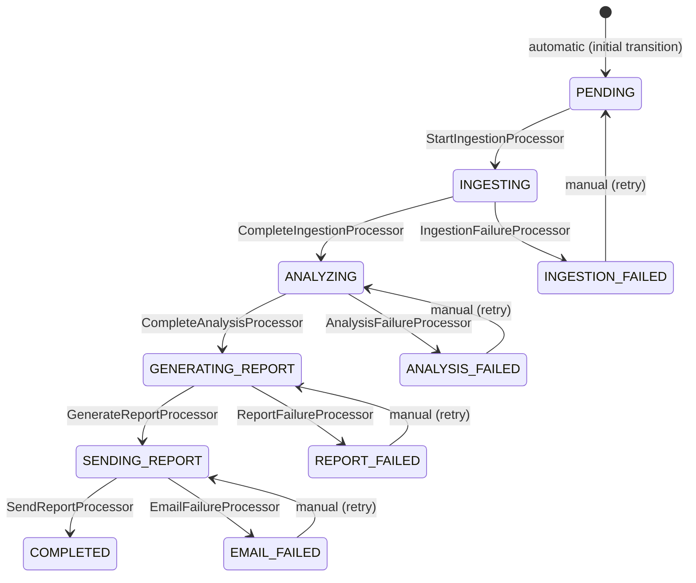
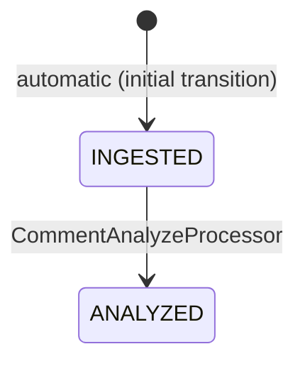
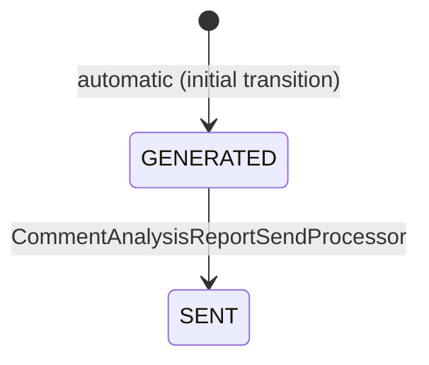

# Workflow Requirements

## Overview
This document defines the workflows for the comments analysis application. Each entity has its own workflow that manages its lifecycle through various states.

## 1. CommentAnalysisJob Workflow

### States and Transitions

```mermaid
stateDiagram-v2
    [*] --> PENDING: automatic (initial transition)
    PENDING --> INGESTING: StartIngestionProcessor
    INGESTING --> ANALYZING: CompleteIngestionProcessor
    ANALYZING --> GENERATING_REPORT: CompleteAnalysisProcessor
    GENERATING_REPORT --> SENDING_REPORT: GenerateReportProcessor
    SENDING_REPORT --> COMPLETED: SendReportProcessor
    
    INGESTING --> INGESTION_FAILED: IngestionFailureProcessor
    ANALYZING --> ANALYSIS_FAILED: AnalysisFailureProcessor
    GENERATING_REPORT --> REPORT_FAILED: ReportFailureProcessor
    SENDING_REPORT --> EMAIL_FAILED: EmailFailureProcessor
    
    INGESTION_FAILED --> PENDING: manual (retry)
    ANALYSIS_FAILED --> ANALYZING: manual (retry)
    REPORT_FAILED --> GENERATING_REPORT: manual (retry)
    EMAIL_FAILED --> SENDING_REPORT: manual (retry)
```

### Transition Details

| From State | To State | Type | Processor | Criterion | Description |
|------------|----------|------|-----------|-----------|-------------|
| INITIAL | PENDING | automatic | null | null | Initial transition when job is created |
| PENDING | INGESTING | automatic | CommentAnalysisJobStartIngestionProcessor | null | Start ingesting comments from API |
| INGESTING | ANALYZING | automatic | CommentAnalysisJobCompleteIngestionProcessor | CommentAnalysisJobIngestionCompleteCriterion | Move to analysis when all comments are ingested |
| ANALYZING | GENERATING_REPORT | automatic | CommentAnalysisJobCompleteAnalysisProcessor | CommentAnalysisJobAnalysisCompleteCriterion | Move to report generation when analysis is complete |
| GENERATING_REPORT | SENDING_REPORT | automatic | CommentAnalysisJobGenerateReportProcessor | null | Generate the analysis report |
| SENDING_REPORT | COMPLETED | automatic | CommentAnalysisJobSendReportProcessor | null | Send report via email and complete job |
| INGESTING | INGESTION_FAILED | automatic | CommentAnalysisJobIngestionFailureProcessor | CommentAnalysisJobIngestionFailedCriterion | Handle ingestion failures |
| ANALYZING | ANALYSIS_FAILED | automatic | CommentAnalysisJobAnalysisFailureProcessor | CommentAnalysisJobAnalysisFailedCriterion | Handle analysis failures |
| GENERATING_REPORT | REPORT_FAILED | automatic | CommentAnalysisJobReportFailureProcessor | CommentAnalysisJobReportFailedCriterion | Handle report generation failures |
| SENDING_REPORT | EMAIL_FAILED | automatic | CommentAnalysisJobEmailFailureProcessor | CommentAnalysisJobEmailFailedCriterion | Handle email sending failures |
| INGESTION_FAILED | PENDING | manual | null | null | Retry from beginning |
| ANALYSIS_FAILED | ANALYZING | manual | null | null | Retry analysis |
| REPORT_FAILED | GENERATING_REPORT | manual | null | null | Retry report generation |
| EMAIL_FAILED | SENDING_REPORT | manual | null | null | Retry email sending |

## 2. Comment Workflow

### States and Transitions

```mermaid
stateDiagram-v2
    [*] --> INGESTED: automatic (initial transition)
    INGESTED --> ANALYZED: CommentAnalyzeProcessor
```

### Transition Details

| From State | To State | Type | Processor | Criterion | Description |
|------------|----------|------|-----------|-----------|-------------|
| INITIAL | INGESTED | automatic | null | null | Initial transition when comment is created |
| INGESTED | ANALYZED | automatic | CommentAnalyzeProcessor | null | Analyze comment sentiment and extract metrics |

## 3. CommentAnalysisReport Workflow

### States and Transitions

```mermaid
stateDiagram-v2
    [*] --> GENERATED: automatic (initial transition)
    GENERATED --> SENT: CommentAnalysisReportSendProcessor
```

### Transition Details

| From State | To State | Type | Processor | Criterion | Description |
|------------|----------|------|-----------|-----------|-------------|
| INITIAL | GENERATED | automatic | null | null | Initial transition when report is created |
| GENERATED | SENT | automatic | CommentAnalysisReportSendProcessor | null | Mark report as sent after email delivery |

## Workflow Coordination

The workflows are coordinated as follows:

1. **CommentAnalysisJob** is the main orchestrating entity
2. When job moves to INGESTING state, it creates multiple **Comment** entities
3. Each **Comment** automatically moves through its workflow (INGESTED → ANALYZED)
4. When all comments are analyzed, the job moves to GENERATING_REPORT state
5. A **CommentAnalysisReport** entity is created and moves through its workflow
6. Finally, the job completes when the report is sent

## Error Handling

Each workflow includes error states and manual retry transitions:
- Failed states capture error information
- Manual transitions allow operators to retry failed operations
- Error processors log failures and set appropriate error messages
