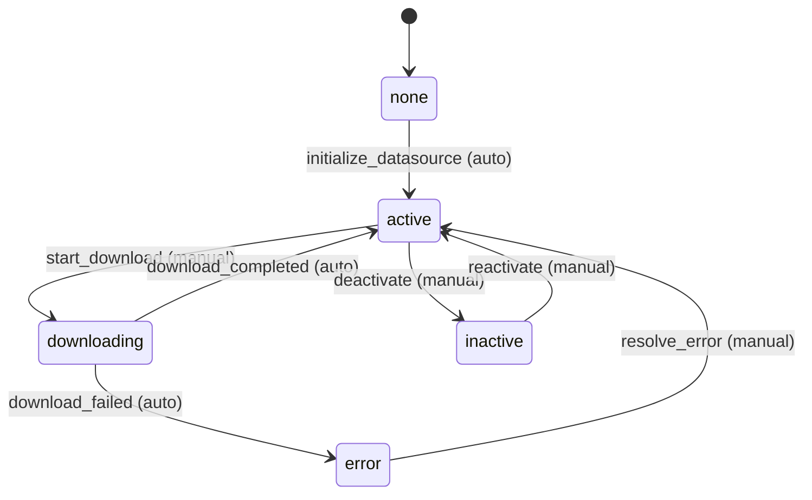
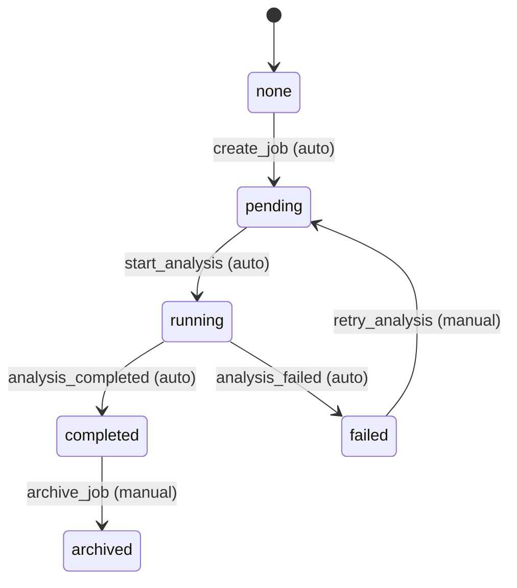
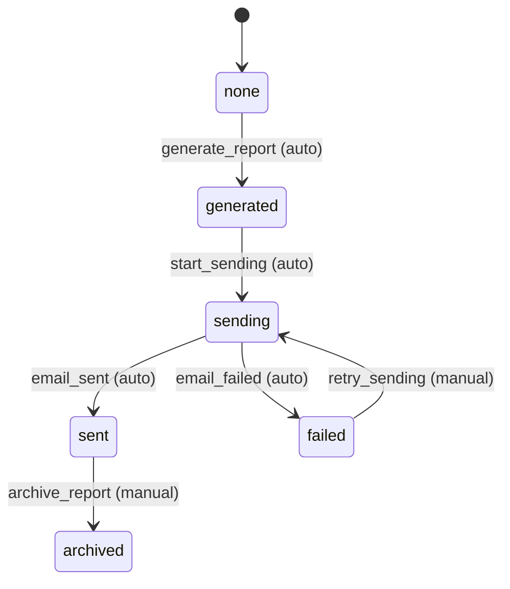
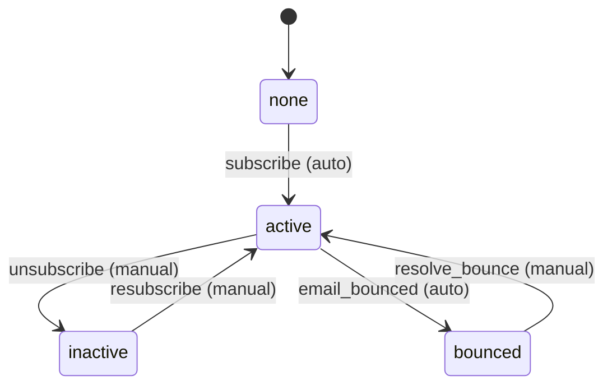

# Workflow Requirements

## Overview
This document defines the workflows for each entity in the London Houses Data Analysis application. Each workflow represents the lifecycle and state transitions of the entities.

## 1. DataSource Workflow

### States and Transitions

**Initial State**: `none`

**States**:
- `none` → `active` (automatic, initial transition)
- `active` → `downloading` (manual, triggered by download request)
- `downloading` → `active` (automatic, after successful download)
- `downloading` → `error` (automatic, if download fails)
- `error` → `active` (manual, after error resolution)
- `active` → `inactive` (manual, to deactivate data source)
- `inactive` → `active` (manual, to reactivate data source)

**Transitions**:
1. `initialize_datasource`: none → active (automatic)
2. `start_download`: active → downloading (manual)
   - Processor: `DataSourceDownloadProcessor`
3. `download_completed`: downloading → active (automatic)
   - Processor: `DataSourceCompletionProcessor`
4. `download_failed`: downloading → error (automatic)
   - Processor: `DataSourceErrorProcessor`
5. `resolve_error`: error → active (manual)
   - Criterion: `DataSourceErrorResolvedCriterion`
6. `deactivate`: active → inactive (manual)
7. `reactivate`: inactive → active (manual)

### Mermaid Diagram

```mermaid
stateDiagram-v2
    [*] --> none
    none --> active : initialize_datasource (auto)
    active --> downloading : start_download (manual)
    downloading --> active : download_completed (auto)
    downloading --> error : download_failed (auto)
    error --> active : resolve_error (manual)
    active --> inactive : deactivate (manual)
    inactive --> active : reactivate (manual)
```

## 2. AnalysisJob Workflow

### States and Transitions

**Initial State**: `none`

**States**:
- `none` → `pending` (automatic, initial transition)
- `pending` → `running` (automatic, when resources available)
- `running` → `completed` (automatic, after successful analysis)
- `running` → `failed` (automatic, if analysis fails)
- `failed` → `pending` (manual, to retry)
- `completed` → `archived` (manual, for cleanup)

**Transitions**:
1. `create_job`: none → pending (automatic)
2. `start_analysis`: pending → running (automatic)
   - Processor: `AnalysisJobProcessor`
   - Criterion: `DataSourceAvailableCriterion`
3. `analysis_completed`: running → completed (automatic)
   - Processor: `AnalysisCompletionProcessor`
4. `analysis_failed`: running → failed (automatic)
   - Processor: `AnalysisErrorProcessor`
5. `retry_analysis`: failed → pending (manual)
6. `archive_job`: completed → archived (manual)

### Mermaid Diagram

```mermaid
stateDiagram-v2
    [*] --> none
    none --> pending : create_job (auto)
    pending --> running : start_analysis (auto)
    running --> completed : analysis_completed (auto)
    running --> failed : analysis_failed (auto)
    failed --> pending : retry_analysis (manual)
    completed --> archived : archive_job (manual)
```

## 3. Report Workflow

### States and Transitions

**Initial State**: `none`

**States**:
- `none` → `generated` (automatic, initial transition)
- `generated` → `sending` (automatic, when ready to send)
- `sending` → `sent` (automatic, after successful email delivery)
- `sending` → `failed` (automatic, if email delivery fails)
- `failed` → `sending` (manual, to retry sending)
- `sent` → `archived` (manual, for cleanup)

**Transitions**:
1. `generate_report`: none → generated (automatic)
   - Processor: `ReportGenerationProcessor`
2. `start_sending`: generated → sending (automatic)
   - Processor: `ReportEmailProcessor`
   - Criterion: `SubscribersAvailableCriterion`
3. `email_sent`: sending → sent (automatic)
   - Processor: `EmailDeliveryConfirmationProcessor`
4. `email_failed`: sending → failed (automatic)
   - Processor: `EmailFailureProcessor`
5. `retry_sending`: failed → sending (manual)
6. `archive_report`: sent → archived (manual)

### Mermaid Diagram

```mermaid
stateDiagram-v2
    [*] --> none
    none --> generated : generate_report (auto)
    generated --> sending : start_sending (auto)
    sending --> sent : email_sent (auto)
    sending --> failed : email_failed (auto)
    failed --> sending : retry_sending (manual)
    sent --> archived : archive_report (manual)
```

## 4. Subscriber Workflow

### States and Transitions

**Initial State**: `none`

**States**:
- `none` → `active` (automatic, initial transition)
- `active` → `inactive` (manual, user unsubscribes)
- `inactive` → `active` (manual, user resubscribes)
- `active` → `bounced` (automatic, after email delivery failures)
- `bounced` → `active` (manual, after email address correction)

**Transitions**:
1. `subscribe`: none → active (automatic)
   - Processor: `SubscriberRegistrationProcessor`
2. `unsubscribe`: active → inactive (manual)
3. `resubscribe`: inactive → active (manual)
   - Processor: `SubscriberReactivationProcessor`
4. `email_bounced`: active → bounced (automatic)
   - Processor: `EmailBounceProcessor`
   - Criterion: `EmailDeliveryFailureCriterion`
5. `resolve_bounce`: bounced → active (manual)
   - Processor: `EmailBounceResolutionProcessor`

### Mermaid Diagram

```mermaid
stateDiagram-v2
    [*] --> none
    none --> active : subscribe (auto)
    active --> inactive : unsubscribe (manual)
    inactive --> active : resubscribe (manual)
    active --> bounced : email_bounced (auto)
    bounced --> active : resolve_bounce (manual)
```

## Workflow Integration

The workflows are interconnected in the following sequence:

1. **DataSource** is activated and downloads data
2. **AnalysisJob** is created to process the downloaded data
3. **Report** is generated from completed analysis
4. **Subscriber** receives the report via email

The system orchestrates these workflows to create an end-to-end data processing pipeline.
