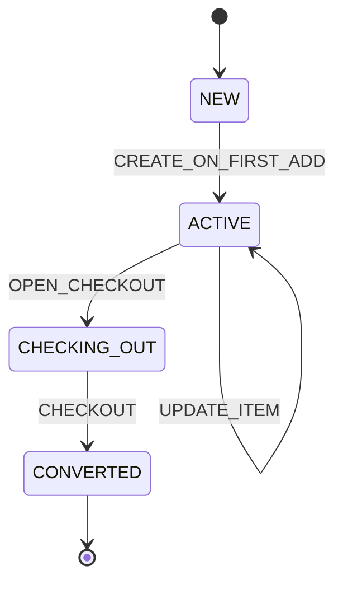
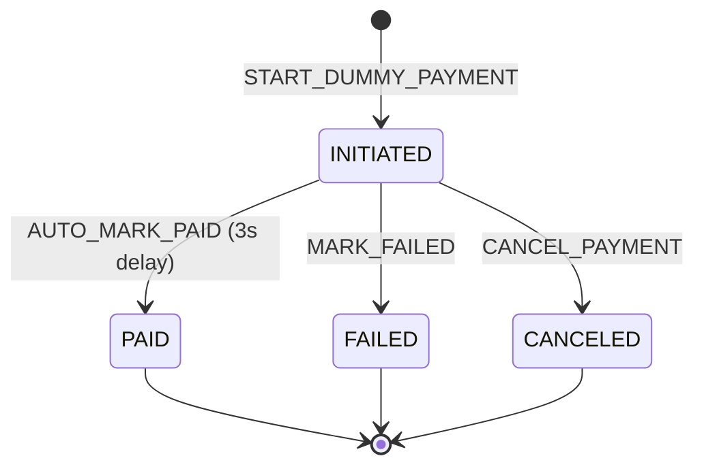
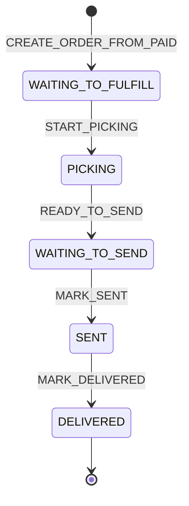
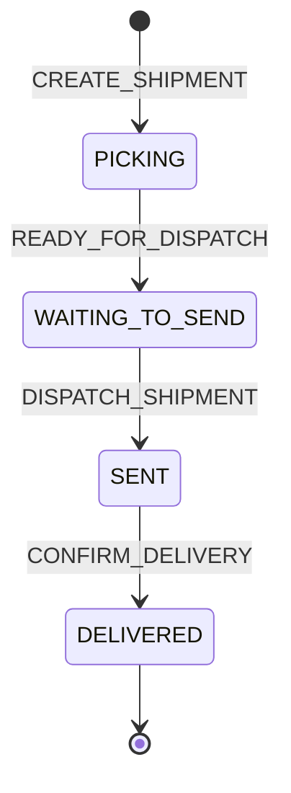

# Workflow Requirements

## CartFlow Workflow

**Name**: CartFlow
**Description**: Manages cart lifecycle from creation through checkout conversion.

### States:
- **NEW**: Initial state when cart is first created
- **ACTIVE**: Cart with items that can be modified
- **CHECKING_OUT**: Cart in checkout process, no modifications allowed
- **CONVERTED**: Cart successfully converted to order

### Transitions:

#### CREATE_ON_FIRST_ADD (NEW → ACTIVE)
- **Type**: Automatic
- **Processor**: CartCreateProcessor
- **Description**: Creates cart and adds first item, recalculates totals

#### ADD_ITEM (ACTIVE → ACTIVE)
- **Type**: Manual
- **Processor**: CartAddItemProcessor
- **Description**: Adds or increments item quantity, recalculates totals

#### UPDATE_ITEM (ACTIVE → ACTIVE)
- **Type**: Manual
- **Processor**: CartUpdateItemProcessor
- **Description**: Updates item quantity or removes if qty=0, recalculates totals

#### OPEN_CHECKOUT (ACTIVE → CHECKING_OUT)
- **Type**: Manual
- **Processor**: CartOpenCheckoutProcessor
- **Description**: Validates cart and moves to checkout state

#### CHECKOUT (CHECKING_OUT → CONVERTED)
- **Type**: Manual
- **Processor**: CartCheckoutProcessor
- **Description**: Finalizes cart conversion, triggers order creation orchestration

### Mermaid State Diagram:

```mermaid
stateDiagram-v2
    [*] --> NEW
    NEW --> ACTIVE : CREATE_ON_FIRST_ADD
    ACTIVE --> ACTIVE : ADD_ITEM
    ACTIVE --> ACTIVE : UPDATE_ITEM
    ACTIVE --> CHECKING_OUT : OPEN_CHECKOUT
    CHECKING_OUT --> CONVERTED : CHECKOUT
    CONVERTED --> [*]
```

---

## PaymentFlow Workflow

**Name**: PaymentFlow
**Description**: Dummy payment processing with auto-approval after 3 seconds.

### States:
- **INITIATED**: Payment started and processing
- **PAID**: Payment completed successfully
- **FAILED**: Payment processing failed
- **CANCELED**: Payment was canceled

### Transitions:

#### START_DUMMY_PAYMENT (Initial → INITIATED)
- **Type**: Automatic
- **Processor**: PaymentCreateProcessor
- **Description**: Creates payment record in INITIATED state

#### AUTO_MARK_PAID (INITIATED → PAID)
- **Type**: Automatic
- **Processor**: PaymentAutoApproveProcessor
- **Description**: Automatically approves payment after 3 seconds delay

#### MARK_FAILED (INITIATED → FAILED)
- **Type**: Manual
- **Processor**: PaymentFailProcessor
- **Description**: Marks payment as failed (for testing/admin purposes)

#### CANCEL_PAYMENT (INITIATED → CANCELED)
- **Type**: Manual
- **Processor**: PaymentCancelProcessor
- **Description**: Cancels payment (for testing/admin purposes)

### Mermaid State Diagram:

```mermaid
stateDiagram-v2
    [*] --> INITIATED : START_DUMMY_PAYMENT
    INITIATED --> PAID : AUTO_MARK_PAID (3s delay)
    INITIATED --> FAILED : MARK_FAILED
    INITIATED --> CANCELED : CANCEL_PAYMENT
    PAID --> [*]
    FAILED --> [*]
    CANCELED --> [*]
```

---

## OrderLifecycle Workflow

**Name**: OrderLifecycle
**Description**: Order fulfillment workflow with single shipment per order.

### States:
- **WAITING_TO_FULFILL**: Order created, waiting for fulfillment to begin
- **PICKING**: Order items being picked from warehouse
- **WAITING_TO_SEND**: Order picked and ready for shipment
- **SENT**: Order shipped to customer
- **DELIVERED**: Order delivered to customer

### Transitions:

#### CREATE_ORDER_FROM_PAID (Initial → WAITING_TO_FULFILL)
- **Type**: Automatic
- **Processor**: OrderCreateProcessor
- **Criterion**: OrderCreateCriterion (validates payment is PAID)
- **Description**: Creates order from cart, decrements stock, creates shipment

#### START_PICKING (WAITING_TO_FULFILL → PICKING)
- **Type**: Manual
- **Processor**: OrderStartPickingProcessor
- **Description**: Begins picking process, updates shipment state

#### READY_TO_SEND (PICKING → WAITING_TO_SEND)
- **Type**: Manual
- **Processor**: OrderReadyToSendProcessor
- **Description**: Marks order as picked and ready for shipment

#### MARK_SENT (WAITING_TO_SEND → SENT)
- **Type**: Manual
- **Processor**: OrderMarkSentProcessor
- **Description**: Marks order as shipped, updates shipment tracking

#### MARK_DELIVERED (SENT → DELIVERED)
- **Type**: Manual
- **Processor**: OrderMarkDeliveredProcessor
- **Description**: Marks order as delivered, completes fulfillment

### Mermaid State Diagram:

```mermaid
stateDiagram-v2
    [*] --> WAITING_TO_FULFILL : CREATE_ORDER_FROM_PAID
    WAITING_TO_FULFILL --> PICKING : START_PICKING
    PICKING --> WAITING_TO_SEND : READY_TO_SEND
    WAITING_TO_SEND --> SENT : MARK_SENT
    SENT --> DELIVERED : MARK_DELIVERED
    DELIVERED --> [*]
```

---

## ShipmentFlow Workflow

**Name**: ShipmentFlow
**Description**: Shipment tracking workflow that drives order status updates.

### States:
- **PICKING**: Items being picked from warehouse
- **WAITING_TO_SEND**: Items picked, waiting for dispatch
- **SENT**: Shipment dispatched to customer
- **DELIVERED**: Shipment delivered to customer

### Transitions:

#### CREATE_SHIPMENT (Initial → PICKING)
- **Type**: Automatic
- **Processor**: ShipmentCreateProcessor
- **Description**: Creates shipment when order is created

#### READY_FOR_DISPATCH (PICKING → WAITING_TO_SEND)
- **Type**: Manual
- **Processor**: ShipmentReadyProcessor
- **Description**: Marks shipment as ready for dispatch

#### DISPATCH_SHIPMENT (WAITING_TO_SEND → SENT)
- **Type**: Manual
- **Processor**: ShipmentDispatchProcessor
- **Description**: Dispatches shipment, updates tracking

#### CONFIRM_DELIVERY (SENT → DELIVERED)
- **Type**: Manual
- **Processor**: ShipmentDeliveryProcessor
- **Description**: Confirms delivery, completes shipment

### Mermaid State Diagram:

```mermaid
stateDiagram-v2
    [*] --> PICKING : CREATE_SHIPMENT
    PICKING --> WAITING_TO_SEND : READY_FOR_DISPATCH
    WAITING_TO_SEND --> SENT : DISPATCH_SHIPMENT
    SENT --> DELIVERED : CONFIRM_DELIVERY
    DELIVERED --> [*]
```

---

## Workflow Integration Notes

### Cross-Workflow Orchestration:
1. **Cart → Payment**: Cart CHECKOUT triggers payment START_DUMMY_PAYMENT
2. **Payment → Order**: Payment PAID triggers order CREATE_ORDER_FROM_PAID
3. **Order → Shipment**: Order creation triggers shipment CREATE_SHIPMENT
4. **Shipment → Order**: Shipment state changes update corresponding order states

### State Synchronization:
- Order and Shipment states are synchronized
- Shipment state changes drive order state updates
- Single shipment per order simplifies state management

### Error Handling:
- Failed payments prevent order creation
- Stock validation prevents overselling
- Manual transitions allow for operational flexibility
