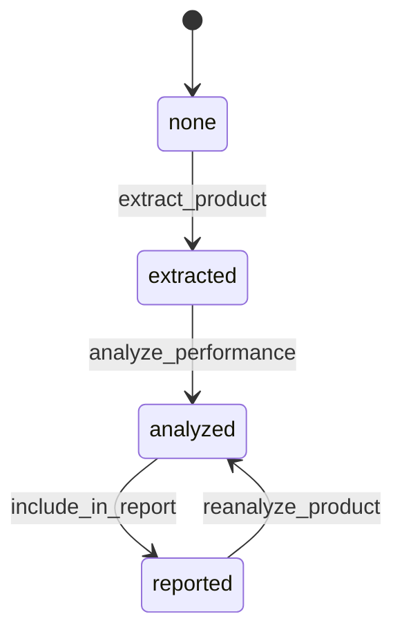
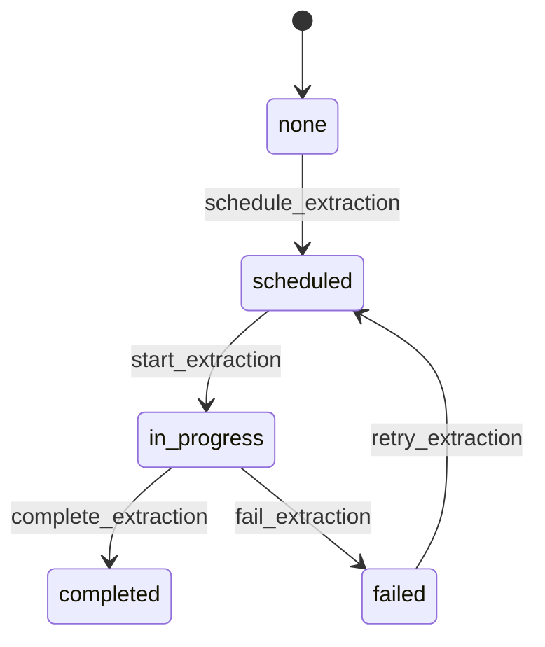
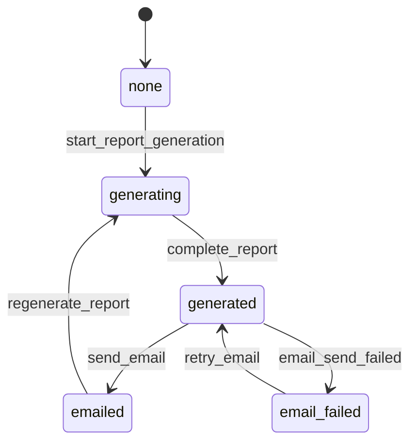
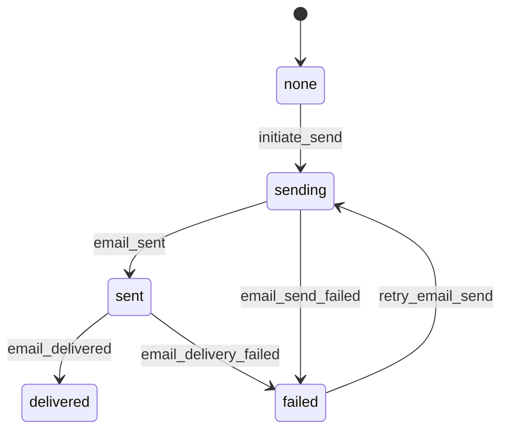

# Workflow Requirements

## Overview
This document defines the workflow state machines for the Product Performance Analysis and Reporting System. Each entity has its own workflow that manages state transitions and business logic execution.

## 1. Product Workflow

**Purpose**: Manages the lifecycle of product data from extraction through analysis and reporting.

**States**: `none` → `extracted` → `analyzed` → `reported`

**Transitions**:

1. **none → extracted** (automatic)
   - **Name**: `extract_product`
   - **Trigger**: When product data is fetched from Pet Store API
   - **Processor**: `ProductExtractionProcessor`
   - **Description**: Extracts product data from Pet Store API and populates product entity

2. **extracted → analyzed** (automatic)
   - **Name**: `analyze_performance`
   - **Trigger**: After successful extraction
   - **Processor**: `ProductAnalysisProcessor`
   - **Description**: Calculates performance metrics, turnover rates, and flags

3. **analyzed → reported** (automatic)
   - **Name**: `include_in_report`
   - **Trigger**: When report generation includes this product
   - **Processor**: `ProductReportingProcessor`
   - **Description**: Prepares product data for inclusion in reports

4. **reported → analyzed** (manual)
   - **Name**: `reanalyze_product`
   - **Trigger**: Manual trigger for re-analysis
   - **Processor**: `ProductAnalysisProcessor`
   - **Description**: Re-calculates performance metrics with updated data

```mermaid
stateDiagram-v2
    [*] --> none
    none --> extracted : extract_product
    extracted --> analyzed : analyze_performance
    analyzed --> reported : include_in_report
    reported --> analyzed : reanalyze_product
```

## 2. DataExtraction Workflow

**Purpose**: Manages the data extraction process from Pet Store API with scheduling and error handling.

**States**: `none` → `scheduled` → `in_progress` → `completed` / `failed`

**Transitions**:

1. **none → scheduled** (automatic)
   - **Name**: `schedule_extraction`
   - **Trigger**: System startup or manual scheduling
   - **Processor**: `ExtractionSchedulingProcessor`
   - **Description**: Schedules data extraction for specified time

2. **scheduled → in_progress** (automatic)
   - **Name**: `start_extraction`
   - **Trigger**: Scheduled time reached
   - **Processor**: `DataExtractionProcessor`
   - **Description**: Begins data extraction from Pet Store API

3. **in_progress → completed** (automatic)
   - **Name**: `complete_extraction`
   - **Trigger**: Successful data extraction
   - **Criterion**: `ExtractionSuccessCriterion`
   - **Processor**: `ExtractionCompletionProcessor`
   - **Description**: Finalizes successful extraction and triggers analysis

4. **in_progress → failed** (automatic)
   - **Name**: `fail_extraction`
   - **Trigger**: Extraction error or timeout
   - **Criterion**: `ExtractionFailureCriterion`
   - **Processor**: `ExtractionFailureProcessor`
   - **Description**: Handles extraction failures and logs errors

5. **failed → scheduled** (manual)
   - **Name**: `retry_extraction`
   - **Trigger**: Manual retry or automatic retry policy
   - **Criterion**: `RetryEligibilityCriterion`
   - **Processor**: `ExtractionRetryProcessor`
   - **Description**: Reschedules failed extraction for retry

```mermaid
stateDiagram-v2
    [*] --> none
    none --> scheduled : schedule_extraction
    scheduled --> in_progress : start_extraction
    in_progress --> completed : complete_extraction
    in_progress --> failed : fail_extraction
    failed --> scheduled : retry_extraction
```

## 3. Report Workflow

**Purpose**: Manages report generation, formatting, and email delivery.

**States**: `none` → `generating` → `generated` → `emailed` / `email_failed`

**Transitions**:

1. **none → generating** (automatic)
   - **Name**: `start_report_generation`
   - **Trigger**: After successful data extraction
   - **Processor**: `ReportInitializationProcessor`
   - **Description**: Initializes report generation process

2. **generating → generated** (automatic)
   - **Name**: `complete_report`
   - **Trigger**: Report generation completed
   - **Processor**: `ReportGenerationProcessor`
   - **Description**: Generates PDF/HTML report with analysis results

3. **generated → emailed** (automatic)
   - **Name**: `send_email`
   - **Trigger**: Report generation completed
   - **Processor**: `EmailSendingProcessor`
   - **Description**: Sends report via email to recipients

4. **generated → email_failed** (automatic)
   - **Name**: `email_send_failed`
   - **Trigger**: Email sending failure
   - **Criterion**: `EmailFailureCriterion`
   - **Processor**: `EmailFailureProcessor`
   - **Description**: Handles email sending failures

5. **email_failed → generated** (manual)
   - **Name**: `retry_email`
   - **Trigger**: Manual retry or automatic retry policy
   - **Criterion**: `EmailRetryEligibilityCriterion`
   - **Processor**: `EmailRetryProcessor`
   - **Description**: Retries email sending

6. **emailed → generating** (manual)
   - **Name**: `regenerate_report`
   - **Trigger**: Manual trigger for report regeneration
   - **Processor**: `ReportRegenerationProcessor`
   - **Description**: Regenerates report with updated data

```mermaid
stateDiagram-v2
    [*] --> none
    none --> generating : start_report_generation
    generating --> generated : complete_report
    generated --> emailed : send_email
    generated --> email_failed : email_send_failed
    email_failed --> generated : retry_email
    emailed --> generating : regenerate_report
```

## 4. EmailNotification Workflow

**Purpose**: Manages email notification delivery with retry logic.

**States**: `none` → `sending` → `sent` → `delivered` / `failed`

**Transitions**:

1. **none → sending** (automatic)
   - **Name**: `initiate_send`
   - **Trigger**: Report ready for email
   - **Processor**: `EmailInitiationProcessor`
   - **Description**: Prepares email content and attachments

2. **sending → sent** (automatic)
   - **Name**: `email_sent`
   - **Trigger**: Email successfully sent to SMTP server
   - **Processor**: `EmailSentProcessor`
   - **Description**: Confirms email was sent to mail server

3. **sent → delivered** (automatic)
   - **Name**: `email_delivered`
   - **Trigger**: Delivery confirmation received
   - **Criterion**: `DeliveryConfirmationCriterion`
   - **Processor**: `EmailDeliveredProcessor`
   - **Description**: Confirms email was delivered to recipient

4. **sending → failed** (automatic)
   - **Name**: `email_send_failed`
   - **Trigger**: SMTP error or timeout
   - **Criterion**: `EmailSendFailureCriterion`
   - **Processor**: `EmailSendFailureProcessor`
   - **Description**: Handles email sending failures

5. **sent → failed** (automatic)
   - **Name**: `email_delivery_failed`
   - **Trigger**: Bounce or delivery failure
   - **Criterion**: `DeliveryFailureCriterion`
   - **Processor**: `EmailDeliveryFailureProcessor`
   - **Description**: Handles email delivery failures

6. **failed → sending** (manual)
   - **Name**: `retry_email_send`
   - **Trigger**: Manual retry or automatic retry policy
   - **Criterion**: `EmailRetryEligibilityCriterion`
   - **Processor**: `EmailRetryProcessor`
   - **Description**: Retries email sending

```mermaid
stateDiagram-v2
    [*] --> none
    none --> sending : initiate_send
    sending --> sent : email_sent
    sent --> delivered : email_delivered
    sending --> failed : email_send_failed
    sent --> failed : email_delivery_failed
    failed --> sending : retry_email_send
```

## Workflow Integration

### Cross-Entity Triggers
1. **DataExtraction.completed** → triggers **Product.extract_product** for each extracted product
2. **Product.analyzed** (all products) → triggers **Report.start_report_generation**
3. **Report.generated** → triggers **EmailNotification.initiate_send**

### Scheduling Integration
- **DataExtraction** workflows are triggered every Monday via scheduled job
- **Report** workflows are triggered after successful data extraction
- **EmailNotification** workflows are triggered after report generation

### Error Handling
- All workflows include failure states with retry mechanisms
- Retry policies are configurable per workflow
- Failed workflows can be manually restarted or automatically retried
- Error notifications are sent to system administrators

### Business Rules
- Products must be extracted before analysis
- Reports can only be generated after product analysis
- Email notifications require completed reports
- Manual transitions are available for error recovery
- Automatic transitions follow business logic validation
