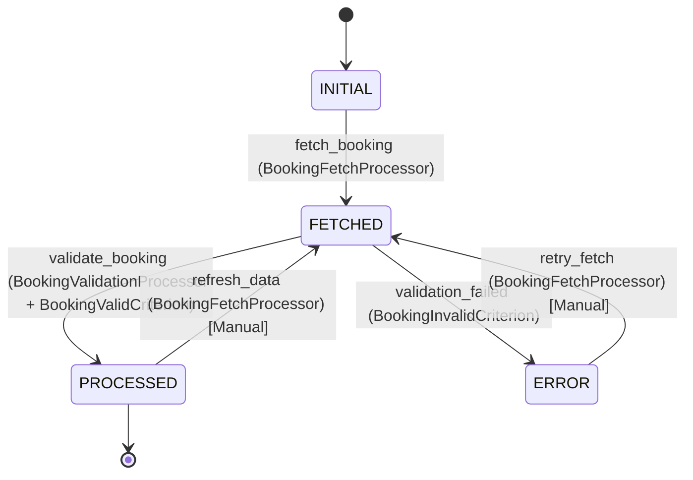
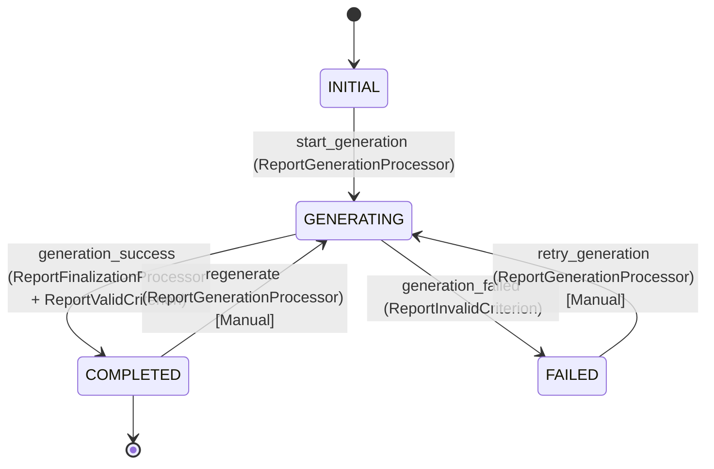

# Workflow Requirements

## Booking Workflow

### Overview
The Booking workflow manages the lifecycle of booking data from initial creation through fetching from external API to being ready for reporting.

### Workflow Name
`BookingWorkflow`

### States
1. **INITIAL** - Booking entity created but not yet populated with external data
2. **FETCHED** - Booking data successfully retrieved from Restful Booker API
3. **PROCESSED** - Booking data validated and ready for reporting
4. **ERROR** - Error occurred during data fetching or processing

### Transitions

| From State | To State | Transition Name | Type | Processor | Criterion | Description |
|------------|----------|----------------|------|-----------|-----------|-------------|
| INITIAL | FETCHED | fetch_booking | Automatic | BookingFetchProcessor | null | Fetch booking data from Restful Booker API |
| FETCHED | PROCESSED | validate_booking | Automatic | BookingValidationProcessor | BookingValidCriterion | Validate and process booking data |
| FETCHED | ERROR | validation_failed | Automatic | null | BookingInvalidCriterion | Handle invalid booking data |
| ERROR | FETCHED | retry_fetch | Manual | BookingFetchProcessor | null | Retry fetching booking data |
| PROCESSED | FETCHED | refresh_data | Manual | BookingFetchProcessor | null | Refresh booking data from API |

### Mermaid State Diagram

```mermaid
stateDiagram-v2
    [*] --> INITIAL
    INITIAL --> FETCHED : fetch_booking (BookingFetchProcessor)
    FETCHED --> PROCESSED : validate_booking (BookingValidationProcessor + BookingValidCriterion)
    FETCHED --> ERROR : validation_failed (BookingInvalidCriterion)
    ERROR --> FETCHED : retry_fetch (BookingFetchProcessor) [Manual]
    PROCESSED --> FETCHED : refresh_data (BookingFetchProcessor) [Manual]
    PROCESSED --> [*]
```

## Report Workflow

### Overview
The Report workflow manages the generation of reports from processed booking data.

### Workflow Name
`ReportWorkflow`

### States
1. **INITIAL** - Report request created
2. **GENERATING** - Report is being generated from booking data
3. **COMPLETED** - Report successfully generated
4. **FAILED** - Report generation failed

### Transitions

| From State | To State | Transition Name | Type | Processor | Criterion | Description |
|------------|----------|----------------|------|-----------|-----------|-------------|
| INITIAL | GENERATING | start_generation | Automatic | ReportGenerationProcessor | null | Start generating report from booking data |
| GENERATING | COMPLETED | generation_success | Automatic | ReportFinalizationProcessor | ReportValidCriterion | Finalize and validate generated report |
| GENERATING | FAILED | generation_failed | Automatic | null | ReportInvalidCriterion | Handle report generation failure |
| FAILED | GENERATING | retry_generation | Manual | ReportGenerationProcessor | null | Retry report generation |
| COMPLETED | GENERATING | regenerate | Manual | ReportGenerationProcessor | null | Regenerate report with updated data |

### Mermaid State Diagram

```mermaid
stateDiagram-v2
    [*] --> INITIAL
    INITIAL --> GENERATING : start_generation (ReportGenerationProcessor)
    GENERATING --> COMPLETED : generation_success (ReportFinalizationProcessor + ReportValidCriterion)
    GENERATING --> FAILED : generation_failed (ReportInvalidCriterion)
    FAILED --> GENERATING : retry_generation (ReportGenerationProcessor) [Manual]
    COMPLETED --> GENERATING : regenerate (ReportGenerationProcessor) [Manual]
    COMPLETED --> [*]
```

## Workflow Integration Notes

### Booking Data Flow
1. **Initial Creation**: Booking entities are created in INITIAL state
2. **Data Fetching**: BookingFetchProcessor retrieves data from Restful Booker API
3. **Validation**: BookingValidationProcessor ensures data integrity
4. **Error Handling**: Failed validations move to ERROR state with manual retry option
5. **Data Refresh**: Manual transitions allow updating booking data

### Report Generation Flow
1. **Report Request**: Report entities created in INITIAL state
2. **Data Aggregation**: ReportGenerationProcessor aggregates processed booking data
3. **Report Finalization**: ReportFinalizationProcessor creates final report output
4. **Error Recovery**: Failed generations can be retried manually
5. **Report Updates**: Completed reports can be regenerated with fresh data

### Cross-Workflow Dependencies
- Reports can only be generated from bookings in PROCESSED state
- Report generation processors will query for bookings with state = PROCESSED
- No direct workflow dependencies, but data dependencies exist

### Manual vs Automatic Transitions
- **Automatic**: System-driven transitions that occur immediately when conditions are met
- **Manual**: User-initiated transitions for error recovery and data refresh operations
- **First Transition**: Always automatic from INITIAL state as per requirements

### Error Handling Strategy
- Both workflows include error states for graceful failure handling
- Manual retry mechanisms allow recovery from transient failures
- Error states preserve entity data for debugging and recovery
