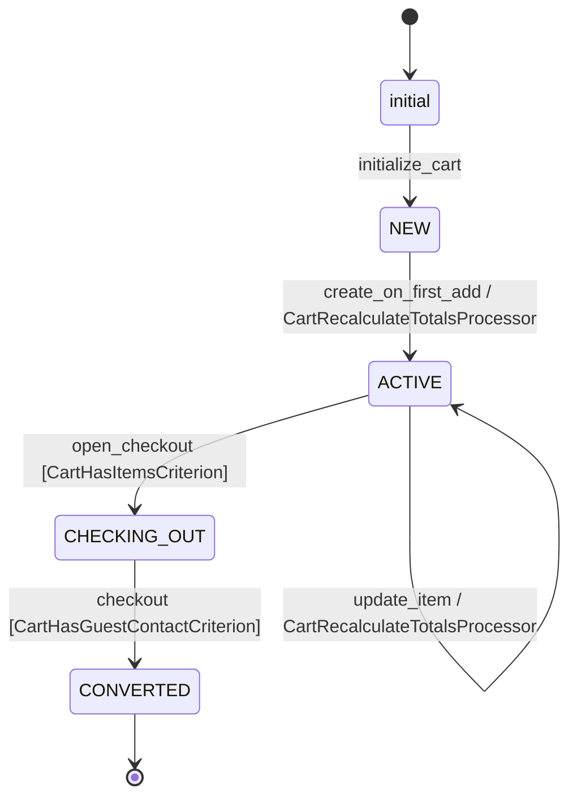
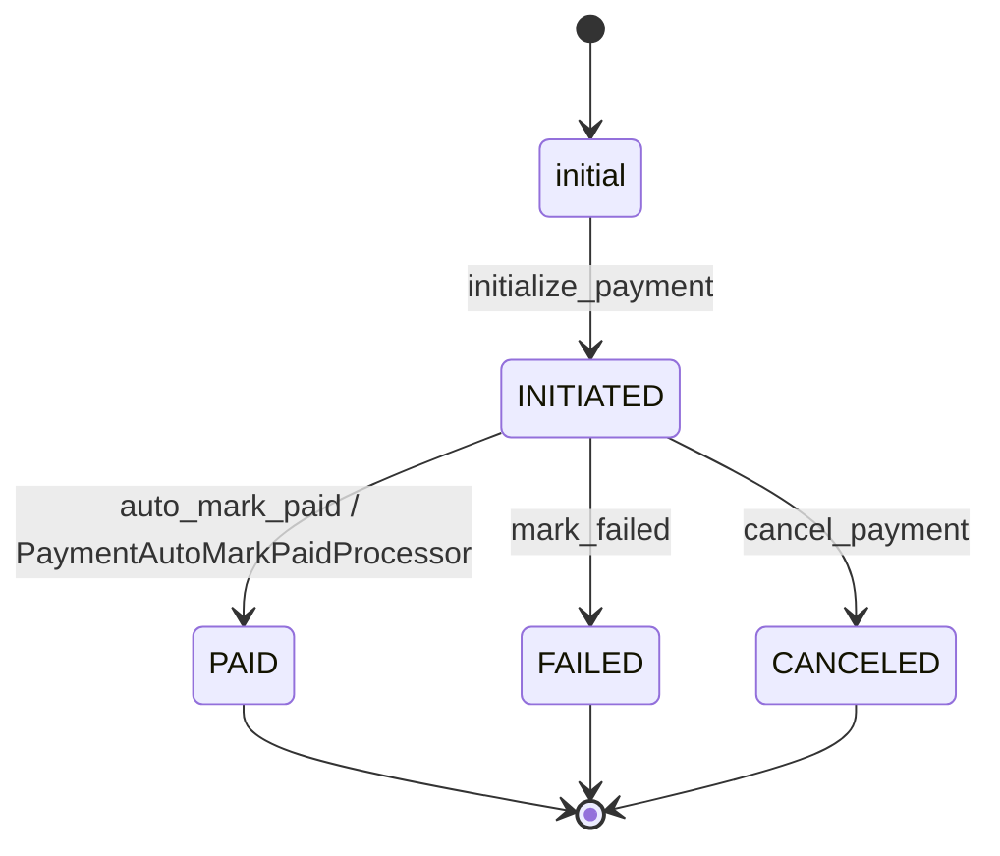
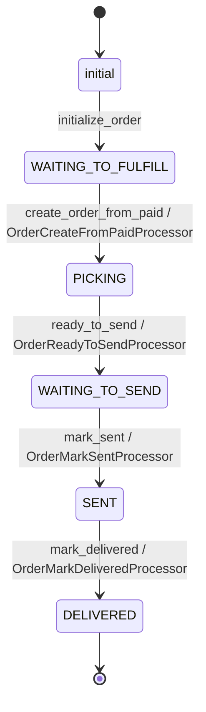
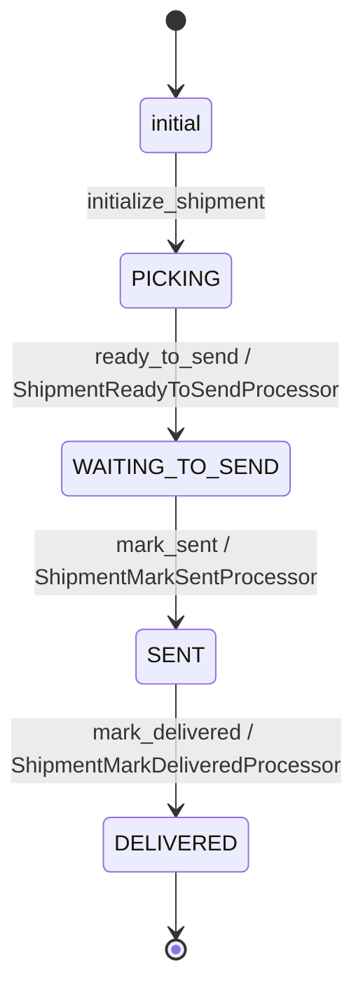

# Workflow Requirements

## Overview
This document defines the workflows for the Cyoda OMS Backend system. Each entity has its own workflow that manages state transitions and business logic.

## Workflows

### 1. CartFlow Workflow
**Entity:** Cart
**Description:** Manages the shopping cart lifecycle from creation to conversion.

**States:**
- `initial` → `NEW` → `ACTIVE` → `CHECKING_OUT` → `CONVERTED`

**Transitions:**

1. **initial → NEW**
   - **Name:** `initialize_cart`
   - **Type:** Automatic (first transition)
   - **Processor:** None
   - **Criterion:** None
   - **Description:** Initial state transition when cart is created

2. **NEW → ACTIVE**
   - **Name:** `create_on_first_add`
   - **Type:** Automatic
   - **Processor:** `CartRecalculateTotalsProcessor`
   - **Criterion:** None
   - **Description:** Activate cart when first item is added

3. **ACTIVE → ACTIVE (loop)**
   - **Name:** `add_item`
   - **Type:** Manual
   - **Processor:** `CartRecalculateTotalsProcessor`
   - **Criterion:** None
   - **Description:** Add or increment item quantity

4. **ACTIVE → ACTIVE (loop)**
   - **Name:** `update_item`
   - **Type:** Manual
   - **Processor:** `CartRecalculateTotalsProcessor`
   - **Criterion:** None
   - **Description:** Update item quantity or remove if qty=0

5. **ACTIVE → CHECKING_OUT**
   - **Name:** `open_checkout`
   - **Type:** Manual
   - **Processor:** None
   - **Criterion:** `CartHasItemsCriterion`
   - **Description:** Start checkout process

6. **CHECKING_OUT → CONVERTED**
   - **Name:** `checkout`
   - **Type:** Manual
   - **Processor:** None
   - **Criterion:** `CartHasGuestContactCriterion`
   - **Description:** Complete checkout and convert cart

```mermaid
stateDiagram-v2
    [*] --> initial
    initial --> NEW : initialize_cart
    NEW --> ACTIVE : create_on_first_add / CartRecalculateTotalsProcessor
    ACTIVE --> ACTIVE : add_item / CartRecalculateTotalsProcessor
    ACTIVE --> ACTIVE : update_item / CartRecalculateTotalsProcessor
    ACTIVE --> CHECKING_OUT : open_checkout [CartHasItemsCriterion]
    CHECKING_OUT --> CONVERTED : checkout [CartHasGuestContactCriterion]
    CONVERTED --> [*]
```

### 2. PaymentFlow Workflow
**Entity:** Payment
**Description:** Manages dummy payment processing with auto-approval after 3 seconds.

**States:**
- `initial` → `INITIATED` → `PAID` | `FAILED` | `CANCELED`

**Transitions:**

1. **initial → INITIATED**
   - **Name:** `initialize_payment`
   - **Type:** Automatic (first transition)
   - **Processor:** None
   - **Criterion:** None
   - **Description:** Initial state transition when payment is created

2. **INITIATED → PAID**
   - **Name:** `auto_mark_paid`
   - **Type:** Automatic
   - **Processor:** `PaymentAutoMarkPaidProcessor`
   - **Criterion:** None
   - **Description:** Auto-approve payment after 3 seconds

3. **INITIATED → FAILED**
   - **Name:** `mark_failed`
   - **Type:** Manual
   - **Processor:** None
   - **Criterion:** None
   - **Description:** Mark payment as failed

4. **INITIATED → CANCELED**
   - **Name:** `cancel_payment`
   - **Type:** Manual
   - **Processor:** None
   - **Criterion:** None
   - **Description:** Cancel payment

```mermaid
stateDiagram-v2
    [*] --> initial
    initial --> INITIATED : initialize_payment
    INITIATED --> PAID : auto_mark_paid / PaymentAutoMarkPaidProcessor
    INITIATED --> FAILED : mark_failed
    INITIATED --> CANCELED : cancel_payment
    PAID --> [*]
    FAILED --> [*]
    CANCELED --> [*]
```

### 3. OrderLifecycle Workflow
**Entity:** Order
**Description:** Manages order fulfillment from creation to delivery.

**States:**
- `initial` → `WAITING_TO_FULFILL` → `PICKING` → `WAITING_TO_SEND` → `SENT` → `DELIVERED`

**Transitions:**

1. **initial → WAITING_TO_FULFILL**
   - **Name:** `initialize_order`
   - **Type:** Automatic (first transition)
   - **Processor:** None
   - **Criterion:** None
   - **Description:** Initial state transition when order is created

2. **WAITING_TO_FULFILL → PICKING**
   - **Name:** `create_order_from_paid`
   - **Type:** Automatic
   - **Processor:** `OrderCreateFromPaidProcessor`
   - **Criterion:** None
   - **Description:** Create order from paid cart, decrement stock, create shipment

3. **PICKING → WAITING_TO_SEND**
   - **Name:** `ready_to_send`
   - **Type:** Manual
   - **Processor:** `OrderReadyToSendProcessor`
   - **Criterion:** None
   - **Description:** Mark order ready for shipping

4. **WAITING_TO_SEND → SENT**
   - **Name:** `mark_sent`
   - **Type:** Manual
   - **Processor:** `OrderMarkSentProcessor`
   - **Criterion:** None
   - **Description:** Mark order as sent

5. **SENT → DELIVERED**
   - **Name:** `mark_delivered`
   - **Type:** Manual
   - **Processor:** `OrderMarkDeliveredProcessor`
   - **Criterion:** None
   - **Description:** Mark order as delivered

```mermaid
stateDiagram-v2
    [*] --> initial
    initial --> WAITING_TO_FULFILL : initialize_order
    WAITING_TO_FULFILL --> PICKING : create_order_from_paid / OrderCreateFromPaidProcessor
    PICKING --> WAITING_TO_SEND : ready_to_send / OrderReadyToSendProcessor
    WAITING_TO_SEND --> SENT : mark_sent / OrderMarkSentProcessor
    SENT --> DELIVERED : mark_delivered / OrderMarkDeliveredProcessor
    DELIVERED --> [*]
```

### 4. ShipmentLifecycle Workflow
**Entity:** Shipment
**Description:** Manages shipment lifecycle synchronized with order states.

**States:**
- `initial` → `PICKING` → `WAITING_TO_SEND` → `SENT` → `DELIVERED`

**Transitions:**

1. **initial → PICKING**
   - **Name:** `initialize_shipment`
   - **Type:** Automatic (first transition)
   - **Processor:** None
   - **Criterion:** None
   - **Description:** Initial state transition when shipment is created

2. **PICKING → WAITING_TO_SEND**
   - **Name:** `ready_to_send`
   - **Type:** Manual
   - **Processor:** `ShipmentReadyToSendProcessor`
   - **Criterion:** None
   - **Description:** Mark shipment ready for sending

3. **WAITING_TO_SEND → SENT**
   - **Name:** `mark_sent`
   - **Type:** Manual
   - **Processor:** `ShipmentMarkSentProcessor`
   - **Criterion:** None
   - **Description:** Mark shipment as sent

4. **SENT → DELIVERED**
   - **Name:** `mark_delivered`
   - **Type:** Manual
   - **Processor:** `ShipmentMarkDeliveredProcessor`
   - **Criterion:** None
   - **Description:** Mark shipment as delivered

```mermaid
stateDiagram-v2
    [*] --> initial
    initial --> PICKING : initialize_shipment
    PICKING --> WAITING_TO_SEND : ready_to_send / ShipmentReadyToSendProcessor
    WAITING_TO_SEND --> SENT : mark_sent / ShipmentMarkSentProcessor
    SENT --> DELIVERED : mark_delivered / ShipmentMarkDeliveredProcessor
    DELIVERED --> [*]
```

## Workflow Coordination

### Order and Shipment Synchronization
- Order and Shipment workflows are coordinated
- Order state changes trigger corresponding Shipment state changes
- Single shipment per order for demo purposes

### Cart to Order Conversion
- Cart CONVERTED state triggers order creation
- Payment PAID state is prerequisite for order creation
- Order creation process snapshots cart data and decrements product stock

## Transition Types
- **Automatic:** System-triggered transitions (first transitions and timed events)
- **Manual:** User or API-triggered transitions requiring explicit action
