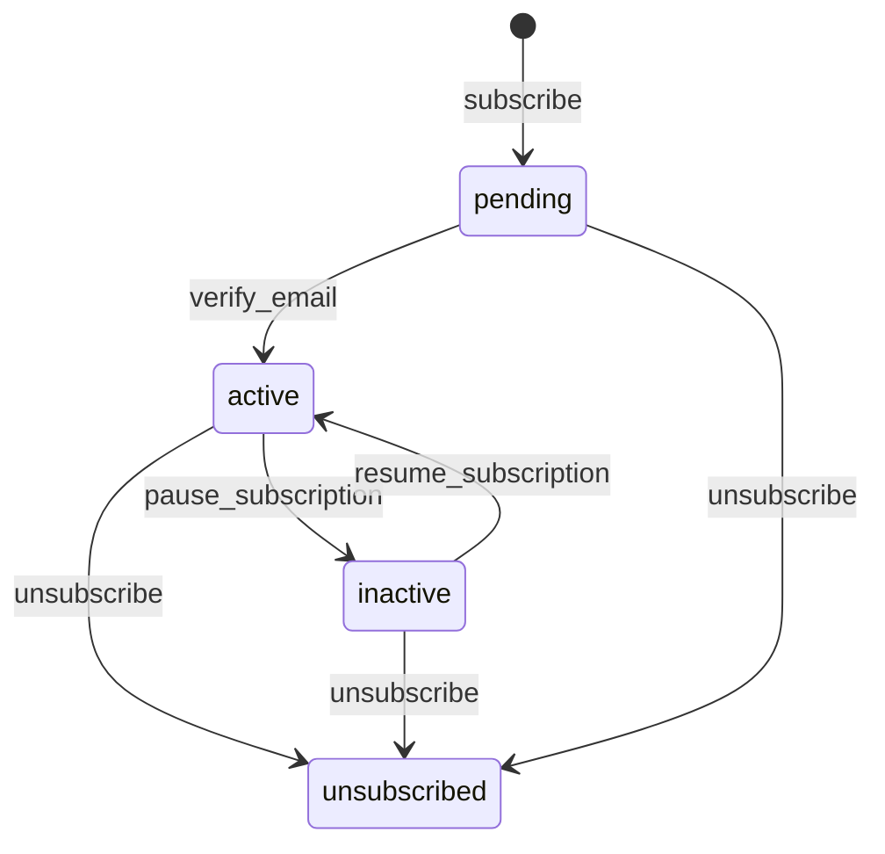
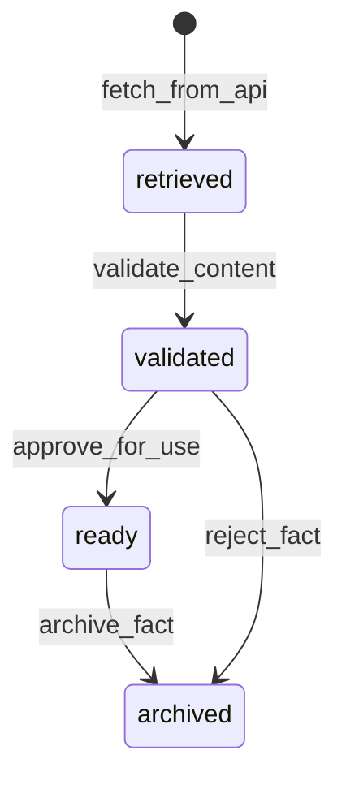
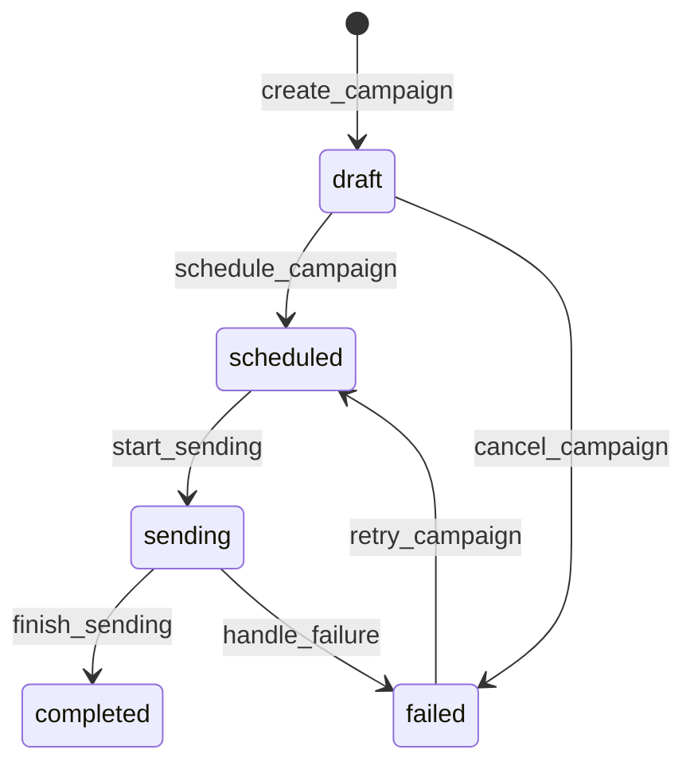
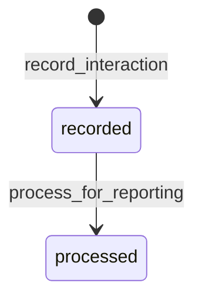

# Workflows

This document defines the workflows for each entity in the Weekly Cat Fact Subscription application.

## Workflow Overview

Each entity has its own workflow that manages its lifecycle through various states and transitions. The workflows include processors for business logic and criteria for conditional transitions.

## 1. Subscriber Workflow

### States and Transitions

```mermaid
stateDiagram-v2
    [*] --> pending: subscribe
    pending --> active: verify_email
    active --> inactive: pause_subscription
    inactive --> active: resume_subscription
    active --> unsubscribed: unsubscribe
    inactive --> unsubscribed: unsubscribe
    pending --> unsubscribed: unsubscribe
```

### Workflow Configuration

**Initial State**: `none`

**Transitions**:

1. **none → pending** (subscribe)
   - **Type**: Automatic
   - **Processor**: SubscriberProcessor (validates email, sends verification)
   - **Criterion**: None

2. **pending → active** (verify_email)
   - **Type**: Manual (triggered by email verification link)
   - **Processor**: SubscriberProcessor (activates subscription)
   - **Criterion**: SubscriberCriterion (validates verification token)

3. **active → inactive** (pause_subscription)
   - **Type**: Manual
   - **Processor**: SubscriberProcessor (pauses subscription)
   - **Criterion**: None

4. **inactive → active** (resume_subscription)
   - **Type**: Manual
   - **Processor**: SubscriberProcessor (resumes subscription)
   - **Criterion**: None

5. **active → unsubscribed** (unsubscribe)
   - **Type**: Manual
   - **Processor**: SubscriberProcessor (processes unsubscription)
   - **Criterion**: None

6. **inactive → unsubscribed** (unsubscribe)
   - **Type**: Manual
   - **Processor**: SubscriberProcessor (processes unsubscription)
   - **Criterion**: None

7. **pending → unsubscribed** (unsubscribe)
   - **Type**: Manual
   - **Processor**: SubscriberProcessor (processes unsubscription)
   - **Criterion**: None

## 2. CatFact Workflow

### States and Transitions

```mermaid
stateDiagram-v2
    [*] --> retrieved: fetch_from_api
    retrieved --> validated: validate_content
    validated --> ready: approve_for_use
    ready --> archived: archive_fact
    validated --> archived: reject_fact
```

### Workflow Configuration

**Initial State**: `none`

**Transitions**:

1. **none → retrieved** (fetch_from_api)
   - **Type**: Automatic
   - **Processor**: CatFactProcessor (fetches from API)
   - **Criterion**: None

2. **retrieved → validated** (validate_content)
   - **Type**: Automatic
   - **Processor**: CatFactProcessor (validates content)
   - **Criterion**: CatFactCriterion (checks content quality)

3. **validated → ready** (approve_for_use)
   - **Type**: Automatic
   - **Processor**: CatFactProcessor (marks as ready)
   - **Criterion**: CatFactCriterion (ensures not duplicate)

4. **ready → archived** (archive_fact)
   - **Type**: Manual
   - **Processor**: CatFactProcessor (archives fact)
   - **Criterion**: CatFactCriterion (checks usage count)

5. **validated → archived** (reject_fact)
   - **Type**: Manual
   - **Processor**: CatFactProcessor (rejects and archives)
   - **Criterion**: None

## 3. EmailCampaign Workflow

### States and Transitions

```mermaid
stateDiagram-v2
    [*] --> draft: create_campaign
    draft --> scheduled: schedule_campaign
    scheduled --> sending: start_sending
    sending --> completed: finish_sending
    sending --> failed: handle_failure
    failed --> scheduled: retry_campaign
    draft --> failed: cancel_campaign
```

### Workflow Configuration

**Initial State**: `none`

**Transitions**:

1. **none → draft** (create_campaign)
   - **Type**: Automatic
   - **Processor**: EmailCampaignProcessor (creates campaign)
   - **Criterion**: None

2. **draft → scheduled** (schedule_campaign)
   - **Type**: Automatic
   - **Processor**: EmailCampaignProcessor (schedules campaign)
   - **Criterion**: EmailCampaignCriterion (validates schedule time)

3. **scheduled → sending** (start_sending)
   - **Type**: Automatic (triggered by scheduler)
   - **Processor**: EmailCampaignProcessor (starts email sending)
   - **Criterion**: EmailCampaignCriterion (checks if time to send)

4. **sending → completed** (finish_sending)
   - **Type**: Automatic
   - **Processor**: EmailCampaignProcessor (finalizes campaign)
   - **Criterion**: EmailCampaignCriterion (all emails processed)

5. **sending → failed** (handle_failure)
   - **Type**: Automatic
   - **Processor**: EmailCampaignProcessor (handles failure)
   - **Criterion**: EmailCampaignCriterion (detects critical failure)

6. **failed → scheduled** (retry_campaign)
   - **Type**: Manual
   - **Processor**: EmailCampaignProcessor (reschedules campaign)
   - **Criterion**: EmailCampaignCriterion (validates retry conditions)

7. **draft → failed** (cancel_campaign)
   - **Type**: Manual
   - **Processor**: EmailCampaignProcessor (cancels campaign)
   - **Criterion**: None

## 4. Interaction Workflow

### States and Transitions

```mermaid
stateDiagram-v2
    [*] --> recorded: record_interaction
    recorded --> processed: process_for_reporting
```

### Workflow Configuration

**Initial State**: `none`

**Transitions**:

1. **none → recorded** (record_interaction)
   - **Type**: Automatic
   - **Processor**: InteractionProcessor (records interaction)
   - **Criterion**: None

2. **recorded → processed** (process_for_reporting)
   - **Type**: Automatic
   - **Processor**: InteractionProcessor (processes for reporting)
   - **Criterion**: InteractionCriterion (validates interaction data)

## Workflow Integration Points

### Scheduled Operations
- **Weekly Cat Fact Retrieval**: Triggers CatFact workflow (none → retrieved)
- **Weekly Email Campaign**: Triggers EmailCampaign workflow (none → draft)
- **Email Sending**: Triggers EmailCampaign transition (scheduled → sending)

### Cross-Entity Triggers
- **Email Campaign Creation**: Requires CatFact in "ready" state
- **Interaction Recording**: Triggered by email opens/clicks from campaigns
- **Subscriber State Changes**: Can affect future campaign targeting

### Business Rules
1. Only active subscribers receive emails
2. Each campaign uses exactly one cat fact
3. Cat facts can be reused but usage is tracked
4. Failed campaigns can be retried with same or different facts
5. All interactions are recorded for reporting purposes
