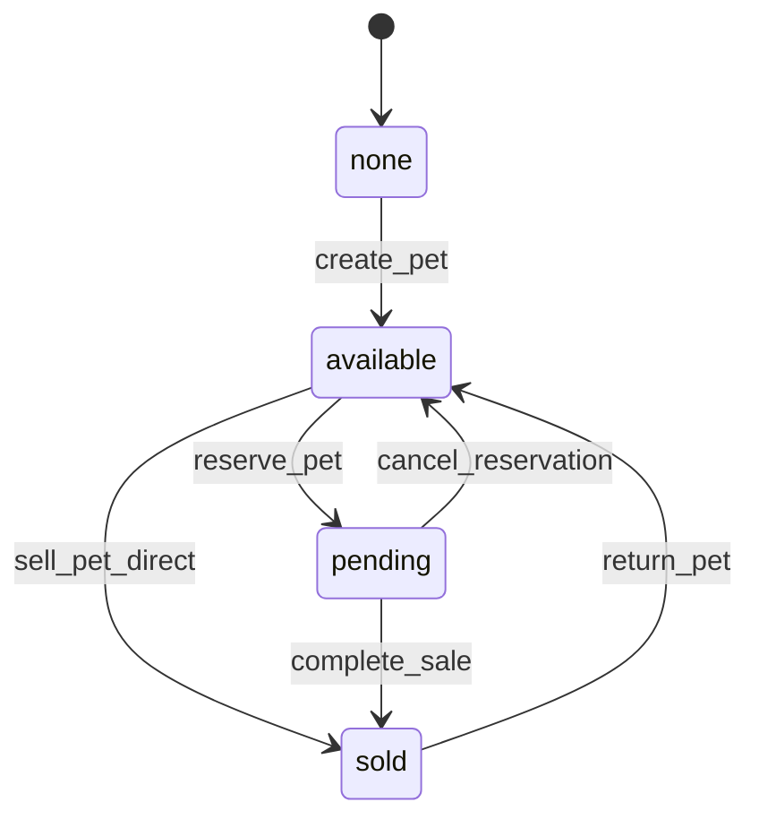
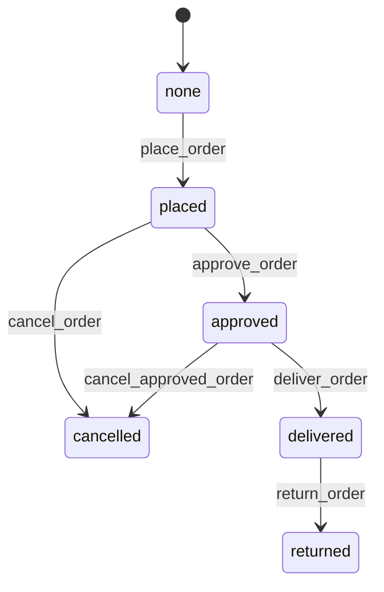
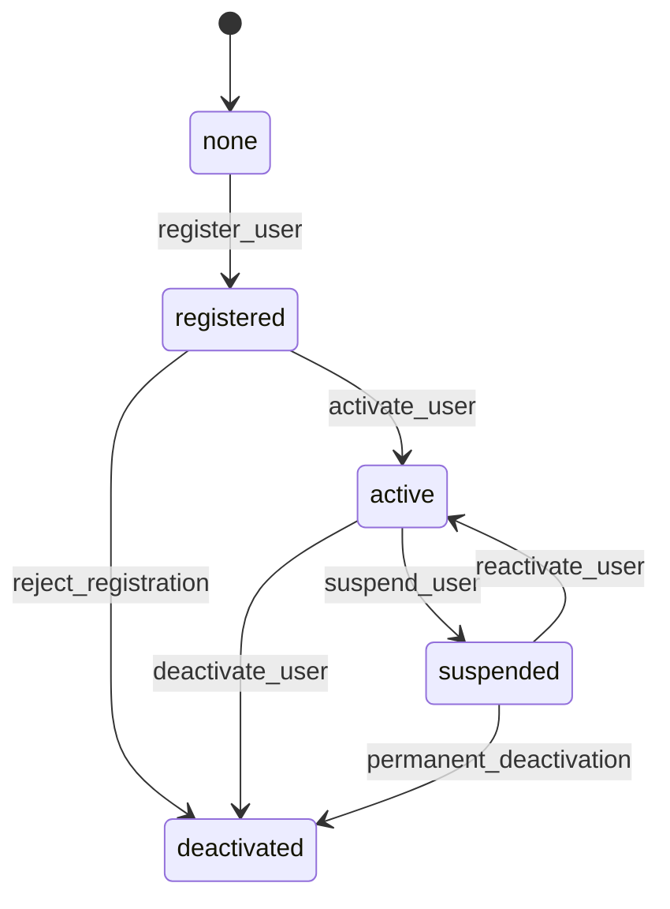
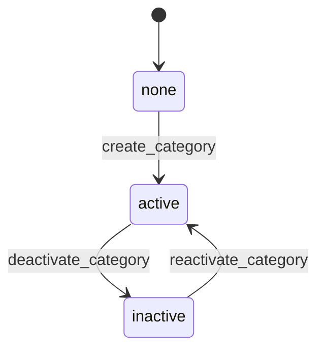
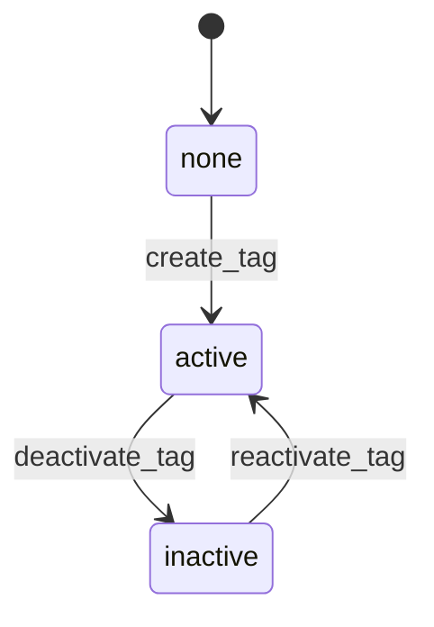

# Purrfect Pets API - Workflow Requirements

## Overview
This document defines the workflow requirements for all entities in the Purrfect Pets API application. Each entity has its own workflow with states, transitions, processors, and criteria.

## 1. Pet Workflow

**Workflow Name**: `pet_workflow`
**Initial State**: `none`

### States and Transitions

```mermaid
stateDiagram-v2
    [*] --> none
    none --> available: create_pet
    available --> pending: reserve_pet
    available --> sold: sell_pet_direct
    pending --> available: cancel_reservation
    pending --> sold: complete_sale
    sold --> available: return_pet
```

### Transition Details

| Transition | From | To | Type | Processor | Criterion |
|------------|------|----|----- |-----------|-----------|
| create_pet | none | available | Automatic | PetCreationProcessor | - |
| reserve_pet | available | pending | Manual | PetReservationProcessor | PetAvailabilityCriterion |
| sell_pet_direct | available | sold | Manual | PetSaleProcessor | PetAvailabilityCriterion |
| cancel_reservation | pending | available | Manual | PetReservationCancelProcessor | - |
| complete_sale | pending | sold | Manual | PetSaleCompletionProcessor | - |
| return_pet | sold | available | Manual | PetReturnProcessor | PetReturnEligibilityCriterion |

## 2. Order Workflow

**Workflow Name**: `order_workflow`
**Initial State**: `none`

### States and Transitions

```mermaid
stateDiagram-v2
    [*] --> none
    none --> placed: place_order
    placed --> approved: approve_order
    placed --> cancelled: cancel_order
    approved --> delivered: deliver_order
    approved --> cancelled: cancel_approved_order
    delivered --> returned: return_order
```

### Transition Details

| Transition | From | To | Type | Processor | Criterion |
|------------|------|----|----- |-----------|-----------|
| place_order | none | placed | Automatic | OrderCreationProcessor | - |
| approve_order | placed | approved | Manual | OrderApprovalProcessor | OrderValidationCriterion |
| cancel_order | placed | cancelled | Manual | OrderCancellationProcessor | - |
| deliver_order | approved | delivered | Manual | OrderDeliveryProcessor | OrderDeliveryCriterion |
| cancel_approved_order | approved | cancelled | Manual | OrderCancellationProcessor | OrderCancellationCriterion |
| return_order | delivered | returned | Manual | OrderReturnProcessor | OrderReturnEligibilityCriterion |

## 3. User Workflow

**Workflow Name**: `user_workflow`
**Initial State**: `none`

### States and Transitions

```mermaid
stateDiagram-v2
    [*] --> none
    none --> registered: register_user
    registered --> active: activate_user
    registered --> deactivated: reject_registration
    active --> suspended: suspend_user
    active --> deactivated: deactivate_user
    suspended --> active: reactivate_user
    suspended --> deactivated: permanent_deactivation
```

### Transition Details

| Transition | From | To | Type | Processor | Criterion |
|------------|------|----|----- |-----------|-----------|
| register_user | none | registered | Automatic | UserRegistrationProcessor | - |
| activate_user | registered | active | Manual | UserActivationProcessor | UserValidationCriterion |
| reject_registration | registered | deactivated | Manual | UserRejectionProcessor | - |
| suspend_user | active | suspended | Manual | UserSuspensionProcessor | UserSuspensionCriterion |
| deactivate_user | active | deactivated | Manual | UserDeactivationProcessor | - |
| reactivate_user | suspended | active | Manual | UserReactivationProcessor | UserReactivationCriterion |
| permanent_deactivation | suspended | deactivated | Manual | UserDeactivationProcessor | - |

## 4. Category Workflow

**Workflow Name**: `category_workflow`
**Initial State**: `none`

### States and Transitions

```mermaid
stateDiagram-v2
    [*] --> none
    none --> active: create_category
    active --> inactive: deactivate_category
    inactive --> active: reactivate_category
```

### Transition Details

| Transition | From | To | Type | Processor | Criterion |
|------------|------|----|----- |-----------|-----------|
| create_category | none | active | Automatic | CategoryCreationProcessor | - |
| deactivate_category | active | inactive | Manual | CategoryDeactivationProcessor | CategoryDeactivationCriterion |
| reactivate_category | inactive | active | Manual | CategoryReactivationProcessor | - |

## 5. Tag Workflow

**Workflow Name**: `tag_workflow`
**Initial State**: `none`

### States and Transitions

```mermaid
stateDiagram-v2
    [*] --> none
    none --> active: create_tag
    active --> inactive: deactivate_tag
    inactive --> active: reactivate_tag
```

### Transition Details

| Transition | From | To | Type | Processor | Criterion |
|------------|------|----|----- |-----------|-----------|
| create_tag | none | active | Automatic | TagCreationProcessor | - |
| deactivate_tag | active | inactive | Manual | TagDeactivationProcessor | TagDeactivationCriterion |
| reactivate_tag | inactive | active | Manual | TagReactivationProcessor | - |

## Workflow Rules and Guidelines

### General Rules
1. **Initial Transition**: The first transition from `none` state is always automatic
2. **Manual Transitions**: All other transitions are manual and require explicit API calls
3. **Loop Transitions**: Transitions that go back to previous states are always manual
4. **State Management**: Entity states are managed by the workflow system and cannot be directly modified

### Processor Naming Convention
- All processors follow PascalCase naming starting with entity name
- Examples: `PetCreationProcessor`, `OrderApprovalProcessor`, `UserRegistrationProcessor`

### Criterion Naming Convention
- All criteria follow PascalCase naming starting with entity name
- Examples: `PetAvailabilityCriterion`, `OrderValidationCriterion`, `UserValidationCriterion`

### Transition Types
- **Automatic**: Triggered automatically by the system (only for initial transitions)
- **Manual**: Triggered by explicit API calls with transition names

### Business Logic Integration
- Processors handle business logic, data validation, and external integrations
- Criteria handle conditional logic and state-based validations
- Each transition can have zero, one, or multiple processors
- Each transition can have zero or one criterion for conditional execution
