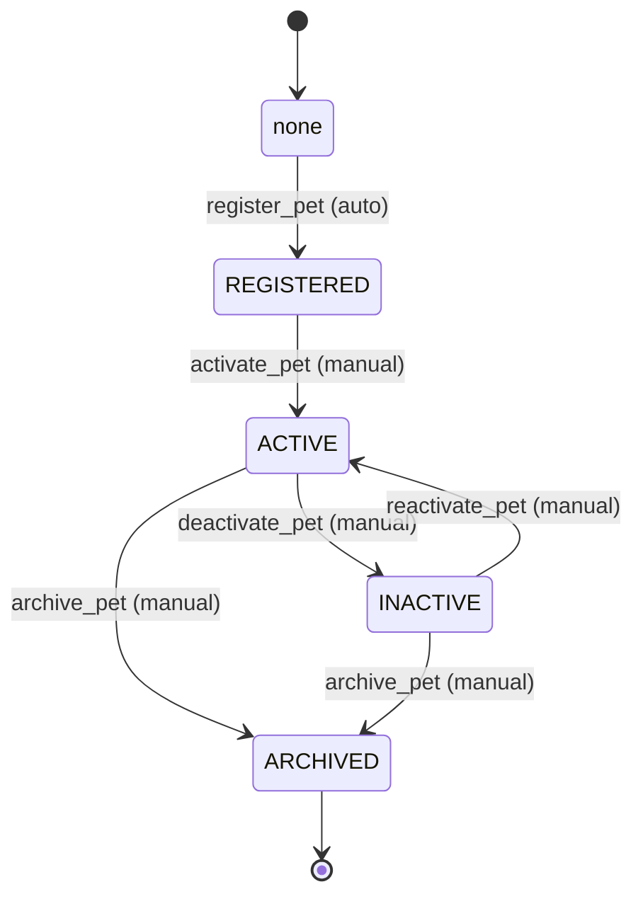
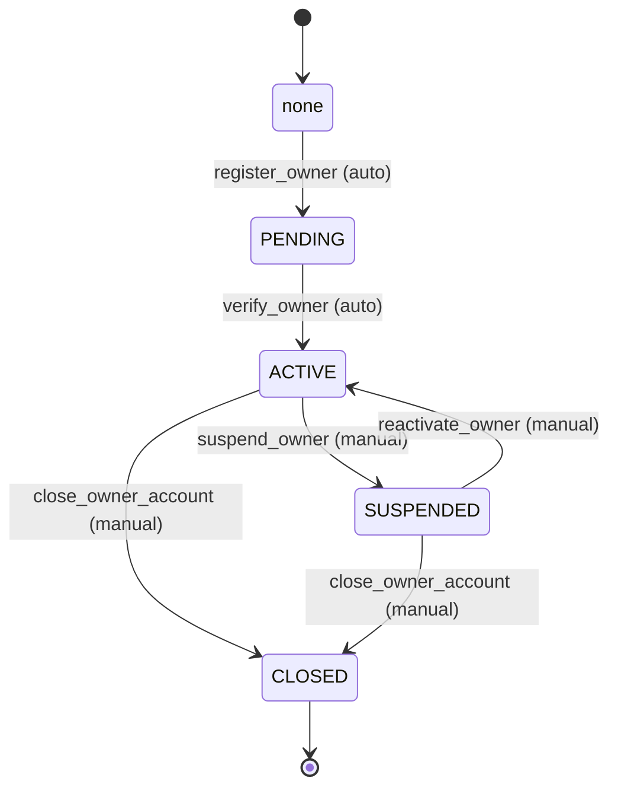
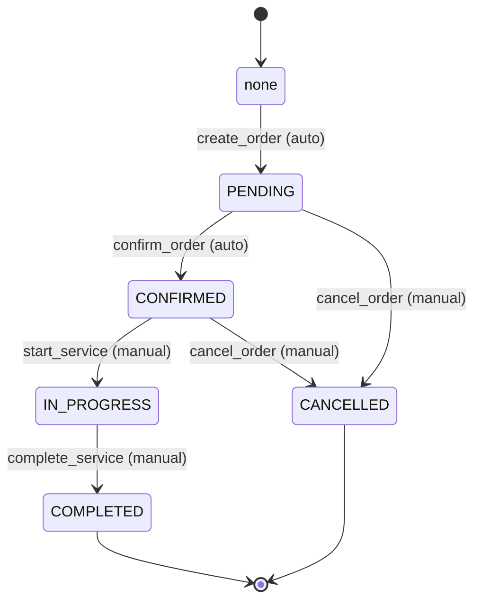

# Workflows Specification - Purrfect Pets API

## Overview
This document defines the workflow state machines for each entity in the Purrfect Pets API. Each entity has its own workflow that manages state transitions based on business rules and user actions.

## 1. Pet Workflow

**Workflow Name:** Pet  
**Description:** Manages the lifecycle of a pet from registration to archival.

**States:**
- `none` (initial) - Starting state before registration
- `REGISTERED` - Pet has been registered but not yet activated
- `ACTIVE` - Pet is active and can receive services
- `INACTIVE` - Pet is temporarily inactive (e.g., moved away)
- `ARCHIVED` - Pet is permanently archived (e.g., deceased)

**Transitions:**

1. **none → REGISTERED** (automatic)
   - Transition: `register_pet`
   - Processor: `PetRegistrationProcessor`
   - Description: Automatically registers a new pet

2. **REGISTERED → ACTIVE** (manual)
   - Transition: `activate_pet`
   - Processor: `PetActivationProcessor`
   - Description: Activates a registered pet for services

3. **ACTIVE → INACTIVE** (manual)
   - Transition: `deactivate_pet`
   - Processor: `PetDeactivationProcessor`
   - Description: Temporarily deactivates a pet

4. **INACTIVE → ACTIVE** (manual)
   - Transition: `reactivate_pet`
   - Processor: `PetReactivationProcessor`
   - Description: Reactivates an inactive pet

5. **ACTIVE → ARCHIVED** (manual)
   - Transition: `archive_pet`
   - Processor: `PetArchivalProcessor`
   - Description: Permanently archives a pet

6. **INACTIVE → ARCHIVED** (manual)
   - Transition: `archive_pet`
   - Processor: `PetArchivalProcessor`
   - Description: Permanently archives an inactive pet

### Pet Workflow Diagram

```mermaid
stateDiagram-v2
    [*] --> none
    none --> REGISTERED : register_pet (auto)
    REGISTERED --> ACTIVE : activate_pet (manual)
    ACTIVE --> INACTIVE : deactivate_pet (manual)
    INACTIVE --> ACTIVE : reactivate_pet (manual)
    ACTIVE --> ARCHIVED : archive_pet (manual)
    INACTIVE --> ARCHIVED : archive_pet (manual)
    ARCHIVED --> [*]
```

---

## 2. Owner Workflow

**Workflow Name:** Owner  
**Description:** Manages the lifecycle of a pet owner from registration to account closure.

**States:**
- `none` (initial) - Starting state before registration
- `PENDING` - Owner registered but pending verification
- `ACTIVE` - Owner is verified and can use services
- `SUSPENDED` - Owner account is temporarily suspended
- `CLOSED` - Owner account is permanently closed

**Transitions:**

1. **none → PENDING** (automatic)
   - Transition: `register_owner`
   - Processor: `OwnerRegistrationProcessor`
   - Description: Automatically creates pending owner account

2. **PENDING → ACTIVE** (automatic)
   - Transition: `verify_owner`
   - Processor: `OwnerVerificationProcessor`
   - Criterion: `OwnerVerificationCriterion`
   - Description: Activates owner after verification

3. **ACTIVE → SUSPENDED** (manual)
   - Transition: `suspend_owner`
   - Processor: `OwnerSuspensionProcessor`
   - Description: Suspends owner account

4. **SUSPENDED → ACTIVE** (manual)
   - Transition: `reactivate_owner`
   - Processor: `OwnerReactivationProcessor`
   - Description: Reactivates suspended owner

5. **ACTIVE → CLOSED** (manual)
   - Transition: `close_owner_account`
   - Processor: `OwnerClosureProcessor`
   - Description: Permanently closes owner account

6. **SUSPENDED → CLOSED** (manual)
   - Transition: `close_owner_account`
   - Processor: `OwnerClosureProcessor`
   - Description: Permanently closes suspended owner account

### Owner Workflow Diagram

```mermaid
stateDiagram-v2
    [*] --> none
    none --> PENDING : register_owner (auto)
    PENDING --> ACTIVE : verify_owner (auto)
    ACTIVE --> SUSPENDED : suspend_owner (manual)
    SUSPENDED --> ACTIVE : reactivate_owner (manual)
    ACTIVE --> CLOSED : close_owner_account (manual)
    SUSPENDED --> CLOSED : close_owner_account (manual)
    CLOSED --> [*]
```

---

## 3. PetCareOrder Workflow

**Workflow Name:** PetCareOrder  
**Description:** Manages the lifecycle of a pet care service order from creation to completion.

**States:**
- `none` (initial) - Starting state before order creation
- `PENDING` - Order created but not yet confirmed
- `CONFIRMED` - Order confirmed and scheduled
- `IN_PROGRESS` - Service is currently being provided
- `COMPLETED` - Service has been completed successfully
- `CANCELLED` - Order was cancelled before completion

**Transitions:**

1. **none → PENDING** (automatic)
   - Transition: `create_order`
   - Processor: `OrderCreationProcessor`
   - Description: Automatically creates a pending order

2. **PENDING → CONFIRMED** (automatic)
   - Transition: `confirm_order`
   - Processor: `OrderConfirmationProcessor`
   - Criterion: `OrderValidationCriterion`
   - Description: Confirms order if validation passes

3. **CONFIRMED → IN_PROGRESS** (manual)
   - Transition: `start_service`
   - Processor: `ServiceStartProcessor`
   - Description: Marks service as started

4. **IN_PROGRESS → COMPLETED** (manual)
   - Transition: `complete_service`
   - Processor: `ServiceCompletionProcessor`
   - Description: Marks service as completed

5. **PENDING → CANCELLED** (manual)
   - Transition: `cancel_order`
   - Processor: `OrderCancellationProcessor`
   - Description: Cancels pending order

6. **CONFIRMED → CANCELLED** (manual)
   - Transition: `cancel_order`
   - Processor: `OrderCancellationProcessor`
   - Description: Cancels confirmed order

### PetCareOrder Workflow Diagram

```mermaid
stateDiagram-v2
    [*] --> none
    none --> PENDING : create_order (auto)
    PENDING --> CONFIRMED : confirm_order (auto)
    CONFIRMED --> IN_PROGRESS : start_service (manual)
    IN_PROGRESS --> COMPLETED : complete_service (manual)
    PENDING --> CANCELLED : cancel_order (manual)
    CONFIRMED --> CANCELLED : cancel_order (manual)
    COMPLETED --> [*]
    CANCELLED --> [*]
```

## Workflow Rules

1. **Initial Transitions**: All workflows start with automatic transitions from `none` state
2. **Manual Transitions**: Loop transitions and state reversals are marked as manual
3. **Automatic Transitions**: Forward progression transitions can be automatic with criteria
4. **Terminal States**: ARCHIVED, CLOSED, COMPLETED, and CANCELLED are terminal states
5. **State Dependencies**: Order workflows depend on Pet and Owner being in valid states
6. **Concurrent Processing**: Multiple orders can be processed simultaneously for the same pet

## Naming Conventions

- **Processors**: PascalCase starting with entity name (e.g., PetRegistrationProcessor)
- **Criteria**: PascalCase starting with entity name (e.g., OwnerVerificationCriterion)
- **Transitions**: snake_case describing the action (e.g., register_pet, confirm_order)
- **States**: UPPER_CASE describing the status (e.g., ACTIVE, PENDING, COMPLETED)
