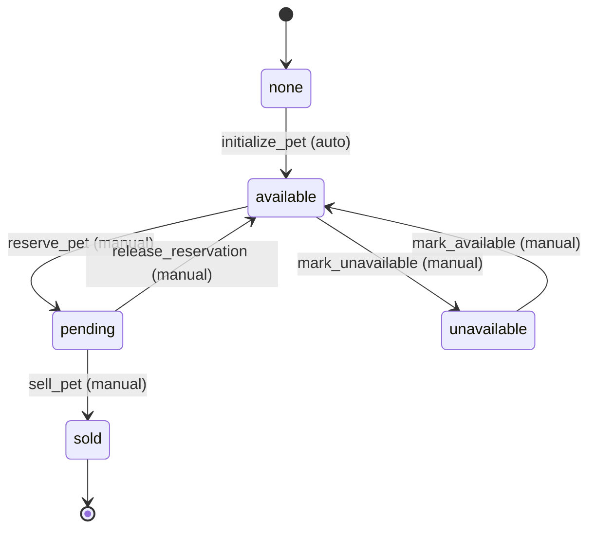
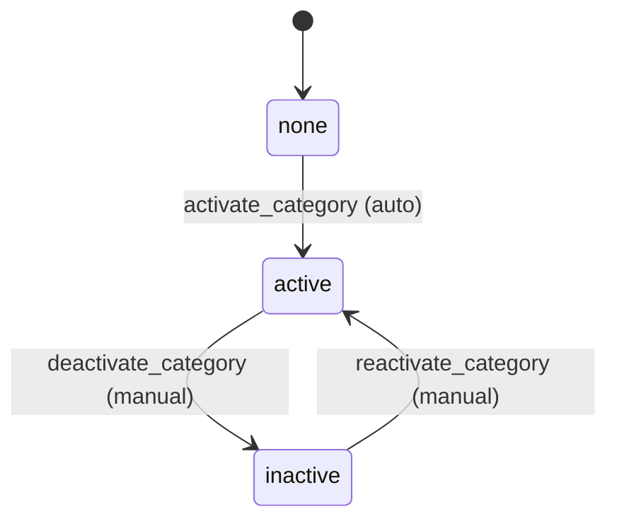
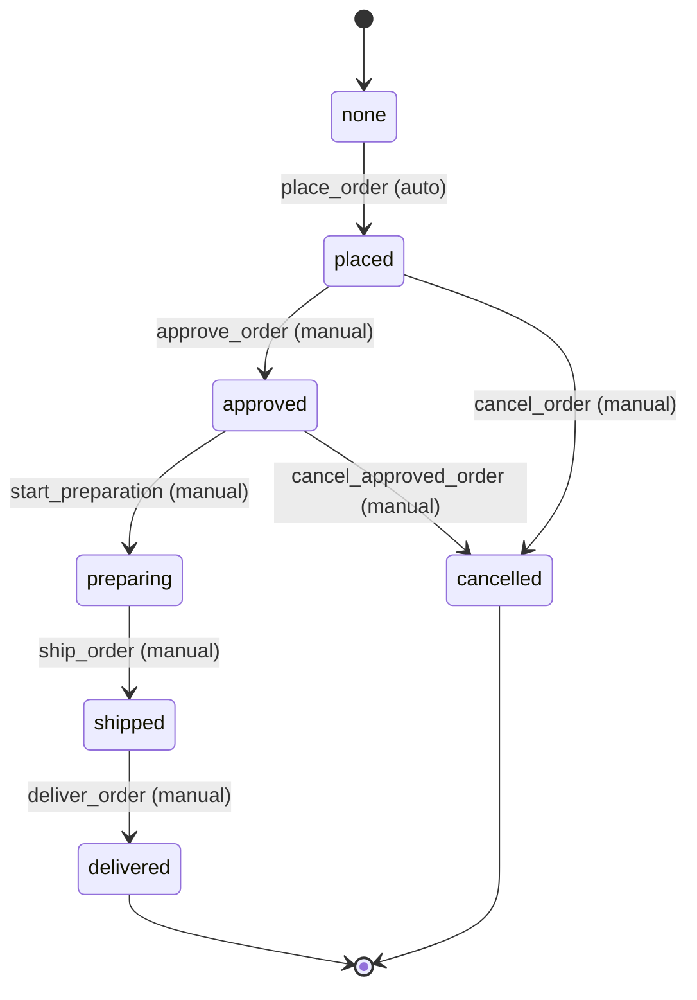
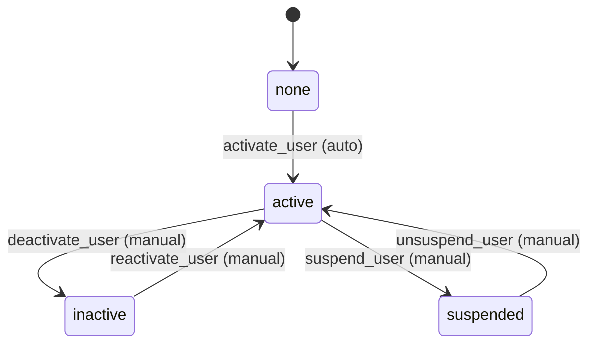

# Purrfect Pets - Workflow Requirements

## Overview
This document defines the workflow state machines for each entity in the Purrfect Pets system. Each entity has its own workflow with states and transitions.

## 1. Pet Workflow

### States
- `none` (initial): Pet entity created but not yet available
- `available`: Pet is available for purchase
- `pending`: Pet is reserved/pending purchase
- `sold`: Pet has been sold
- `unavailable`: Pet is temporarily unavailable

### Transitions
1. `initialize_pet` (automatic): none → available
2. `reserve_pet` (manual): available → pending
3. `release_reservation` (manual): pending → available
4. `sell_pet` (manual): pending → sold
5. `mark_unavailable` (manual): available → unavailable
6. `mark_available` (manual): unavailable → available

### Mermaid Diagram

```mermaid
stateDiagram-v2
    [*] --> none
    none --> available : initialize_pet (auto)
    available --> pending : reserve_pet (manual)
    pending --> available : release_reservation (manual)
    pending --> sold : sell_pet (manual)
    available --> unavailable : mark_unavailable (manual)
    unavailable --> available : mark_available (manual)
    sold --> [*]
```

## 2. Category Workflow

### States
- `none` (initial): Category created but not active
- `active`: Category is active and visible
- `inactive`: Category is inactive and hidden

### Transitions
1. `activate_category` (automatic): none → active
2. `deactivate_category` (manual): active → inactive
3. `reactivate_category` (manual): inactive → active

### Mermaid Diagram

```mermaid
stateDiagram-v2
    [*] --> none
    none --> active : activate_category (auto)
    active --> inactive : deactivate_category (manual)
    inactive --> active : reactivate_category (manual)
```

## 3. Order Workflow

### States
- `none` (initial): Order created but not placed
- `placed`: Order has been placed by customer
- `approved`: Order has been approved for processing
- `preparing`: Order is being prepared for shipment
- `shipped`: Order has been shipped
- `delivered`: Order has been delivered
- `cancelled`: Order has been cancelled

### Transitions
1. `place_order` (automatic): none → placed
2. `approve_order` (manual): placed → approved
3. `start_preparation` (manual): approved → preparing
4. `ship_order` (manual): preparing → shipped
5. `deliver_order` (manual): shipped → delivered
6. `cancel_order` (manual): placed → cancelled
7. `cancel_approved_order` (manual): approved → cancelled

### Mermaid Diagram

```mermaid
stateDiagram-v2
    [*] --> none
    none --> placed : place_order (auto)
    placed --> approved : approve_order (manual)
    placed --> cancelled : cancel_order (manual)
    approved --> preparing : start_preparation (manual)
    approved --> cancelled : cancel_approved_order (manual)
    preparing --> shipped : ship_order (manual)
    shipped --> delivered : deliver_order (manual)
    delivered --> [*]
    cancelled --> [*]
```

## 4. User Workflow

### States
- `none` (initial): User registered but not activated
- `active`: User account is active
- `inactive`: User account is inactive
- `suspended`: User account is suspended

### Transitions
1. `activate_user` (automatic): none → active
2. `deactivate_user` (manual): active → inactive
3. `reactivate_user` (manual): inactive → active
4. `suspend_user` (manual): active → suspended
5. `unsuspend_user` (manual): suspended → active

### Mermaid Diagram

```mermaid
stateDiagram-v2
    [*] --> none
    none --> active : activate_user (auto)
    active --> inactive : deactivate_user (manual)
    inactive --> active : reactivate_user (manual)
    active --> suspended : suspend_user (manual)
    suspended --> active : unsuspend_user (manual)
```

## Workflow Transition Details

### Pet Workflow Transitions
- **initialize_pet**: Automatic transition when pet is first created, no processor/criterion needed
- **reserve_pet**: Manual transition with PetReservationProcessor
- **release_reservation**: Manual transition with PetReleaseProcessor
- **sell_pet**: Manual transition with PetSaleProcessor
- **mark_unavailable**: Manual transition with PetUnavailableProcessor
- **mark_available**: Manual transition with PetAvailableProcessor

### Category Workflow Transitions
- **activate_category**: Automatic transition when category is first created, no processor/criterion needed
- **deactivate_category**: Manual transition with CategoryDeactivationProcessor
- **reactivate_category**: Manual transition with CategoryActivationProcessor

### Order Workflow Transitions
- **place_order**: Automatic transition when order is first created, with OrderPlacementProcessor
- **approve_order**: Manual transition with OrderApprovalProcessor and OrderApprovalCriterion
- **start_preparation**: Manual transition with OrderPreparationProcessor
- **ship_order**: Manual transition with OrderShippingProcessor
- **deliver_order**: Manual transition with OrderDeliveryProcessor
- **cancel_order**: Manual transition with OrderCancellationProcessor
- **cancel_approved_order**: Manual transition with OrderCancellationProcessor

### User Workflow Transitions
- **activate_user**: Automatic transition when user is first created, with UserActivationProcessor
- **deactivate_user**: Manual transition with UserDeactivationProcessor
- **reactivate_user**: Manual transition with UserActivationProcessor
- **suspend_user**: Manual transition with UserSuspensionProcessor
- **unsuspend_user**: Manual transition with UserActivationProcessor

## Notes
- All first transitions from `none` state are automatic
- Manual transitions require explicit API calls with transition names
- Processors handle business logic during transitions
- Criteria evaluate conditions before allowing transitions
- Loop transitions (to same or previous states) are marked as manual
- Terminal states lead to workflow completion
