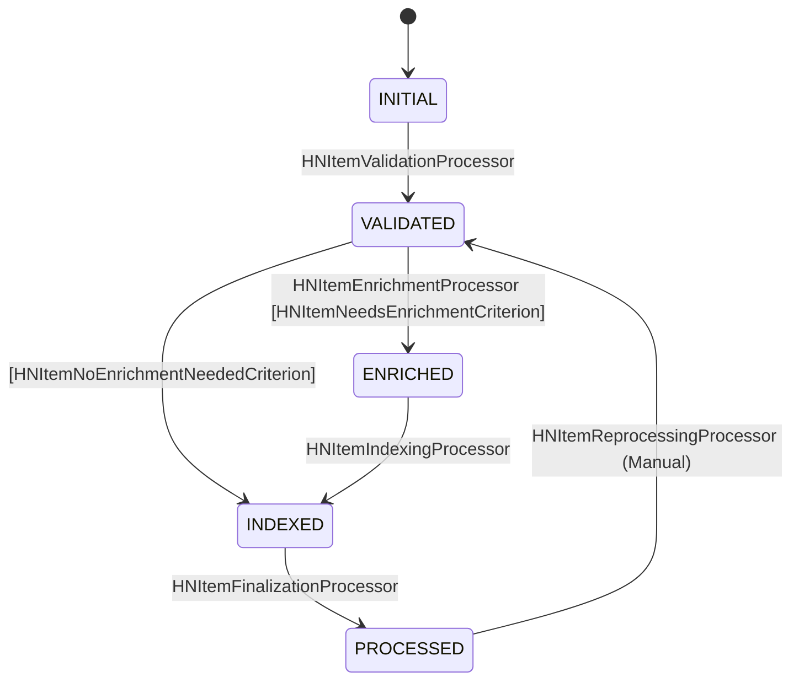
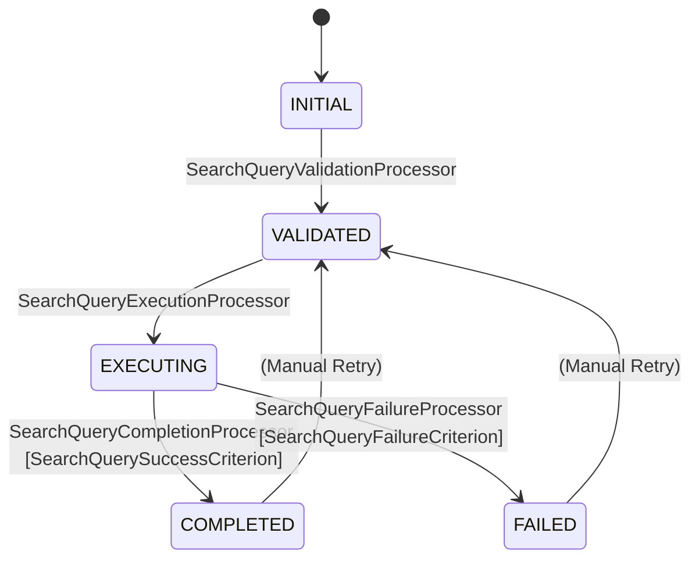
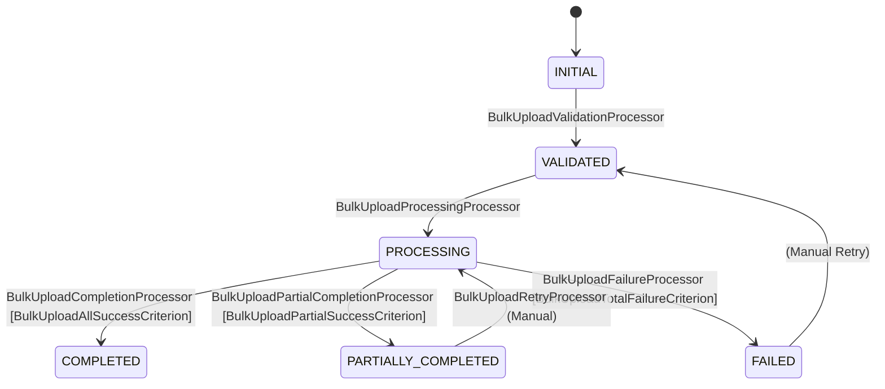

# Workflows

## 1. HNItem Workflow

### Description
Manages the lifecycle of Hacker News items from creation/import through validation, enrichment, indexing, and final processing.

### States
- **INITIAL**: Item is newly created or imported
- **VALIDATED**: Item has been validated for required fields and data integrity
- **ENRICHED**: Item has been enriched with additional data if needed
- **INDEXED**: Item has been indexed for search capabilities
- **PROCESSED**: Item is fully processed and available for queries

### Transitions

#### INITIAL → VALIDATED
- **Type**: Automatic
- **Processor**: HNItemValidationProcessor
- **Criterion**: None
- **Description**: Validates item structure and required fields

#### VALIDATED → ENRICHED
- **Type**: Automatic
- **Processor**: HNItemEnrichmentProcessor
- **Criterion**: HNItemNeedsEnrichmentCriterion
- **Description**: Enriches item with additional data if needed

#### VALIDATED → INDEXED (Alternative path)
- **Type**: Automatic
- **Processor**: None
- **Criterion**: HNItemNoEnrichmentNeededCriterion
- **Description**: Skip enrichment if not needed

#### ENRICHED → INDEXED
- **Type**: Automatic
- **Processor**: HNItemIndexingProcessor
- **Criterion**: None
- **Description**: Indexes item for search capabilities

#### INDEXED → PROCESSED
- **Type**: Automatic
- **Processor**: HNItemFinalizationProcessor
- **Criterion**: None
- **Description**: Finalizes item processing

#### PROCESSED → VALIDATED (Reprocessing)
- **Type**: Manual
- **Processor**: HNItemReprocessingProcessor
- **Criterion**: None
- **Description**: Allows reprocessing of items if needed

### Mermaid State Diagram

```mermaid
stateDiagram-v2
    [*] --> INITIAL
    INITIAL --> VALIDATED : HNItemValidationProcessor
    VALIDATED --> ENRICHED : HNItemEnrichmentProcessor [HNItemNeedsEnrichmentCriterion]
    VALIDATED --> INDEXED : [HNItemNoEnrichmentNeededCriterion]
    ENRICHED --> INDEXED : HNItemIndexingProcessor
    INDEXED --> PROCESSED : HNItemFinalizationProcessor
    PROCESSED --> VALIDATED : HNItemReprocessingProcessor (Manual)
```

## 2. SearchQuery Workflow

### Description
Manages the execution of search queries for HN items, including validation, execution, and result processing.

### States
- **INITIAL**: Query is newly created
- **VALIDATED**: Query parameters have been validated
- **EXECUTING**: Search is currently being executed
- **COMPLETED**: Search has completed successfully
- **FAILED**: Search execution failed

### Transitions

#### INITIAL → VALIDATED
- **Type**: Automatic
- **Processor**: SearchQueryValidationProcessor
- **Criterion**: None
- **Description**: Validates search query parameters

#### VALIDATED → EXECUTING
- **Type**: Automatic
- **Processor**: SearchQueryExecutionProcessor
- **Criterion**: None
- **Description**: Executes the search query

#### EXECUTING → COMPLETED
- **Type**: Automatic
- **Processor**: SearchQueryCompletionProcessor
- **Criterion**: SearchQuerySuccessCriterion
- **Description**: Completes successful search execution

#### EXECUTING → FAILED
- **Type**: Automatic
- **Processor**: SearchQueryFailureProcessor
- **Criterion**: SearchQueryFailureCriterion
- **Description**: Handles failed search execution

#### COMPLETED → VALIDATED (Retry)
- **Type**: Manual
- **Processor**: None
- **Criterion**: None
- **Description**: Allows re-execution of completed queries

#### FAILED → VALIDATED (Retry)
- **Type**: Manual
- **Processor**: None
- **Criterion**: None
- **Description**: Allows retry of failed queries

### Mermaid State Diagram

```mermaid
stateDiagram-v2
    [*] --> INITIAL
    INITIAL --> VALIDATED : SearchQueryValidationProcessor
    VALIDATED --> EXECUTING : SearchQueryExecutionProcessor
    EXECUTING --> COMPLETED : SearchQueryCompletionProcessor [SearchQuerySuccessCriterion]
    EXECUTING --> FAILED : SearchQueryFailureProcessor [SearchQueryFailureCriterion]
    COMPLETED --> VALIDATED : (Manual Retry)
    FAILED --> VALIDATED : (Manual Retry)
```

## 3. BulkUpload Workflow

### Description
Manages the bulk upload process for importing multiple HN items from JSON files.

### States
- **INITIAL**: Upload is newly created
- **VALIDATED**: File format and structure have been validated
- **PROCESSING**: Items are being processed individually
- **COMPLETED**: All items have been processed successfully
- **PARTIALLY_COMPLETED**: Some items processed successfully, some failed
- **FAILED**: Upload processing failed completely

### Transitions

#### INITIAL → VALIDATED
- **Type**: Automatic
- **Processor**: BulkUploadValidationProcessor
- **Criterion**: None
- **Description**: Validates file format and structure

#### VALIDATED → PROCESSING
- **Type**: Automatic
- **Processor**: BulkUploadProcessingProcessor
- **Criterion**: None
- **Description**: Starts processing individual items

#### PROCESSING → COMPLETED
- **Type**: Automatic
- **Processor**: BulkUploadCompletionProcessor
- **Criterion**: BulkUploadAllSuccessCriterion
- **Description**: All items processed successfully

#### PROCESSING → PARTIALLY_COMPLETED
- **Type**: Automatic
- **Processor**: BulkUploadPartialCompletionProcessor
- **Criterion**: BulkUploadPartialSuccessCriterion
- **Description**: Some items processed, some failed

#### PROCESSING → FAILED
- **Type**: Automatic
- **Processor**: BulkUploadFailureProcessor
- **Criterion**: BulkUploadTotalFailureCriterion
- **Description**: Processing failed completely

#### PARTIALLY_COMPLETED → PROCESSING (Retry Failed)
- **Type**: Manual
- **Processor**: BulkUploadRetryProcessor
- **Criterion**: None
- **Description**: Retry processing failed items

#### FAILED → VALIDATED (Retry)
- **Type**: Manual
- **Processor**: None
- **Criterion**: None
- **Description**: Retry entire upload process

### Mermaid State Diagram

```mermaid
stateDiagram-v2
    [*] --> INITIAL
    INITIAL --> VALIDATED : BulkUploadValidationProcessor
    VALIDATED --> PROCESSING : BulkUploadProcessingProcessor
    PROCESSING --> COMPLETED : BulkUploadCompletionProcessor [BulkUploadAllSuccessCriterion]
    PROCESSING --> PARTIALLY_COMPLETED : BulkUploadPartialCompletionProcessor [BulkUploadPartialSuccessCriterion]
    PROCESSING --> FAILED : BulkUploadFailureProcessor [BulkUploadTotalFailureCriterion]
    PARTIALLY_COMPLETED --> PROCESSING : BulkUploadRetryProcessor (Manual)
    FAILED --> VALIDATED : (Manual Retry)
```
