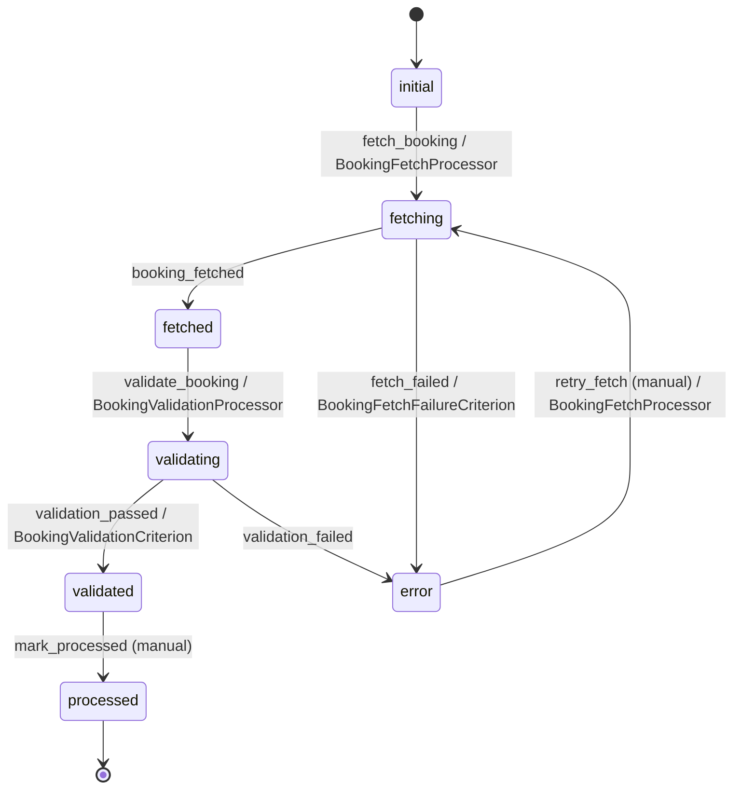
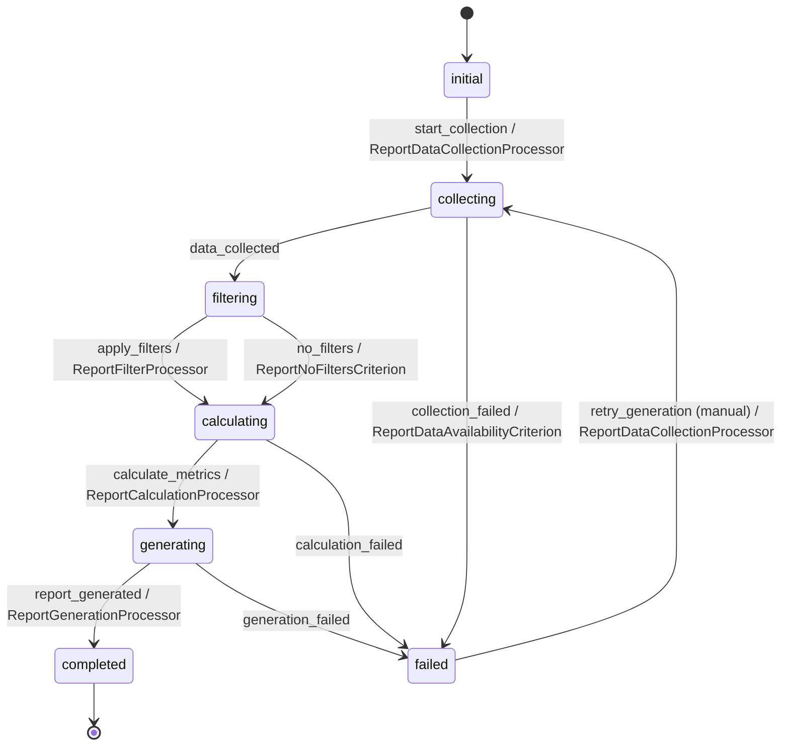

# Workflows Requirements

## 1. Booking Workflow

### Description
The Booking workflow manages the lifecycle of booking data from initial creation through API retrieval, validation, and processing for report generation.

### States
- `initial` - Starting state for new booking records
- `fetching` - Booking data is being retrieved from Restful Booker API
- `fetched` - Booking data successfully retrieved from API
- `validating` - Booking data is being validated
- `validated` - Booking data has been validated successfully
- `processed` - Booking is ready for report generation
- `error` - Error occurred during processing

### Transitions

| From State | Transition Name | To State | Type | Processor | Criterion |
|------------|----------------|----------|------|-----------|-----------|
| initial | fetch_booking | fetching | Automatic | BookingFetchProcessor | - |
| fetching | booking_fetched | fetched | Automatic | - | - |
| fetching | fetch_failed | error | Automatic | - | BookingFetchFailureCriterion |
| fetched | validate_booking | validating | Automatic | BookingValidationProcessor | - |
| validating | validation_passed | validated | Automatic | - | BookingValidationCriterion |
| validating | validation_failed | error | Automatic | - | - |
| validated | mark_processed | processed | Manual | - | - |
| error | retry_fetch | fetching | Manual | BookingFetchProcessor | - |

### Mermaid State Diagram

```mermaid
stateDiagram-v2
    [*] --> initial
    initial --> fetching : fetch_booking / BookingFetchProcessor
    fetching --> fetched : booking_fetched
    fetching --> error : fetch_failed / BookingFetchFailureCriterion
    fetched --> validating : validate_booking / BookingValidationProcessor
    validating --> validated : validation_passed / BookingValidationCriterion
    validating --> error : validation_failed
    validated --> processed : mark_processed (manual)
    error --> fetching : retry_fetch (manual) / BookingFetchProcessor
    processed --> [*]
```

---

## 2. Report Workflow

### Description
The Report workflow manages the lifecycle of report generation from initial request through data collection, processing, and completion.

### States
- `initial` - Starting state for new report requests
- `collecting` - Collecting booking data for the report
- `filtering` - Applying filters to booking data
- `calculating` - Calculating report metrics and summaries
- `generating` - Generating the final report output
- `completed` - Report successfully generated
- `failed` - Report generation failed

### Transitions

| From State | Transition Name | To State | Type | Processor | Criterion |
|------------|----------------|----------|------|-----------|-----------|
| initial | start_collection | collecting | Automatic | ReportDataCollectionProcessor | - |
| collecting | data_collected | filtering | Automatic | - | - |
| collecting | collection_failed | failed | Automatic | - | ReportDataAvailabilityCriterion |
| filtering | apply_filters | calculating | Automatic | ReportFilterProcessor | - |
| filtering | no_filters | calculating | Automatic | - | ReportNoFiltersCriterion |
| calculating | calculate_metrics | generating | Automatic | ReportCalculationProcessor | - |
| calculating | calculation_failed | failed | Automatic | - | - |
| generating | report_generated | completed | Automatic | ReportGenerationProcessor | - |
| generating | generation_failed | failed | Automatic | - | - |
| failed --> collecting : retry_generation (manual) / ReportDataCollectionProcessor

### Mermaid State Diagram

```mermaid
stateDiagram-v2
    [*] --> initial
    initial --> collecting : start_collection / ReportDataCollectionProcessor
    collecting --> filtering : data_collected
    collecting --> failed : collection_failed / ReportDataAvailabilityCriterion
    filtering --> calculating : apply_filters / ReportFilterProcessor
    filtering --> calculating : no_filters / ReportNoFiltersCriterion
    calculating --> generating : calculate_metrics / ReportCalculationProcessor
    calculating --> failed : calculation_failed
    generating --> completed : report_generated / ReportGenerationProcessor
    generating --> failed : generation_failed
    failed --> collecting : retry_generation (manual) / ReportDataCollectionProcessor
    completed --> [*]
```

---

## Workflow Design Notes

### 1. Automatic vs Manual Transitions
- **Automatic transitions**: Execute immediately when conditions are met
- **Manual transitions**: Require explicit user action or API call
- First transition from `initial` state is always automatic

### 2. Error Handling
- Both workflows include error states for robust error handling
- Manual retry transitions allow recovery from error states
- Error states capture failure reasons for debugging

### 3. Processor Usage
- Processors handle business logic during transitions
- Each processor focuses on a single responsibility
- Processors can modify entity data and trigger external API calls

### 4. Criterion Usage
- Criteria evaluate conditions for conditional transitions
- Used for validation, error detection, and business rule evaluation
- Keep criteria simple and focused on specific conditions

### 5. State Transitions
- No loops in automatic transitions to prevent infinite cycles
- Manual transitions allow for retry mechanisms
- Clear separation between data processing and user actions

### 6. Integration Points
- Booking workflow integrates with Restful Booker API
- Report workflow depends on processed booking data
- Both workflows support manual intervention when needed
