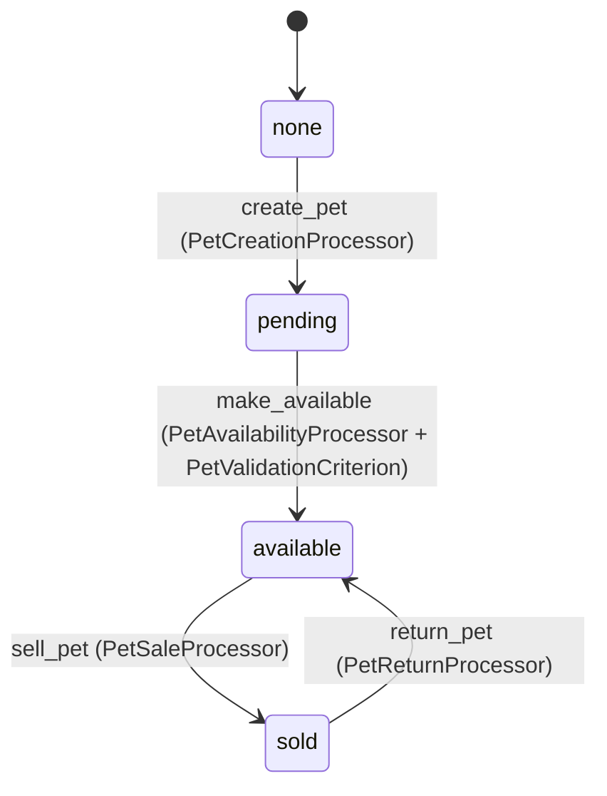
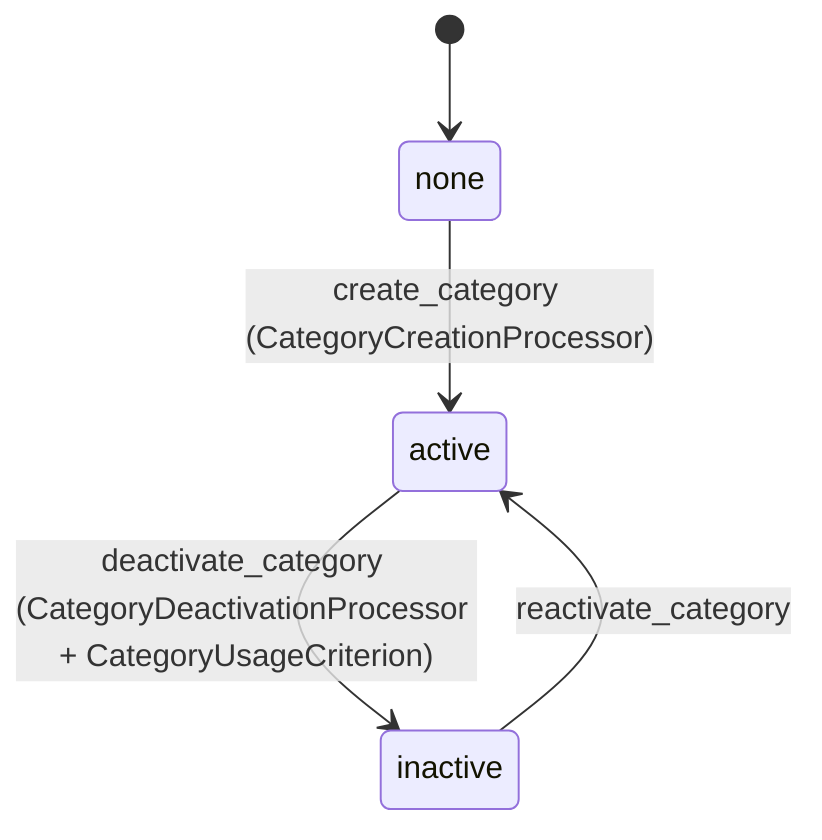
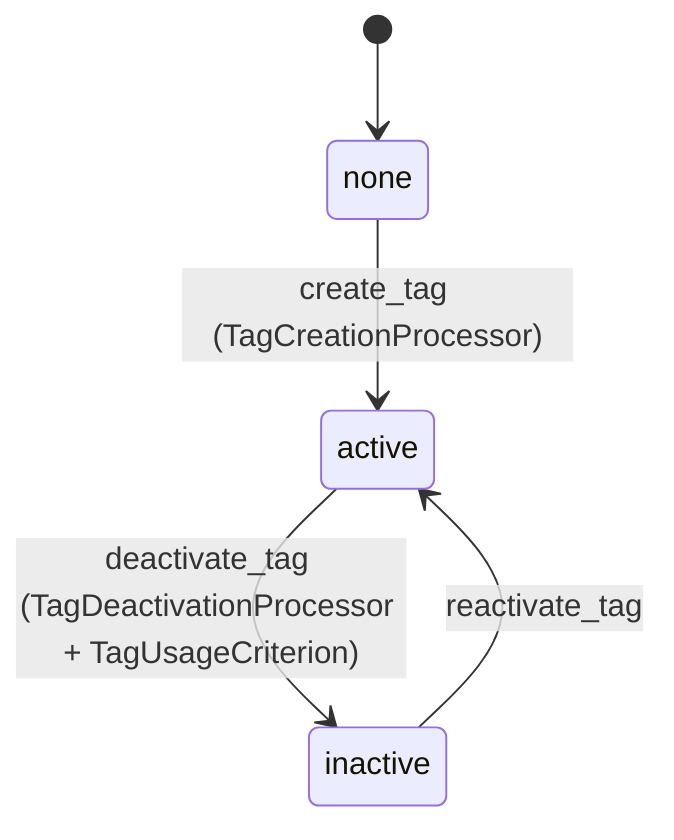
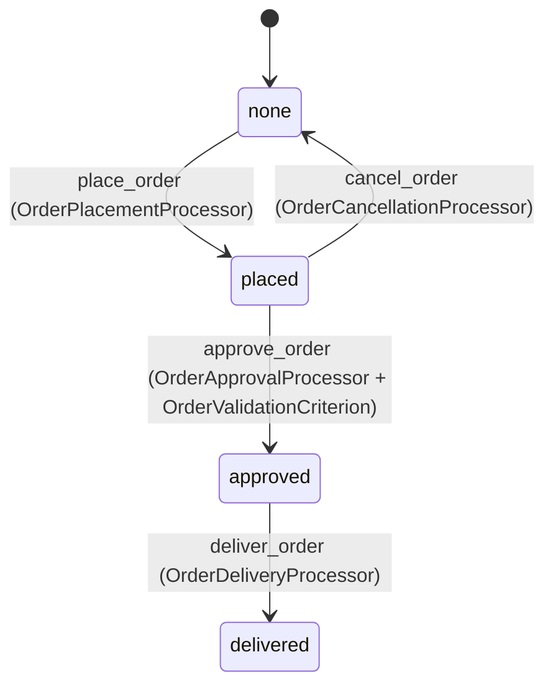

# Workflows Requirements

## Overview
Each entity in the Purrfect Pets API has its own workflow that manages state transitions and business logic. Workflows define the lifecycle of entities from creation to completion.

## 1. Pet Workflow

### States
- `none` (initial state)
- `pending` - Pet is created but not yet available
- `available` - Pet is available for purchase
- `sold` - Pet has been sold

### Transitions

#### From `none` to `pending`
- **Name**: `create_pet`
- **Type**: Automatic (first transition)
- **Processor**: `PetCreationProcessor`
- **Description**: Initialize pet with basic validation

#### From `pending` to `available`
- **Name**: `make_available`
- **Type**: Manual
- **Processor**: `PetAvailabilityProcessor`
- **Criterion**: `PetValidationCriterion`
- **Description**: Make pet available after validation

#### From `available` to `sold`
- **Name**: `sell_pet`
- **Type**: Manual
- **Processor**: `PetSaleProcessor`
- **Description**: Mark pet as sold when order is placed

#### From `sold` to `available` (return)
- **Name**: `return_pet`
- **Type**: Manual
- **Processor**: `PetReturnProcessor`
- **Description**: Return pet to available status

### Mermaid Diagram

```mermaid
stateDiagram-v2
    [*] --> none
    none --> pending : create_pet (PetCreationProcessor)
    pending --> available : make_available (PetAvailabilityProcessor + PetValidationCriterion)
    available --> sold : sell_pet (PetSaleProcessor)
    sold --> available : return_pet (PetReturnProcessor)
```

## 2. Category Workflow

### States
- `none` (initial state)
- `active` - Category is active and can be used
- `inactive` - Category is inactive but preserved

### Transitions

#### From `none` to `active`
- **Name**: `create_category`
- **Type**: Automatic (first transition)
- **Processor**: `CategoryCreationProcessor`
- **Description**: Create and activate category

#### From `active` to `inactive`
- **Name**: `deactivate_category`
- **Type**: Manual
- **Processor**: `CategoryDeactivationProcessor`
- **Criterion**: `CategoryUsageCriterion`
- **Description**: Deactivate category if not in use

#### From `inactive` to `active`
- **Name**: `reactivate_category`
- **Type**: Manual
- **Description**: Reactivate category

### Mermaid Diagram

```mermaid
stateDiagram-v2
    [*] --> none
    none --> active : create_category (CategoryCreationProcessor)
    active --> inactive : deactivate_category (CategoryDeactivationProcessor + CategoryUsageCriterion)
    inactive --> active : reactivate_category
```

## 3. Tag Workflow

### States
- `none` (initial state)
- `active` - Tag is active and can be used
- `inactive` - Tag is inactive but preserved

### Transitions

#### From `none` to `active`
- **Name**: `create_tag`
- **Type**: Automatic (first transition)
- **Processor**: `TagCreationProcessor`
- **Description**: Create and activate tag

#### From `active` to `inactive`
- **Name**: `deactivate_tag`
- **Type**: Manual
- **Processor**: `TagDeactivationProcessor`
- **Criterion**: `TagUsageCriterion`
- **Description**: Deactivate tag if not in use

#### From `inactive` to `active`
- **Name**: `reactivate_tag`
- **Type**: Manual
- **Description**: Reactivate tag

### Mermaid Diagram

```mermaid
stateDiagram-v2
    [*] --> none
    none --> active : create_tag (TagCreationProcessor)
    active --> inactive : deactivate_tag (TagDeactivationProcessor + TagUsageCriterion)
    inactive --> active : reactivate_tag
```

## 4. Order Workflow

### States
- `none` (initial state)
- `placed` - Order has been placed
- `approved` - Order has been approved
- `delivered` - Order has been delivered

### Transitions

#### From `none` to `placed`
- **Name**: `place_order`
- **Type**: Automatic (first transition)
- **Processor**: `OrderPlacementProcessor`
- **Description**: Place order and validate pet availability

#### From `placed` to `approved`
- **Name**: `approve_order`
- **Type**: Manual
- **Processor**: `OrderApprovalProcessor`
- **Criterion**: `OrderValidationCriterion`
- **Description**: Approve order after validation

#### From `approved` to `delivered`
- **Name**: `deliver_order`
- **Type**: Manual
- **Processor**: `OrderDeliveryProcessor`
- **Description**: Mark order as delivered

#### From `placed` to `none` (cancel)
- **Name**: `cancel_order`
- **Type**: Manual
- **Processor**: `OrderCancellationProcessor`
- **Description**: Cancel order and return pet to available

### Mermaid Diagram

```mermaid
stateDiagram-v2
    [*] --> none
    none --> placed : place_order (OrderPlacementProcessor)
    placed --> approved : approve_order (OrderApprovalProcessor + OrderValidationCriterion)
    approved --> delivered : deliver_order (OrderDeliveryProcessor)
    placed --> none : cancel_order (OrderCancellationProcessor)
```

## Workflow Integration Rules

### Cross-Entity State Dependencies
1. **Pet-Order Integration**: When an order is placed, the pet should transition to `sold` state
2. **Order Cancellation**: When an order is cancelled, the pet should return to `available` state
3. **Category/Tag Deactivation**: Only allowed if no active pets are using them

### Business Rules
1. **Pet Availability**: Pets must be in `available` state to be ordered
2. **Order Validation**: Orders can only be approved if the pet is still available
3. **Category/Tag Management**: Categories and tags can be deactivated only if not in use
4. **State Consistency**: System maintains referential integrity across entity states

### Manual vs Automatic Transitions
- **Automatic**: First transitions from `none` state (system-triggered)
- **Manual**: All other transitions require explicit user action or business event
- **Loop Transitions**: Return/reactivation transitions are always manual
