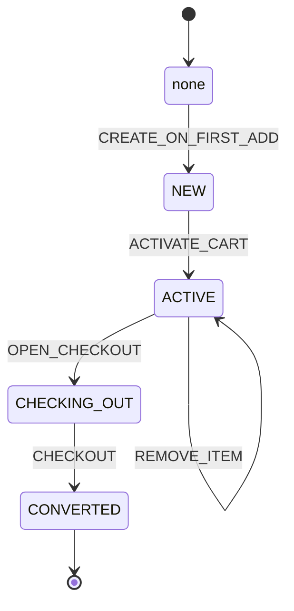
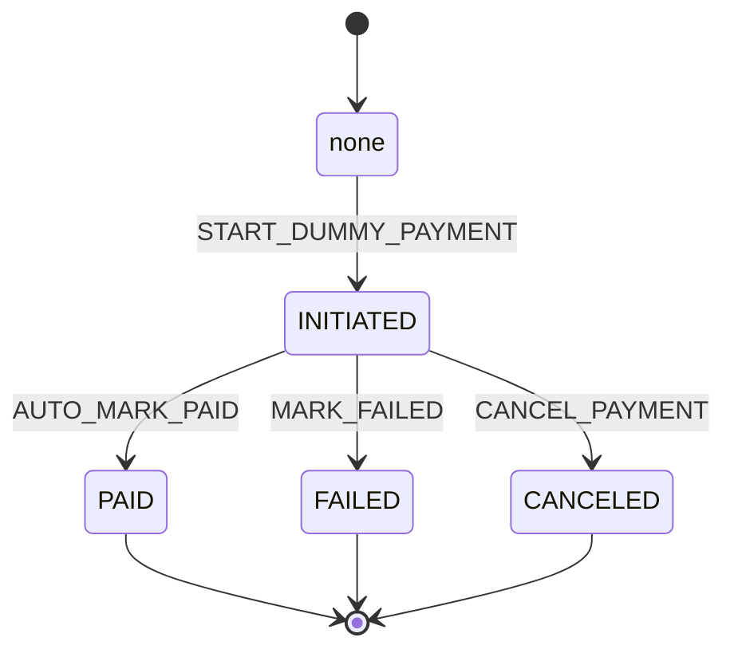
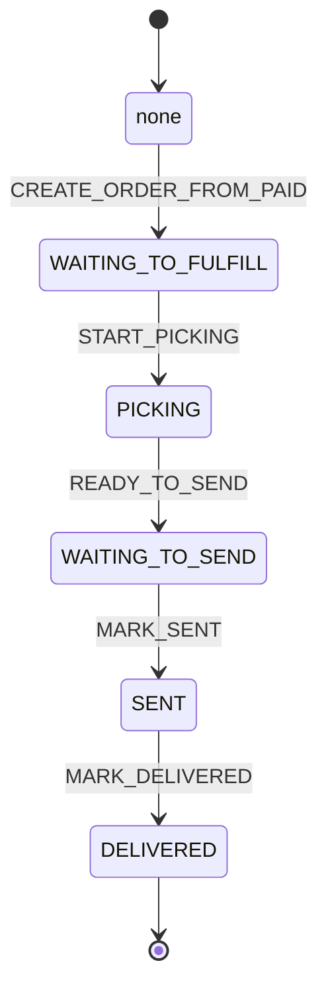
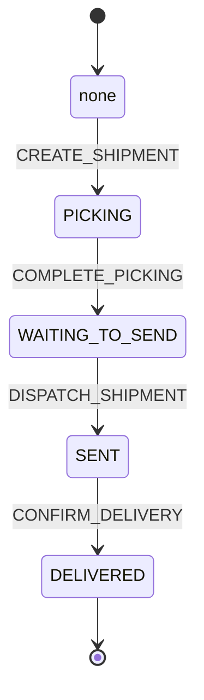

# Workflow Requirements

## Overview
This document defines the detailed workflow requirements for all entities in the Cyoda OMS Backend system. Each workflow manages the state transitions and business logic for its corresponding entity.

## Workflow Definitions

### 1. CartFlow Workflow

**Entity**: Cart
**Purpose**: Manages cart lifecycle from creation through checkout completion

**States**: 
- `none` (initial state)
- `NEW` - Cart created but no items added yet
- `ACTIVE` - Cart has items and can be modified
- `CHECKING_OUT` - Cart is in checkout process
- `CONVERTED` - Cart has been converted to order

**Transitions**:

1. **CREATE_ON_FIRST_ADD** (Automatic)
   - From: `none` → To: `NEW`
   - Trigger: First item added to cart
   - Processor: `CartCreateProcessor`
   - Description: Initialize cart and add first line item

2. **ACTIVATE_CART** (Automatic)
   - From: `NEW` → To: `ACTIVE`
   - Trigger: After cart creation with first item
   - Processor: `CartRecalculateTotalsProcessor`
   - Description: Recalculate totals and activate cart

3. **ADD_ITEM** (Manual)
   - From: `ACTIVE` → To: `ACTIVE` (loop)
   - Trigger: Add/increment item in cart
   - Processor: `CartRecalculateTotalsProcessor`
   - Description: Add item and recalculate totals

4. **UPDATE_ITEM** (Manual)
   - From: `ACTIVE` → To: `ACTIVE` (loop)
   - Trigger: Update item quantity in cart
   - Processor: `CartRecalculateTotalsProcessor`
   - Description: Update item quantity and recalculate totals

5. **REMOVE_ITEM** (Manual)
   - From: `ACTIVE` → To: `ACTIVE` (loop)
   - Trigger: Remove item from cart
   - Processor: `CartRecalculateTotalsProcessor`
   - Description: Remove item and recalculate totals

6. **OPEN_CHECKOUT** (Manual)
   - From: `ACTIVE` → To: `CHECKING_OUT`
   - Trigger: User initiates checkout
   - Description: Prepare cart for checkout process

7. **CHECKOUT** (Manual)
   - From: `CHECKING_OUT` → To: `CONVERTED`
   - Trigger: Checkout completed with payment
   - Description: Mark cart as converted to order

```mermaid
stateDiagram-v2
    [*] --> none
    none --> NEW : CREATE_ON_FIRST_ADD
    NEW --> ACTIVE : ACTIVATE_CART
    ACTIVE --> ACTIVE : ADD_ITEM
    ACTIVE --> ACTIVE : UPDATE_ITEM
    ACTIVE --> ACTIVE : REMOVE_ITEM
    ACTIVE --> CHECKING_OUT : OPEN_CHECKOUT
    CHECKING_OUT --> CONVERTED : CHECKOUT
    CONVERTED --> [*]
```

### 2. PaymentFlow Workflow

**Entity**: Payment
**Purpose**: Manages dummy payment processing with auto-approval

**States**:
- `none` (initial state)
- `INITIATED` - Payment started
- `PAID` - Payment completed successfully
- `FAILED` - Payment failed
- `CANCELED` - Payment canceled

**Transitions**:

1. **START_DUMMY_PAYMENT** (Automatic)
   - From: `none` → To: `INITIATED`
   - Trigger: Payment creation
   - Processor: `PaymentCreateDummyProcessor`
   - Description: Create payment record in initiated state

2. **AUTO_MARK_PAID** (Automatic)
   - From: `INITIATED` → To: `PAID`
   - Trigger: Auto-triggered after ~3 seconds
   - Processor: `PaymentAutoMarkPaidProcessor`
   - Description: Automatically mark payment as paid after delay

3. **MARK_FAILED** (Manual)
   - From: `INITIATED` → To: `FAILED`
   - Trigger: Payment processing failure
   - Description: Mark payment as failed

4. **CANCEL_PAYMENT** (Manual)
   - From: `INITIATED` → To: `CANCELED`
   - Trigger: Payment cancellation
   - Description: Cancel payment before completion

```mermaid
stateDiagram-v2
    [*] --> none
    none --> INITIATED : START_DUMMY_PAYMENT
    INITIATED --> PAID : AUTO_MARK_PAID
    INITIATED --> FAILED : MARK_FAILED
    INITIATED --> CANCELED : CANCEL_PAYMENT
    PAID --> [*]
    FAILED --> [*]
    CANCELED --> [*]
```

### 3. OrderLifecycle Workflow

**Entity**: Order
**Purpose**: Manages order fulfillment from creation through delivery

**States**:
- `none` (initial state)
- `WAITING_TO_FULFILL` - Order created, waiting for fulfillment
- `PICKING` - Order items being picked
- `WAITING_TO_SEND` - Order picked, waiting to ship
- `SENT` - Order shipped
- `DELIVERED` - Order delivered

**Transitions**:

1. **CREATE_ORDER_FROM_PAID** (Automatic)
   - From: `none` → To: `WAITING_TO_FULFILL`
   - Trigger: Order creation from paid cart
   - Processor: `OrderCreateFromPaidProcessor`
   - Description: Create order, decrement stock, create shipment

2. **START_PICKING** (Manual)
   - From: `WAITING_TO_FULFILL` → To: `PICKING`
   - Trigger: Fulfillment process started
   - Description: Begin order picking process

3. **READY_TO_SEND** (Manual)
   - From: `PICKING` → To: `WAITING_TO_SEND`
   - Trigger: Picking completed
   - Description: Order ready for shipment

4. **MARK_SENT** (Manual)
   - From: `WAITING_TO_SEND` → To: `SENT`
   - Trigger: Order shipped
   - Description: Mark order as sent

5. **MARK_DELIVERED** (Manual)
   - From: `SENT` → To: `DELIVERED`
   - Trigger: Order delivered
   - Description: Mark order as delivered

```mermaid
stateDiagram-v2
    [*] --> none
    none --> WAITING_TO_FULFILL : CREATE_ORDER_FROM_PAID
    WAITING_TO_FULFILL --> PICKING : START_PICKING
    PICKING --> WAITING_TO_SEND : READY_TO_SEND
    WAITING_TO_SEND --> SENT : MARK_SENT
    SENT --> DELIVERED : MARK_DELIVERED
    DELIVERED --> [*]
```

### 4. ShipmentFlow Workflow

**Entity**: Shipment
**Purpose**: Manages shipment lifecycle and drives order state updates

**States**:
- `none` (initial state)
- `PICKING` - Items being picked for shipment
- `WAITING_TO_SEND` - Shipment ready to send
- `SENT` - Shipment dispatched
- `DELIVERED` - Shipment delivered

**Transitions**:

1. **CREATE_SHIPMENT** (Automatic)
   - From: `none` → To: `PICKING`
   - Trigger: Shipment creation during order processing
   - Processor: `ShipmentCreateProcessor`
   - Description: Initialize shipment with order line items

2. **COMPLETE_PICKING** (Manual)
   - From: `PICKING` → To: `WAITING_TO_SEND`
   - Trigger: Picking process completed
   - Processor: `ShipmentUpdateOrderStateProcessor`
   - Description: Update picked quantities and sync order state

3. **DISPATCH_SHIPMENT** (Manual)
   - From: `WAITING_TO_SEND` → To: `SENT`
   - Trigger: Shipment dispatched
   - Processor: `ShipmentUpdateOrderStateProcessor`
   - Description: Mark shipment as sent and sync order state

4. **CONFIRM_DELIVERY** (Manual)
   - From: `SENT` → To: `DELIVERED`
   - Trigger: Delivery confirmed
   - Processor: `ShipmentUpdateOrderStateProcessor`
   - Description: Mark shipment as delivered and sync order state

```mermaid
stateDiagram-v2
    [*] --> none
    none --> PICKING : CREATE_SHIPMENT
    PICKING --> WAITING_TO_SEND : COMPLETE_PICKING
    WAITING_TO_SEND --> SENT : DISPATCH_SHIPMENT
    SENT --> DELIVERED : CONFIRM_DELIVERY
    DELIVERED --> [*]
```

## Workflow Orchestration

### Order Creation Flow
1. Cart reaches `CONVERTED` state
2. Payment reaches `PAID` state
3. OrderLifecycle `CREATE_ORDER_FROM_PAID` transition triggered
4. Order created in `WAITING_TO_FULFILL` state
5. Shipment created in `PICKING` state
6. Product stock decremented

### State Synchronization
- Shipment state changes drive Order state updates
- Single shipment per order ensures 1:1 state mapping
- Order state reflects current shipment state

## Transition Types
- **Automatic**: Triggered by system events or processors
- **Manual**: Triggered by user actions or external events
- **Loop transitions**: Manual transitions that return to the same state
