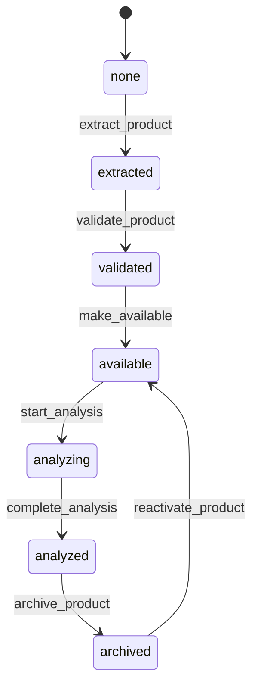
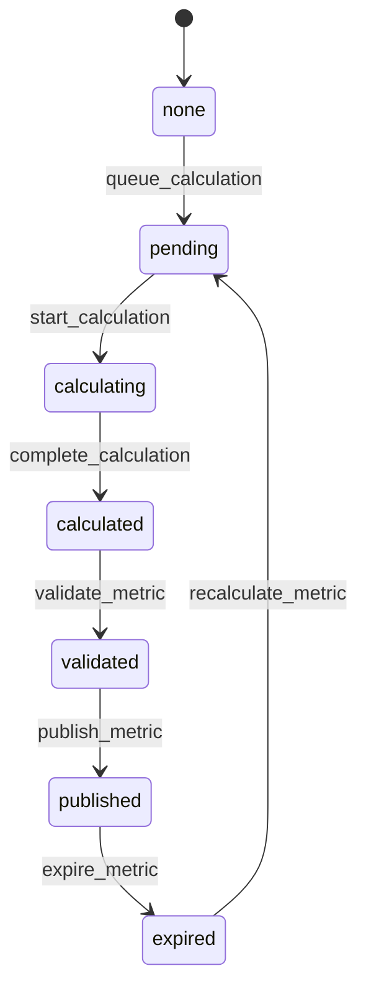
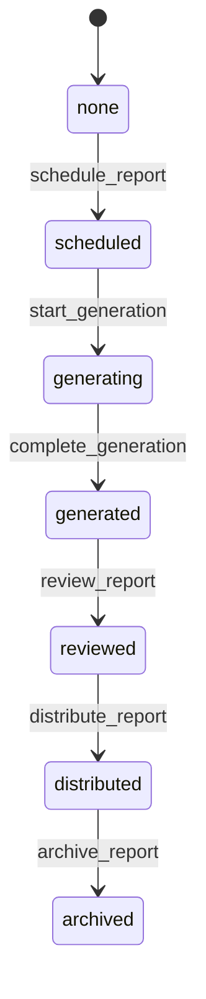
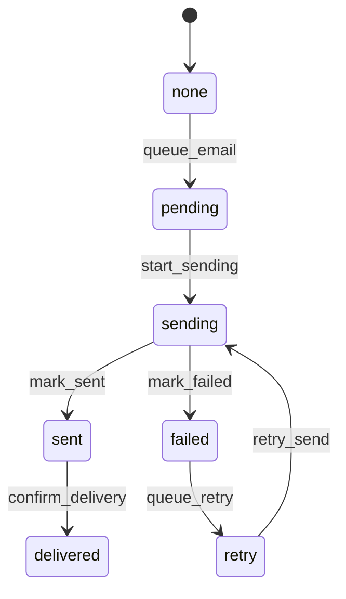
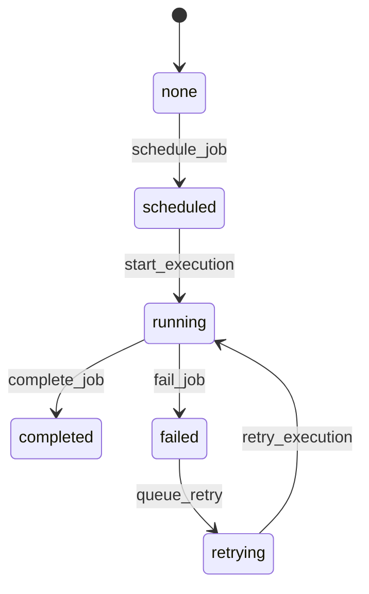

# Workflows Requirements

## Overview
This document defines the workflow state machines for each entity in the Product Performance Analysis and Reporting System. Each workflow represents the lifecycle and business processes for the respective entity.

## 1. Product Workflow

**Purpose**: Manages the lifecycle of products from extraction to performance analysis.

**States**:
- `none` (initial): Starting state
- `extracted`: Product data extracted from Pet Store API
- `validated`: Product data validated and enriched
- `available`: Product ready for performance analysis
- `analyzing`: Performance analysis in progress
- `analyzed`: Performance analysis completed
- `archived`: Product archived (no longer active)

**Transitions**:

1. `extract_product`: none → extracted
   - **Type**: Automatic
   - **Processor**: ProductExtractionProcessor
   - **Description**: Extract product data from Pet Store API

2. `validate_product`: extracted → validated
   - **Type**: Automatic
   - **Processor**: ProductValidationProcessor
   - **Description**: Validate and enrich product data

3. `make_available`: validated → available
   - **Type**: Automatic
   - **Criterion**: ProductAvailabilityCriterion
   - **Description**: Check if product meets availability criteria

4. `start_analysis`: available → analyzing
   - **Type**: Manual
   - **Processor**: ProductAnalysisInitiatorProcessor
   - **Description**: Initiate performance analysis for product

5. `complete_analysis`: analyzing → analyzed
   - **Type**: Automatic
   - **Processor**: ProductAnalysisCompletionProcessor
   - **Description**: Complete performance analysis

6. `archive_product`: analyzed → archived
   - **Type**: Manual
   - **Criterion**: ProductArchiveCriterion
   - **Description**: Archive product if no longer needed

7. `reactivate_product`: archived → available
   - **Type**: Manual
   - **Description**: Reactivate archived product

```mermaid
stateDiagram-v2
    [*] --> none
    none --> extracted : extract_product
    extracted --> validated : validate_product
    validated --> available : make_available
    available --> analyzing : start_analysis
    analyzing --> analyzed : complete_analysis
    analyzed --> archived : archive_product
    archived --> available : reactivate_product
```

## 2. PerformanceMetric Workflow

**Purpose**: Manages the calculation and validation of performance metrics.

**States**:
- `none` (initial): Starting state
- `pending`: Metric calculation queued
- `calculating`: Metric calculation in progress
- `calculated`: Metric calculation completed
- `validated`: Metric validated and approved
- `published`: Metric published for reporting
- `expired`: Metric no longer valid

**Transitions**:

1. `queue_calculation`: none → pending
   - **Type**: Automatic
   - **Processor**: MetricQueueProcessor
   - **Description**: Queue metric for calculation

2. `start_calculation`: pending → calculating
   - **Type**: Automatic
   - **Processor**: MetricCalculationProcessor
   - **Description**: Begin metric calculation

3. `complete_calculation`: calculating → calculated
   - **Type**: Automatic
   - **Processor**: MetricCompletionProcessor
   - **Description**: Complete metric calculation

4. `validate_metric`: calculated → validated
   - **Type**: Automatic
   - **Criterion**: MetricValidationCriterion
   - **Description**: Validate calculated metric

5. `publish_metric`: validated → published
   - **Type**: Automatic
   - **Description**: Publish metric for use in reports

6. `expire_metric`: published → expired
   - **Type**: Automatic
   - **Criterion**: MetricExpirationCriterion
   - **Description**: Expire outdated metrics

7. `recalculate_metric`: expired → pending
   - **Type**: Manual
   - **Description**: Recalculate expired metric

```mermaid
stateDiagram-v2
    [*] --> none
    none --> pending : queue_calculation
    pending --> calculating : start_calculation
    calculating --> calculated : complete_calculation
    calculated --> validated : validate_metric
    validated --> published : publish_metric
    published --> expired : expire_metric
    expired --> pending : recalculate_metric
```

## 3. Report Workflow

**Purpose**: Manages the generation and distribution of performance reports.

**States**:
- `none` (initial): Starting state
- `scheduled`: Report generation scheduled
- `generating`: Report generation in progress
- `generated`: Report generated successfully
- `reviewed`: Report reviewed and approved
- `distributed`: Report distributed to recipients
- `archived`: Report archived

**Transitions**:

1. `schedule_report`: none → scheduled
   - **Type**: Automatic
   - **Processor**: ReportSchedulingProcessor
   - **Description**: Schedule report generation

2. `start_generation`: scheduled → generating
   - **Type**: Automatic
   - **Processor**: ReportGenerationProcessor
   - **Description**: Begin report generation

3. `complete_generation`: generating → generated
   - **Type**: Automatic
   - **Processor**: ReportCompletionProcessor
   - **Description**: Complete report generation

4. `review_report`: generated → reviewed
   - **Type**: Automatic
   - **Criterion**: ReportQualityCriterion
   - **Description**: Validate report quality

5. `distribute_report`: reviewed → distributed
   - **Type**: Automatic
   - **Processor**: ReportDistributionProcessor
   - **Description**: Distribute report to recipients

6. `archive_report`: distributed → archived
   - **Type**: Automatic
   - **Criterion**: ReportArchiveCriterion
   - **Description**: Archive old reports

```mermaid
stateDiagram-v2
    [*] --> none
    none --> scheduled : schedule_report
    scheduled --> generating : start_generation
    generating --> generated : complete_generation
    generated --> reviewed : review_report
    reviewed --> distributed : distribute_report
    distributed --> archived : archive_report
```

## 4. EmailNotification Workflow

**Purpose**: Manages email notification delivery process.

**States**:
- `none` (initial): Starting state
- `pending`: Email queued for sending
- `sending`: Email being sent
- `sent`: Email sent successfully
- `delivered`: Email delivered to recipient
- `failed`: Email delivery failed
- `retry`: Email queued for retry

**Transitions**:

1. `queue_email`: none → pending
   - **Type**: Automatic
   - **Processor**: EmailQueueProcessor
   - **Description**: Queue email for sending

2. `start_sending`: pending → sending
   - **Type**: Automatic
   - **Processor**: EmailSendingProcessor
   - **Description**: Begin email sending process

3. `mark_sent`: sending → sent
   - **Type**: Automatic
   - **Description**: Mark email as sent

4. `confirm_delivery`: sent → delivered
   - **Type**: Automatic
   - **Processor**: EmailDeliveryConfirmationProcessor
   - **Description**: Confirm email delivery

5. `mark_failed`: sending → failed
   - **Type**: Automatic
   - **Criterion**: EmailFailureCriterion
   - **Description**: Mark email as failed

6. `queue_retry`: failed → retry
   - **Type**: Automatic
   - **Criterion**: EmailRetryCriterion
   - **Description**: Queue email for retry if within limits

7. `retry_send`: retry → sending
   - **Type**: Automatic
   - **Processor**: EmailRetryProcessor
   - **Description**: Retry sending email

```mermaid
stateDiagram-v2
    [*] --> none
    none --> pending : queue_email
    pending --> sending : start_sending
    sending --> sent : mark_sent
    sending --> failed : mark_failed
    sent --> delivered : confirm_delivery
    failed --> retry : queue_retry
    retry --> sending : retry_send
```

## 5. DataExtractionJob Workflow

**Purpose**: Manages automated data extraction jobs from Pet Store API.

**States**:
- `none` (initial): Starting state
- `scheduled`: Job scheduled for execution
- `running`: Job currently executing
- `completed`: Job completed successfully
- `failed`: Job execution failed
- `retrying`: Job queued for retry

**Transitions**:

1. `schedule_job`: none → scheduled
   - **Type**: Automatic
   - **Processor**: JobSchedulingProcessor
   - **Description**: Schedule data extraction job

2. `start_execution`: scheduled → running
   - **Type**: Automatic
   - **Processor**: JobExecutionProcessor
   - **Description**: Begin job execution

3. `complete_job`: running → completed
   - **Type**: Automatic
   - **Processor**: JobCompletionProcessor
   - **Description**: Complete job successfully

4. `fail_job`: running → failed
   - **Type**: Automatic
   - **Criterion**: JobFailureCriterion
   - **Description**: Mark job as failed

5. `queue_retry`: failed → retrying
   - **Type**: Automatic
   - **Criterion**: JobRetryCriterion
   - **Description**: Queue job for retry

6. `retry_execution`: retrying → running
   - **Type**: Automatic
   - **Processor**: JobRetryProcessor
   - **Description**: Retry job execution

```mermaid
stateDiagram-v2
    [*] --> none
    none --> scheduled : schedule_job
    scheduled --> running : start_execution
    running --> completed : complete_job
    running --> failed : fail_job
    failed --> retrying : queue_retry
    retrying --> running : retry_execution
```

## Workflow Integration Notes

1. **Cross-Entity Triggers**: 
   - DataExtractionJob completion triggers Product extraction
   - Product analysis completion triggers PerformanceMetric calculation
   - PerformanceMetric completion triggers Report generation
   - Report distribution triggers EmailNotification

2. **Error Handling**: All workflows include failure states and retry mechanisms where appropriate

3. **Manual vs Automatic**: Most transitions are automatic to support the weekly automation requirement, with manual transitions for administrative actions

4. **State Persistence**: All workflow states are persisted and can be queried for monitoring and debugging
